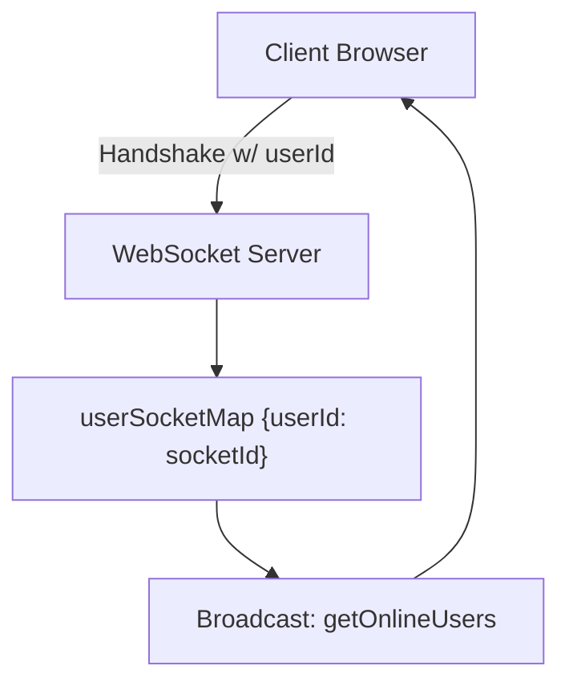

# Real-time Communication

Shinychat utilizes WebSockets to enable instant messaging and real-time presence tracking. To ensure flexibility, the project provides two backend implementations: a Node.js version using `socket.io` and a Python version using `python-socketio`.

## Architecture Overview

The real-time layer maintains a stateful mapping between a unique User ID and their current Socket Session ID. This allows the server to route private messages to specific users regardless of their connection instance.




## Backend Comparison

Both implementations achieve parity in functionality but differ in their underlying runtime handling.

| Feature | Node.js Implementation | Python Implementation |
| :--- | :--- | :--- |
| **Library** | `socket.io` | `python-socketio` (AsyncServer) |
| **Concurrency** | Event-driven (Non-blocking) | Asynchronous (ASGI) |
| **User Mapping** | Local Object (`userSocketMap`) | Local Dictionary (`user_socket_map`) |
| **Auth Method** | `socket.handshake.query` | ASGI `QUERY_STRING` parsing |
| **Presence** | `io.emit("getOnlineUsers", ...)` | `await sio.emit("getOnlineUsers", ...)` |

## Implementation Details

### Node.js (JavaScript)
The Node.js backend leverages the native `socket.io` handshake object to quickly associate users upon connection.

```javascript
// backend/src/lib/socket.js

const userSocketMap = {}; // {userId : socketId}

io.on("connection", (socket) => {
    const userId = socket.handshake.query.userId;
    if(userId) userSocketMap[userId] = socket.id;

    // Broadcast online users to all connected clients
    io.emit("getOnlineUsers", Object.keys(userSocketMap));

    socket.on("disconnect", () => {
        delete userSocketMap[userId]; 
        io.emit("getOnlineUsers", Object.keys(userSocketMap));
    });
});

export function getReceiverSocketId(userId) {
    return userSocketMap[userId];
}
```

### Python (ASGI)
The Python implementation utilizes an `AsyncServer` to handle concurrent WebSocket connections. Because the `disconnect` event only provides the `sid`, the server iterates through the map to identify the associated user.

```python
# backend_py/app/sockets/socket_app.py

user_socket_map: Dict[str, str] = {} # {userId: socketId}

@sio.event
async def connect(sid, environ):
    # Manual parsing of ASGI QUERY_STRING for userId
    query_string = environ.get("QUERY_STRING", "")
    queries = dict(q.split("=") for q in query_string.split("&") if "=" in q)
    user_id = queries.get("userId")
    
    if user_id:
        user_socket_map[user_id] = sid
        await sio.emit("getOnlineUsers", list(user_socket_map.keys()))

@sio.event
async def disconnect(sid):
    # Reverse lookup to find user_id by sid
    for user_id, mapped_sid in list(user_socket_map.items()):
        if mapped_sid == sid:
            del user_socket_map[user_id]
            await sio.emit("getOnlineUsers", list(user_socket_map.keys()))
            break
```

## Key Technical Considerations

### 1. Connection Handshaking
In both versions, the client must pass the `userId` as a query parameter during the initial connection request. This ensures that the server can map the socket session to a database user immediately.

### 2. State Management
The `userSocketMap` is stored in-memory. In a production environment scaled across multiple server instances, this should be replaced with a distributed store such as **Redis** using a Socket.io Redis Adapter to ensure users connected to different pods can still communicate.

### 3. Complexity Analysis
- **Connection/Retrieval:** $O(1)$ time complexity via hash map lookup.
- **Disconnection (Python):** $O(n)$ time complexity due to the reverse lookup of the session ID in the user map.