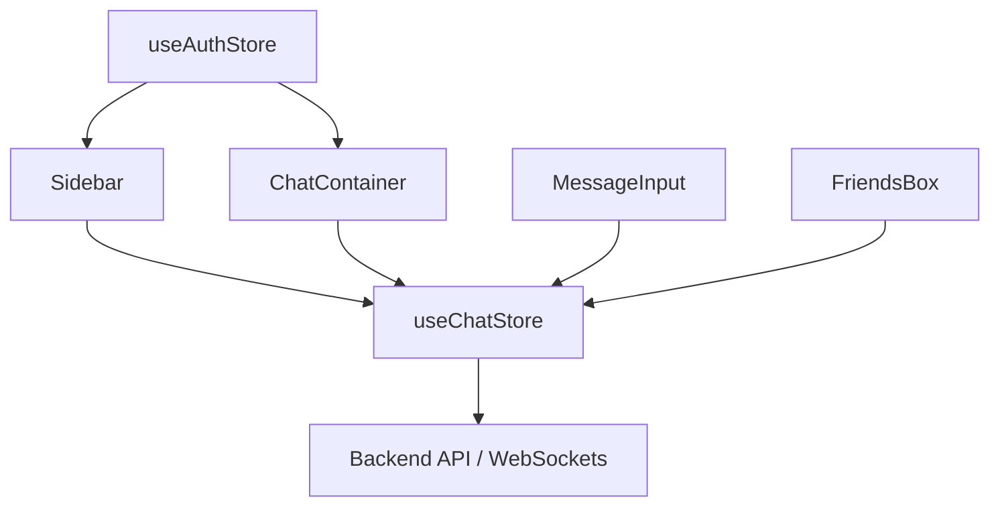

# Chat Interface Components

The chat interface of Shinychat is built as a modular set of React components that interact with a centralized state management system (`useChatStore` and `useAuthStore`). The UI is designed for responsiveness, transitioning from a full-width sidebar on mobile to a split-pane view on desktop.

## Architecture Overview

The following diagram illustrates the data flow between the UI components and the state stores.

---

## Component Breakdown

### 1. Sidebar
The `Sidebar` serves as the primary navigation for selecting conversations. It manages the list of friends and provides real-time visibility into user availability.

**Key Functionalities:**
- **Friend Listing**: Renders a list of friends fetched via `getFriends()`.
- **Online Filtering**: Implements a toggle to filter users based on the `onlineUsers` array from the `useAuthStore`.
- **User Selection**: Updates the `selectedUser` state in the store, which triggers the `ChatContainer` to load specific messages.
- **Responsive Design**: Adjusts width and visibility based on whether a user is selected (to optimize mobile screen real estate).

### 2. ChatContainer
The `ChatContainer` is the core orchestration component for the active conversation. It handles the message lifecycle, from fetching history to real-time updates.

**Technical Implementation:**
- **Lifecycle Management**: 
    - On mount/user change: Calls `getMessages(selectedUser._id)` and `subscribeToMessages()`.
    - On unmount: Calls `unsubscribeFromMessages()` to prevent memory leaks and unnecessary socket traffic.
- **Auto-Scrolling**: Utilizes a `useRef` (`messageEndRef`) and a `useEffect` hook to trigger `scrollIntoView({ behaviour: "smooth" })` whenever the `messages` array updates.
- **Message Rendering**: 
    - Dynamically assigns CSS classes (`chat-start` vs `chat-end`) based on whether the `senderId` matches the `authUser._id`.
    - Supports polymorphic content: both plain text and image attachments.

### 3. MessageInput
The `MessageInput` component provides a rich interface for sending messages, supporting both text and image uploads.

**Key Features:**
- **Image Preview**: Uses the `FileReader` API to generate a Base64 preview of the selected image before it is uploaded to the server.
- **Validation**: Prevents empty submissions by disabling the send button if both text and image fields are empty.
- **State Reset**: Automatically clears the input field and image preview upon a successful `sendMessage` call.

### 4. FriendsBox
The `FriendsBox` is a modal interface used for managing the user's social graph.

**Management Tabs:**
- **Friends**: Displays current connections with the ability to remove friends via `removeFriend`.
- **Pending**: Lists incoming friend requests with `acceptFriendRequest` and `rejectFriendRequest` actions.
- **Sent**: Tracks outgoing requests that are awaiting a response.

**Friend Discovery**:
Includes a search form that accepts a username or email identifier to trigger `sendFriendRequest`.

---

## State Integration Summary

| Component | Store Dependency | Primary Action | State Trigger |
| :--- | :--- | :--- | :--- |
| **Sidebar** | `useChatStore` | `setSelectedUser` | `onlineUsers` change |
| **ChatContainer** | `useChatStore` | `subscribeToMessages` | `selectedUser` change |
| **MessageInput** | `useChatStore` | `sendMessage` | Form submission |
| **FriendsBox** | `useChatStore` | `sendFriendRequest` | Tab switching / Action buttons |