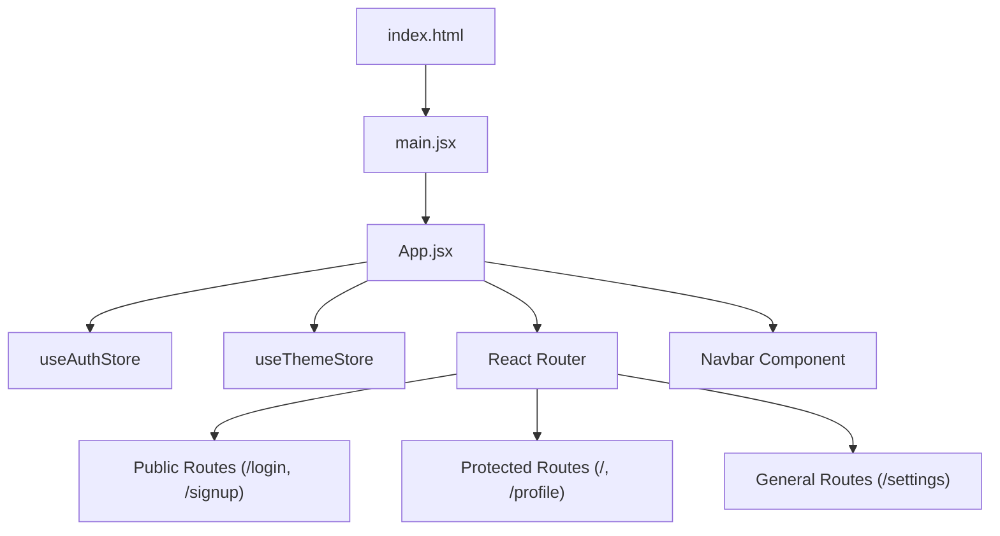

# Frontend Application

The `shinychat` frontend is a modern Single Page Application (SPA) built with **React**, utilizing a modular architecture to handle real-time communication, authentication states, and dynamic theming.

## Architecture Overview

The application follows a centralized state management pattern combined with declarative routing. The root of the application is managed by `App.jsx`, which acts as the orchestrator for authentication guards and global UI providers.

## Core Application Logic

### Entry Point and Routing
The application utilizes `react-router-dom` to manage navigation. A key feature of the architecture is the **Authentication Guard** implemented within `App.jsx`. 

- **Auth Verification**: On mount, the application invokes `checkAuth()` via the `useAuthStore` to validate the user's session.
- **Loading State**: While authentication is being verified (`isCheckingAuth`), a full-screen loader is displayed to prevent "flash of unauthenticated content" (FOUC).
- **Route Protection**: 
    - Protected routes (like `HomePage` and `ProfilePage`) redirect unauthenticated users to `/login`.
    - Guest-only routes (like `LoginPage` and `SignUpPage`) redirect authenticated users back to the home page.

### Layout and UI Components
The interface is designed for responsiveness and accessibility using **Tailwind CSS** and **DaisyUI**.

#### Global Wrapper
The entire application is wrapped in a `div` that dynamically applies a `data-theme` attribute. This attribute is driven by the `useThemeStore`, allowing for instant, application-wide theme switching without page reloads.

#### Navigation (`Navbar.jsx`)
The Navbar serves as the primary navigation hub and is fixed to the top of the viewport with a backdrop-blur effect. It implements conditional rendering based on the `authUser` state:
- **Public View**: Displays the logo and a link to Settings.
- **Authenticated View**: Adds access to the Friends list (via `useChatStore`), User Profile, and the Logout functionality.

## State Management

The application employs a store-based pattern (Zustand) to decouple business logic from UI components:

| Store | Responsibility | Key Actions/State |
| :--- | :--- | :--- |
| `useAuthStore` | Session & Identity | `authUser`, `checkAuth`, `logout`, `onlineUsers` |
| `useThemeStore` | Visual Appearance | `theme` |
| `useChatStore` | Chat UI State | `toggleFriendsBox` |

## Component Tree Summary

- **`App.jsx`**: Root provider, routing logic, and auth guarding.
- **`Navbar.jsx`**: Global navigation and session-based action triggers.
- **`Toaster`**: Integrated `react-hot-toast` for non-blocking system notifications.
- **Pages**: Modular views for Home, Login, Signup, Settings, and Profile.