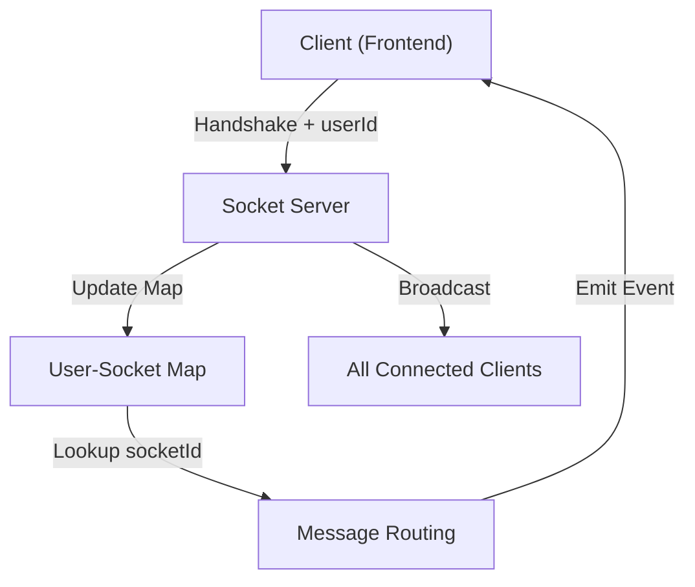

# Real-time Communication

ShinyChat utilizes WebSockets to enable instant, bi-directional communication between clients and servers. To provide flexibility across different ecosystem requirements, the real-time layer is implemented in both Node.js and Python, maintaining a consistent architectural pattern for session tracking and presence management.

## Architecture Overview

The communication layer acts as a stateful bridge between the stateless REST API and the end user. It maps unique User IDs to specific Socket IDs to ensure messages are routed to the correct active session.



## Implementation Details

Both backends implement a "Presence Tracking" system that allows the application to know which users are currently online.

### Node.js Implementation (`socket.io`)

The Node.js backend leverages `socket.io` for robust event handling and automatic reconnection.

- **Session Mapping**: A global `userSocketMap` object stores key-value pairs where the key is the `userId` and the value is the `socket.id`.
- **Connection Flow**: Upon connection, the server extracts the `userId` from the handshake query parameters and updates the map.
- **Presence Broadcasting**: Whenever a user connects or disconnects, the server emits a `getOnlineUsers` event containing a list of all currently active User IDs.

```javascript
// Core mapping function for message routing
export function getReceiverSocketId(userId) {
    return userSocketMap[userId];
}
```

### Python Implementation (`python-socketio`)

The Python backend uses `python-socketio` with an ASGI async mode to achieve high concurrency.

- **ASGI Integration**: The implementation parses the `QUERY_STRING` from the ASGI `environ` to retrieve the `userId` during the `connect` event.
- **Async Event Loop**: All socket operations (`emit`, `connect`, `disconnect`) are handled asynchronously to prevent blocking the server.
- **Reverse Lookup**: Since `python-socketio` handles disconnections via the `sid` (Session ID), the backend iterates through the map to identify and remove the corresponding `user_id`.

```python
def get_receiver_socket_id(receiver_id: str) -> Optional[str]:
    return user_socket_map.get(str(receiver_id))
```

## Event Lifecycle

The following table describes the events shared across both implementations:

| Event | Trigger | Payload | Purpose |
| :--- | :--- | :--- | :--- |
| `connection` | Client initiates WebSocket | `userId` (query) | Maps user to session and initializes presence. |
| `getOnlineUsers` | Connect/Disconnect | `string[]` (User IDs) | Updates the client-side list of active users. |
| `disconnect` | Client closes connection | `sid` | Cleans up the map to prevent ghost sessions. |

## Routing Logic

To send a private message, the system follows this sequence:
1. The API receives a message request with a `receiverId`.
2. The system calls `getReceiverSocketId(receiverId)` (Node) or `get_receiver_socket_id(receiver_id)` (Python).
3. If a socket ID is returned, the server emits the message specifically to that socket.
4. If no ID is found, the message is stored in the database as "unread" without an active socket emission.