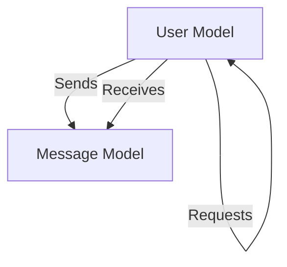

# Data Models and Storage

Shinychat utilizes MongoDB for persistent data storage via Mongoose and Cloudinary for the management of binary assets, such as profile pictures and chat images.

## Database Schema

The application relies on two primary entities: **Users** and **Messages**. These models are designed to support social networking features (friend requests) and real-time messaging.

### User Model
The `User` model handles authentication, identity, and social graphs. It supports dual-authentication paths (Email/Password and Google OAuth).

| Field | Type | Required | Description |
| :--- | :--- | :--- | :--- |
| `email` | `String` | Yes | Unique email address for authentication. |
| `username` | `String` | Yes | Unique handle (3-20 characters). |
| `password` | `String` | Conditional | Required for `email` provider; omitted for `google`. |
| `profilePic` | `String` | No | Cloudinary URL to the user's avatar. |
| `friends` | `Array[ObjectId]` | No | List of references to other `User` documents. |
| `friendRequests` | `Array[ObjectId]` | No | Incoming friend requests pending approval. |
| `sentRequests` | `Array[ObjectId]` | No | Outgoing friend requests awaiting response. |
| `authProvider` | `Enum` | Yes | Either `email` or `google`. |
| `googleId` | `String` | No | Unique identifier from Google OAuth. |

**Business Logic:** A pre-save hook ensures data integrity by validating that passwords are provided for email sign-ups and removed for Google-authenticated accounts to prevent stale credential storage.

### Message Model
The `Message` model stores the communication history between two users.

| Field | Type | Required | Description |
| :--- | :--- | :--- | :--- |
| `senderId` | `ObjectId` | Yes | Reference to the `User` who sent the message. |
| `receiverId` | `ObjectId` | Yes | Reference to the `User` receiving the message. |
| `text` | `String` | No | The textual content of the message. |
| `image` | `String` | No | Cloudinary URL to an attached image. |

## Data Relationships

The following diagram illustrates the relationships between the User and Message entities, highlighting the self-referencing nature of the social graph.



## File and Image Storage

To maintain a lean database, all binary files are offloaded to Cloudinary. The integration is implemented across both the Node.js and Python backend environments.

### Cloudinary Integration

The system utilizes a centralized configuration using environment variables (`CLOUDINARY_CLOUD_NAME`, `CLOUDINARY_API_KEY`, `CLOUDINARY_API_SECRET`).

#### Node.js Implementation
The Node.js backend initializes the Cloudinary SDK to handle media uploads globally:

```javascript
import { v2 as cloudinary } from "cloudinary";
import { config } from 'dotenv';

config();

cloudinary.config({
    cloud_name: process.env.CLOUDINARY_CLOUD_NAME,
    api_key: process.env.CLOUDINARY_API_KEY,
    api_secret: process.env.CLOUDINARY_API_SECRET,
});
```

#### Python Implementation
The Python utility provides a streamlined asynchronous wrapper for uploading base64 encoded images, returning a secure HTTPS URL for database storage.

```python
async def upload_image(image_base64: str) -> str:
    """Uploads base64 image string to Cloudinary and returns secure URL."""
    result = cloudinary.uploader.upload(image_base64)
    return result.get("secure_url")
```

### Storage Workflow
1. **Client Side**: The client sends an image as a base64 string or multipart file.
2. **Backend**: The server receives the payload and forwards it to the Cloudinary API.
3. **Storage**: Cloudinary stores the image and returns a `secure_url`.
4. **Persistence**: The `secure_url` is saved in the `User.profilePic` or `Message.image` field in MongoDB.