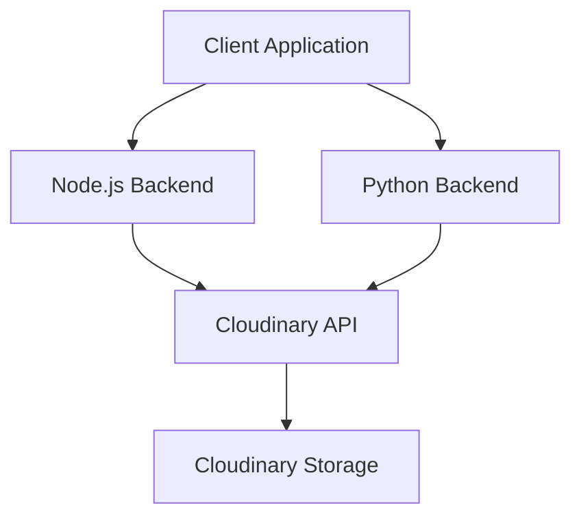

# Shared Services & Integrations

To maintain a consistent media experience across the multi-backend architecture, `shinychat` utilizes **Cloudinary** as a centralized service for image hosting, transformation, and delivery. This ensures that regardless of which backend processes a request, image assets are stored and served from a unified source.

## Architecture Overview

The following diagram illustrates how both the Node.js and Python backends interface with the Cloudinary API to handle media uploads.




## Implementation

### Node.js Backend

In the Node.js environment, Cloudinary is configured as a singleton library. It leverages `dotenv` to load credentials during the initialization phase, ensuring that the API client is authenticated before any requests are made.

**File:** `backend/src/lib/cloudinary.js`

```javascript
import {v2 as cloudinary} from "cloudinary"
import { config } from 'dotenv'

config();

cloudinary.config(
    {
        cloud_name: process.env.CLOUDINARY_CLOUD_NAME,
        api_key: process.env.CLOUDINARY_API_KEY,
        api_secret: process.env.CLOUDINARY_API_SECRET,
    }
);

export default cloudinary;
```

### Python Backend

The Python backend implements a utility wrapper around the Cloudinary SDK. It uses a centralized `settings` object for configuration and provides an asynchronous-ready helper function to process base64 encoded images.

**File:** `backend_py/app/utils/cloudinary.py`

```python
import cloudinary
import cloudinary.uploader
from app.core.config import settings

cloudinary.config(
    cloud_name=settings.cloudinary_cloud_name,
    api_key=settings.cloudinary_api_key,
    api_secret=settings.cloudinary_api_secret
)

async def upload_image(image_base64: str) -> str:
    """Uploads base64 image string to Cloudinary and returns secure URL."""
    # Cloudinary's python SDK upload is blocking, but it handles base64 natively
    result = cloudinary.uploader.upload(image_base64)
    return result.get("secure_url")
```

## Configuration Requirements

Both backends require the following environment variables to be defined to establish a connection with the service:

| Variable | Description | Backend |
| :--- | :--- | :--- |
| `CLOUDINARY_CLOUD_NAME` | Your unique Cloudinary cloud identifier | Node.js / Python |
| `CLOUDINARY_API_KEY` | The API key for authentication | Node.js / Python |
| `CLOUDINARY_API_SECRET` | The API secret for secure requests | Node.js / Python |

## Key Technical Details

1. **Base64 Handling**: The Python implementation is specifically optimized to handle `image_base64` strings. The Cloudinary SDK natively parses these strings, removing the need for manual decoding to binary buffers before upload.
2. **Consistency**: By using the same cloud credentials across both backends, `shinychat` ensures that all uploaded media is stored in a single bucket, simplifying asset management and CDN caching.
3. **Secure Delivery**: Both implementations are configured to return and utilize the `secure_url`, ensuring all media is delivered over HTTPS.