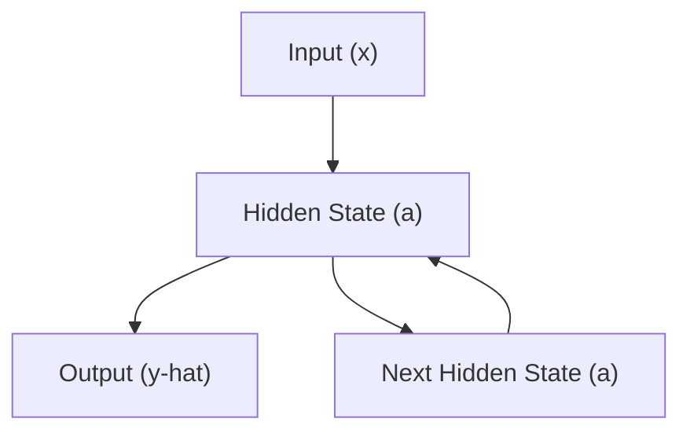
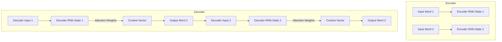

```md
# Sequence Models and Applications

Sequence models are fundamental in deep learning for processing data where order matters, such as text, time series, and audio. They excel at capturing temporal dependencies and have enabled breakthroughs in Natural Language Processing (NLP), speech recognition, and more.

## Understanding Sequence Models

The core idea behind sequence models is to process input data step-by-step, maintaining an internal state that summarizes past information. This allows the model to make predictions based on the entire sequence context, rather than just individual, independent data points.

### Why Sequence Models?

Traditional neural networks struggle with sequential data because they treat each input independently. Sequence models, like Recurrent Neural Networks (RNNs), overcome this by introducing a recurrent connection that allows information to persist across time steps.

```
The recurrent neural network that passes on the activation to the next time step for it to use.
The recurrent neural network scans through the data from left to right. The parameters it uses for each time step are shared.
```

### Recurrent Neural Network (RNN) Model

An RNN processes sequences by iterating through them, updating its hidden state at each step. This hidden state acts as a memory, carrying information from previous elements in the sequence to inform the processing of current and future elements.

```
What is RNN?
Unlike traditional feedforward neural networks, RNNs have connections that form directed cycles. This allows them to maintain a "memory" of previous inputs by using their internal state, making them particularly useful for tasks that involve sequential data or time series, such as:
```

The "unrolled" representation of an RNN clearly illustrates this sequential processing across time steps.





### Backpropagation Through Time (BPTT)

Training RNNs involves backpropagation, adapted for sequential data. Backpropagation Through Time (BPTT) unfolds the network across all time steps and computes gradients by propagating errors backward through this unrolled structure.

```
Backpropagation Through Time


```

### Challenges with Basic RNNs: Vanishing and Exploding Gradients

Basic RNNs can suffer from vanishing or exploding gradients, especially for long sequences. Vanishing gradients make it hard for the model to learn long-term dependencies, as the influence of early inputs diminishes significantly by the time they reach later time steps. Exploding gradients, conversely, can destabilize training.

```
Vanishing Gradients with RNNs
The vanishing gradient problem occurs because the error associated with later timesteps has a hard time propagating back to affect the computations of earlier timesteps.
Exploding Gradients - Gradient Clipping: rescaling the gradient vectors if they exceed a certain threshold.
```

## Advanced Sequence Models

To address the limitations of basic RNNs, more sophisticated architectures like Gated Recurrent Units (GRUs) and Long Short-Term Memory (LSTM) networks were developed.

### Gated Recurrent Unit (GRU)

GRUs introduce "gates" that control the flow of information, allowing the network to selectively remember or forget information. This helps mitigate the vanishing gradient problem and capture longer dependencies.

```
The GRU unit computes the output activation (a) and can be used to make predictions (y hat).
The GRU unit has two gates: the update gate (Gamma_u) and the relevance gate (Gamma_r).
The update gate determines when to update the memory cell value, while the relevance gate determines the relevance of the previous memory cell value.
```

### Long Short-Term Memory (LSTM)

LSTMs are similar to GRUs but feature a more complex gating mechanism, typically including an input gate, forget gate, and output gate. This enhanced control over the cell state makes LSTMs highly effective for learning long-range dependencies in sequential data.

```
LSTM units have three gates: the update gate, the forget gate, and the output gate.
The update gate controls whether or not to update the memory cell with a candidate value.
The forget gate controls which information to forget from the memory cell.
The output gate determines the output of the LSTM unit.
```

### Bidirectional RNNs (BRNN)

BRNNs process sequences in both forward and backward directions. This allows the model to capture context from both past and future elements, leading to more informed predictions, especially in tasks like Named Entity Recognition where future context is crucial.

```
The network computes the forward activations first and then the backward activations.
The bidirectional RNN can make predictions anywhere in the sequence by taking into account information from the past, present, and future.
```

### Deep RNNs

Stacking multiple RNN layers creates Deep RNNs, which can learn more complex patterns and hierarchical features within sequential data. Each layer can learn increasingly abstract representations of the input sequence.

```
For learning very complex functions sometimes is useful to stack multiple layers of RNNs together to build even deeper versions of these models.
```

## Applications of Sequence Models

Sequence models have a wide range of applications across various domains:

### Language Modeling and Sequence Generation

Language models estimate the probability of a sequence of words, enabling tasks like text generation, auto-completion, and machine translation.

```
A language model estimates the probability of a given sentence.
To build a language model using an RNN, you need a training set of text.
Tokenization is the process of mapping words to vectors or indices.
An RNN predicts the probability of the next word in a sequence.
```

### Speech Recognition

End-to-end deep learning models, often incorporating sequence models, can directly transcribe spoken audio into text, eliminating the need for intermediate hand-engineered features like phonemes.

```
In speech recognition, the number of input time steps (audio frames) is often larger than the number of output time steps (transcript characters). This misalignment makes it challenging to directly map the input to the output. The CTC cost function allows for flexible alignment between the input and output sequences.
```

### Sentiment Analysis

Sequence models can analyze text to determine its sentiment (positive, negative, neutral). Unlike simple bag-of-words models, RNNs can consider word order and context to provide more accurate sentiment predictions.

```
RNN for sentiment classification


```

## Word Representation and Embeddings

Representing words effectively is crucial for sequence models, especially in NLP. One-hot encoding, while simple, fails to capture semantic relationships between words.

### Word Embeddings

Word embeddings represent words as dense, low-dimensional vectors in a continuous vector space. Words with similar meanings are mapped to nearby points in this space, allowing models to generalize better and capture semantic similarities.

```
Properties of Words Embeddings


sim = similarity e_w is such that it is similar to e_king - e_man + e_woman
where e_w = embedding of word w
```

### Learning Word Embeddings: Word2Vec and GloVe

Algorithms like Word2Vec (Skip-gram and CBOW) and GloVe learn word embeddings by analyzing word co-occurrence statistics in large text corpora. These methods are computationally efficient and produce high-quality embeddings.

```
Word2Vec
Simpler and computationally efficient algorithm.
1. Skip-grams : The model learns the mapping from a context word to a target word within a certain window.
2. The model uses a softmax unit to output the probabilities of different target words given the context word.
3. The loss function for softmax is -y*log(y_hat).
```

```
GloVe Word Vectors
The algorithm optimizes the difference between theta i transpose e j and log of X ij squared.
X ij represents the number of times word i appears in the context of word j.
```

### Debiasing Word Embeddings

Word embeddings can inadvertently capture societal biases present in the training data (e.g., gender, ethnicity). Techniques exist to identify and mitigate these biases, ensuring fairer and more equitable representations.

```
Reducing bias in word embeddings
- Identify bias direction
- Neutralize
- Equalize pairs
```

## Sequence-to-Sequence Models and Attention

Sequence-to-sequence (Seq2Seq) models, often built with RNNs or Transformers, are designed for tasks where the input and output are both sequences, such as machine translation and text summarization.

### Encoder-Decoder Architecture

A typical Seq2Seq model consists of an encoder that processes the input sequence into a context vector, and a decoder that generates the output sequence from this context vector.

```
Encoder: The encoder network takes an input sequence, such as a sentence in a source language, and processes it to create a fixed-length representation called the "context vector" or "thought vector".
Decoder: The decoder network takes the context vector generated by the encoder and uses it to generate an output sequence, such as a translated sentence in a target language.
```

### Beam Search

Beam search is a decoding algorithm used in Seq2Seq models to find a more optimal output sequence than greedy search. It explores multiple promising translation hypotheses simultaneously, balancing exploration and exploitation.

```
Beam Search ⇒ approximate search algorithm
given an input sentence, we do not want to output a random translation but rather the best and a more likely translation.
Beam search is an algo to this .
```

### Attention Mechanism

The attention mechanism significantly enhances Seq2Seq models, especially for long sequences. Instead of relying solely on a fixed-size context vector, attention allows the decoder to dynamically focus on different parts of the input sequence at each decoding step, improving translation quality and handling longer inputs more effectively.

```
The context vector is a weighted sum of the features from different time steps, based on the attention weights.
The attention model can be computationally expensive, as it requires computing attention weights for each word in the input sentence. This results in a quadratic cost if the input and output sentences are long.
```





## Key Takeaways

*   Sequence models are essential for tasks involving ordered data like text and time series.
*   RNNs, GRUs, and LSTMs are core architectures for processing sequential information, with GRUs and LSTMs offering improved performance on long sequences by mitigating vanishing gradients.
*   Word embeddings provide dense, semantic representations of words, enabling better generalization and understanding of language.
*   Seq2Seq models, augmented with attention mechanisms and efficient decoding strategies like beam search, have revolutionized tasks such as machine translation and speech recognition.
*   The Transformer architecture, with its self-attention mechanism, further advanced parallel processing of sequences, becoming a dominant model in modern NLP.
```