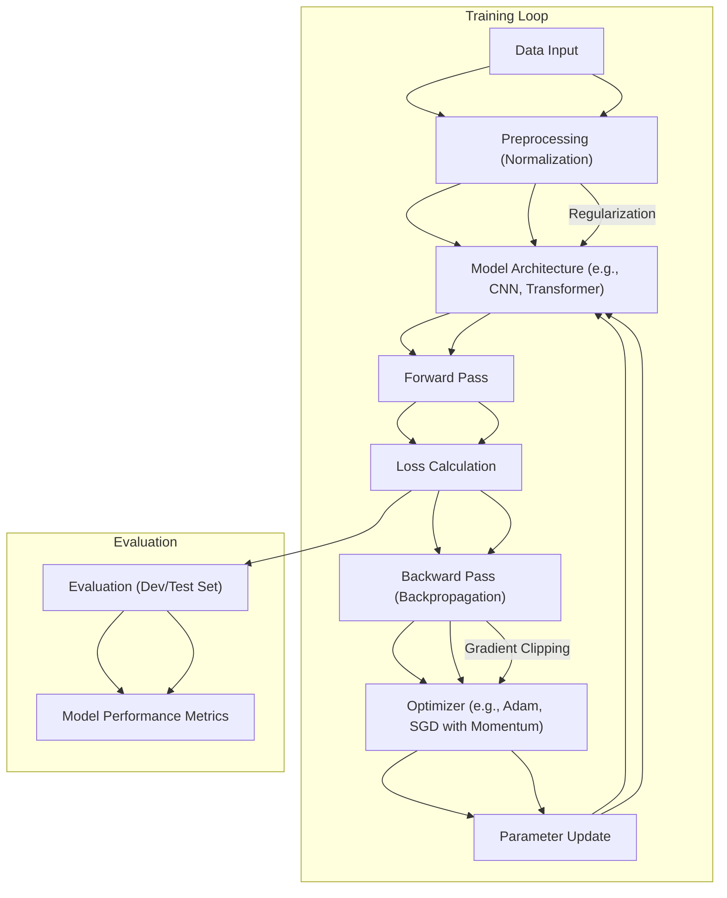

# Advanced Deep Learning Topics

This section delves into sophisticated concepts and modules within deep learning, building upon foundational knowledge to address complex challenges in model development and optimization.

## Train/Dev/Test Set Strategy

Effective deep learning necessitates a well-defined data partitioning strategy. The training set is paramount for model learning, the development (dev) set is crucial for hyperparameter tuning and model selection, and the test set provides an unbiased evaluation of the final model's performance. It's critical that the dev and test sets originate from the same data distribution to ensure meaningful evaluation.

```markdown
We split data as Training - on which model is trained; Development - on which few best models are observed; Test - to get unbiased accuarcy of the best model. Presence of test set is optional.
```

## Bias and Variance Analysis

Understanding the interplay between bias and variance is fundamental to diagnosing and resolving model performance issues. High bias indicates underfitting, where the model is too simple to capture the underlying data patterns. High variance suggests overfitting, where the model has learned the training data too well, including noise, and fails to generalize to unseen data.

```markdown
We can identify if we have a high bias or a high variance issue from the train set and dev set errors.
```

```markdown
For high bias and high variance the model is underfitting and overfitting the data at the same time.
```

## Regularization Techniques

Regularization methods are employed to mitigate overfitting and improve model generalization. L2 regularization, also known as weight decay, penalizes large weights, encouraging simpler models. L1 regularization, while less common in deep learning, can lead to sparse weight matrices by driving some weights to exact zero.

```markdown
The regularization term penalizes large values of W. The alternative term for L2 regularization is weight decay. For the matrix w, this norm is called the Frobenius norm.
```

### Dropout Regularization

Dropout is a powerful regularization technique where randomly selected neurons are ignored (zeroed out) during training. This prevents co-adaptation between neurons and encourages the network to learn more robust, distributed representations. During inference, dropout is not applied.

```markdown
Not to use dropout reg. in Testing
```

## Input Normalization

Normalizing input features is essential when features have vastly different scales. This process typically involves subtracting the mean and dividing by the standard deviation of each feature, ensuring all features are on a similar scale. This can significantly speed up gradient descent convergence.

```markdown
Normalisation is to be done with same parameters on both training and test sets. It helps to bring different parameters on different scales, on similar scales, which speeds up gradient descent.
```

## Vanishing and Exploding Gradients

In deep networks, gradients can either shrink exponentially (vanishing) or grow exponentially (exploding) during backpropagation. This can severely hinder or even halt the learning process. Careful weight initialization and optimization algorithms are key to addressing these issues.

```markdown
These problems occur when the derivatives or slopes of the network's parameters become very large or very small, making training difficult.
```

### Weight Initialization

Proper weight initialization is crucial for mitigating vanishing and exploding gradients. Techniques like Xavier and He initialization aim to set initial weights such that the variance of activations and gradients remains relatively stable across layers, promoting smoother training.

```markdown
Proper Initialization: By starting with weights that have a reasonable variance (e.g., 1/n or 2/n), the network is more likely to converge to a lower training (and generalization) error.
```

## Optimization Algorithms

### Mini-batch Gradient Descent

Mini-batch gradient descent offers a balance between the computational efficiency of stochastic gradient descent and the stability of batch gradient descent. It processes data in small batches, leading to faster convergence and more stable updates compared to processing individual examples.

```markdown
Rather than applying gradient descent for the whole training set, we can divide it into mini batches which is more efficient, this technique also make the training way faster (i.e. faster convergence to minima of cost function).
```

### Gradient Descent with Momentum

Momentum accelerates gradient descent by incorporating an exponentially weighted average of past gradients. This helps to smooth out oscillations and speed up convergence, especially in directions with consistent gradients.

```markdown
It will always work better than normal gd algorithm. We use the EWA of the gradient terms.
```

### RMSprop and Adam

RMSprop (Root Mean Square Propagation) adapts the learning rate for each parameter based on the magnitudes of recent gradients. Adam (Adaptive Moment Estimation) further enhances this by combining the benefits of momentum and RMSprop, making it a highly effective and widely used optimization algorithm.

```markdown
Adam (Adaptive Moment Estimation) optimization algorithm is basically putting momentum and RMSprop together and combines the effect of gradient descent with momentum together with gradient descent with RMSprop.
```

## Learning Rate Decay

Gradually decreasing the learning rate over epochs (learning rate decay) can help the optimization process converge more precisely to the minimum. As the model approaches the optimal solution, smaller updates become more beneficial.

```markdown
The concept of learning rate decay involves gradually reducing the learning rate over time to achieve better convergence and avoid getting stuck in local optima.
```

## Hyperparameter Tuning

The process of finding optimal hyperparameters is critical for model performance. Strategies like random search and a "coarse-to-fine" approach can efficiently explore the hyperparameter space. For hyperparameters like learning rates that span several orders of magnitude, sampling on a logarithmic scale is preferred.

```markdown
We can organise them priority wise. One way to find the best values, for instance out of 2 hyperparameters, is to plot some random points in a 2-D space, where each axis denotes each of those 2 hyperparameters.
```

```markdown
If we want a random number between 0.0001 and 1 then we will bet 90% of the numbers from 0.1 to 1, so to get uniformity among the random selections we can use log scale rather than a linear scale.
```

## Normalizing Activations (Batch Normalization)

Batch Normalization (Batch Norm) is a technique that normalizes the inputs to a layer within a neural network. By standardizing the mean and variance of layer inputs, Batch Norm helps to stabilize training, allows for higher learning rates, and acts as a regularizer. It significantly reduces the problem of "covariate shift."

```markdown
Batch normalization is an algorithm that helps in the training of neural networks by normalizing the mean and variance of hidden unit values.
```

```markdown
Batch Norm makes sure that at least the mean and variance of two similar sets X remains same so the training of weights and biases doesn’t change the activations of various layers drastically, reducing covariate shift.
```

### Batch Norm at Test Time

During testing, Batch Norm uses population statistics (typically an exponentially weighted average of the mean and variance computed during training) to ensure consistent normalization, as mini-batches are not available.

```markdown
During testing, a separate estimate of the mean and variance is needed. This is typically done using an exponentially weighted average across mini-batches.
```

## Softmax Regression

Softmax regression is an extension of logistic regression used for multi-class classification problems. It outputs a probability distribution over multiple classes, indicating the likelihood of an input belonging to each class.

```markdown
The Softmax layer computes the linear part of the final layer and applies the Softmax activation function to generate the output probabilities for each class.
```

## Deep Learning Frameworks

Modern deep learning relies on powerful frameworks that abstract away much of the low-level implementation details, allowing practitioners to focus on model architecture and training. TensorFlow and PyTorch are prominent examples.

```markdown
w is the parameter u want to optimize
```

## Key Takeaways

- Data partitioning into train, dev, and test sets is foundational.
- Bias-variance analysis guides model improvement strategies.
- Regularization techniques like L2 and Dropout combat overfitting.
- Careful weight initialization and optimization algorithms (Momentum, RMSprop, Adam) address training instabilities.
- Hyperparameter tuning requires systematic exploration, often using logarithmic scales and coarse-to-fine strategies.
- Batch Normalization stabilizes training and accelerates convergence by normalizing layer inputs.
- Softmax regression is the go-to for multi-class classification.




