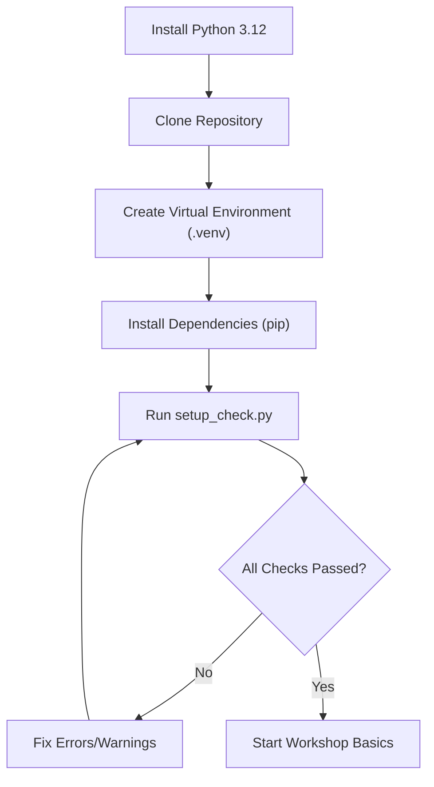

# Getting Started

Welcome to the **OpenCV Workshop**. This guide will help you set up your development environment and verify that your system is ready for computer vision tasks. This workshop is specifically designed for first-year engineering students to gain hands-on experience with image processing and real-time video analysis.

## Setup Workflow

The following diagram illustrates the sequence of steps required to move from a fresh system to a fully functional OpenCV environment.



## Installation Guide (Windows)

Follow these steps precisely to ensure compatibility with the provided scripts.

### 1. Install Python 3.12
Open PowerShell as an Administrator and run the following command:

```powershell
winget install -e --id Python.Python.3.12
```

### 2. Project Initialization
Clone the repository and navigate into the project directory:

```powershell
cd opencv-workshop-local-v2
```

### 3. Environment Isolation
To prevent package conflicts, create and activate a dedicated virtual environment:

```powershell
py -3.12 -m venv .venv
.venv\Scripts\activate
```

### 4. Install Dependencies
Install the pinned versions of the required libraries to ensure stability:

```powershell
pip install mediapipe==0.10.21
pip install opencv-python==4.8.0.74
```

## System Verification

Before starting the lessons, you must verify that your Python environment, libraries, and hardware (webcam) are functioning correctly.

### Running the Diagnostics
Execute the provided setup script:

```powershell
python setup_check.py
```

### Understanding the Results
The `setup_check.py` script will output the status of your environment using the following markers:

| Marker | Meaning | Action Required |
| :--- | :--- | :--- |
| `[OK]` | Component is installed and working | None |
| `[WARN]` | Component is working but version is non-optimal | Optional update |
| `[FAIL]` | Component is missing or malfunctioning | Must fix before proceeding |

**Common Fixes:**
- **Webcam `[FAIL]`**: Ensure no other applications (Zoom, Teams, Browser) are using the camera.
- **Library `[FAIL]`**: Run `pip install -r requirements.txt` to install all missing dependencies.
- **Python Version `[FAIL]`**: Ensure you are using Python 3.12 via the `winget` command mentioned above.

## Running Your First Script

The workshop is structured into modular files located in the `basics/` directory. All scripts in this folder rely on `constants.py` for path management, so you **must** run them from within the `basics/` folder.

```powershell
cd basics
python 1io.py
```

> **Pro Tip:** If an OpenCV window appears frozen, click on the window to give it focus and press any key (or `Q`/`ESC` as specified in the Quick Reference) to close it.