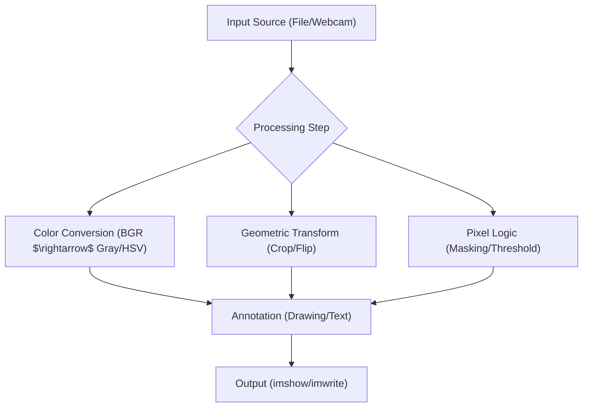

# Fundamental Image Processing

This section covers the bedrock of computer vision: how to ingest visual data, understand its underlying structure, and manipulate pixels through geometric and logical operations.

## Image and Video I/O

OpenCV treats images as NumPy arrays. The primary workflow involves reading a file from disk, processing the array, and either displaying it in a window or writing it back to a file.

### Static Images
- `cv2.imread(path)`: Loads an image. If the path is invalid, it returns `None`.
- `cv2.imshow(window_name, image)`: Opens a GUI window to display the image.
- `cv2.imwrite(path, image)`: Saves the NumPy array as an image file.
- `cv2.waitKey(delay)`: Pauses execution. A delay of `0` waits indefinitely for a key press.

### Video and Webcam
Video is handled as a sequence of frames. The `cv2.VideoCapture` object manages the stream, while `cv2.VideoWriter` handles the output.

```python
cap = cv2.VideoCapture(0) # 0 is the default camera index
ret, frame = cap.read()   # ret is a boolean indicating success
```

To save video, a **FourCC** (Four Character Code) is required to specify the codec (e.g., `XVID`).

## Image Representation and Color Spaces

In OpenCV, images are represented as 3D NumPy arrays with the shape `(height, width, channels)`.

### The BGR Default
Unlike most libraries that use RGB, **OpenCV loads images in BGR order**. This is a legacy design choice. When integrating with other libraries (like Matplotlib), you must convert BGR to RGB.

### Color Space Conversions
Color spaces are used to isolate specific information (like brightness or hue) to make detection easier.

| Color Space | Use Case | Channels |
| :--- | :--- | :--- |
| **BGR** | Standard display/storage | Blue, Green, Red |
| **Grayscale** | Edge detection, shape analysis | Intensity (0-255) |
| **HSV** | Color-based segmentation (Hue, Saturation, Value) | Hue (0-179), S, V |
| **LAB** | Perceptual uniformity (Lightness, A, B) | L, A, B |

Conversion is handled via `cv2.cvtColor(src, code)`.

## Drawing Primitives

Drawing functions allow you to annotate images, which is essential for visualizing bounding boxes or keypoints.

### Basic Shapes
All drawing functions modify the original image array in place.

- **Rectangles**: `cv2.rectangle(img, pt1, pt2, color, thickness)`
- **Circles**: `cv2.circle(img, center, radius, color, thickness)`
- **Lines**: `cv2.line(img, pt1, pt2, color, thickness)`
- **Polygons**: `cv2.polylines(img, [pts], isClosed, color, thickness)`
- **Text**: `cv2.putText(img, text, org, font, scale, color, thickness)`

*Note: A thickness of `-1` fills the shape.*

### Semi-Transparent Overlays
To create transparency, draw the shape on a copy of the image and blend it with the original using `cv2.addWeighted(src1, alpha, src2, beta, gamma)`.

## Bitwise Operations and Thresholding

These operations treat pixel values as binary data to create masks or isolate regions of interest.

### Bitwise Logic
- **NOT**: Inverts pixel values (0 becomes 255).
- **AND**: Keeps pixels only where both images (or the mask) are non-zero. Used for masking.
- **OR**: Keeps pixels if either image is non-zero.

### Image Geometry
- **Cropping**: Performed via NumPy slicing: `img[y_start:y_end, x_start:x_end]`.
- **Flipping**: `cv2.flip(img, flipCode)` where `1` is horizontal and `0` is vertical.

### Thresholding
Thresholding converts a grayscale image into a binary (black and white) image.

1. **Binary Thresholding**: Pixels above a global value are set to 255, others to 0.
2. **Adaptive Thresholding**: Calculates the threshold for small regions, making it robust to uneven lighting.
3. **Otsu's Binarization**: Automatically calculates the optimal threshold value based on the image histogram.



## Summary Table of Fundamental Functions

| Function | Purpose | Key Parameter |
| :--- | :--- | :--- |
| `cv2.imread` | Load image | `filename` |
| `cv2.cvtColor` | Change color space | `COLOR_BGR2GRAY`, `COLOR_BGR2HSV` |
| `cv2.resize` | Change dimensions | `(width, height)` |
| `cv2.threshold` | Binarize image | `thresh`, `maxval`, `type` |
| `cv2.bitwise_and` | Apply mask | `mask=mask_array` |
| `cv2.addWeighted` | Image blending | `alpha`, `beta` (weights) |