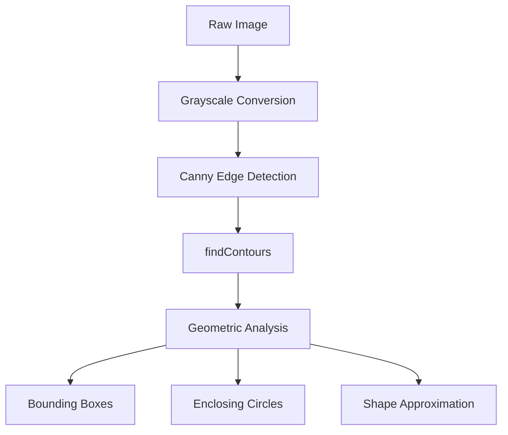

# Image Filtering and Analysis

This section explores the fundamental techniques used to clean, enhance, and analyze image data. By manipulating pixels through convolution kernels and statistical distributions, we can remove noise, sharpen details, and isolate objects within a scene.

## Image Filtering

Filtering involves modifying each pixel based on the values of its neighbors. This process is essential for pre-processing images to remove noise or prepare them for edge detection.

### Filter Comparison

| Filter | Technique | Best Use Case | Key Characteristic |
| :--- | :--- | :--- | :--- |
| **Gaussian Blur** | Weighted average (Bell curve) | General smoothing | Reduces high-frequency noise |
| **Median Blur** | Median of neighborhood | Salt-and-pepper noise | Preserves edges better than Gaussian |
| **Bilateral Filter** | Distance + Color similarity | Noise removal with sharp edges | Non-linear; keeps boundaries crisp |
| **Sharpening** | Custom High-pass kernel | Enhancing detail | Amplifies contrast between neighbors |

```python
# Example: Applying Gaussian Blur
gaussian = cv2.GaussianBlur(img, (5, 5), 0)

# Example: Applying Median Blur
median = cv2.medianBlur(img, 5)

# Example: Applying Bilateral Filter
bilateral = cv2.bilateralFilter(img, 9, 75, 75)
```

## Image Histograms

A histogram represents the distribution of pixel intensities. In a grayscale image, the X-axis represents brightness (0–255) and the Y-axis represents the number of pixels at that intensity.

### Brightness Adjustment
By adding a constant offset to every pixel (and clamping the result between 0 and 255), we can shift the histogram left (darker) or right (brighter).

**Key Function:** `cv2.calcHist()` is used to compute the frequency of intensity values, which can then be normalized for visualization.

## Convolution Kernels and Padding

Convolution is the mathematical foundation of most image filters. A **kernel** is a small matrix that slides across the image, performing a weighted sum of the current pixel and its neighbors.

### Custom Kernels
You can define your own kernels to achieve specific effects using `cv2.filter2D()`:

*   **Sharpen:** High center weight with negative surrounding weights.
*   **Emboss:** Asymmetric gradients that create a 3D relief effect.

### Padding (Borders)
When a kernel reaches the edge of an image, it lacks enough neighbors to complete the calculation. Padding solves this by adding a border:
*   `BORDER_CONSTANT`: Adds a solid colored frame.
*   `BORDER_REFLECT`: Mirrors the image content at the boundary for a seamless transition.

## Edge Detection and Contour Analysis

Edge detection identifies areas where image brightness changes sharply, typically signifying an object's boundary.

### Detection Pipeline
1.  **Sobel Operator**: Calculates the gradient of image intensity in a specific direction (X or Y).
2.  **Canny Edge Detector**: A multi-stage algorithm that includes noise reduction and hysteresis thresholding to find thin, clean edges.

### Contour Analysis
Contours are the "connect-the-dots" outlines of shapes found in binary images (like those produced by Canny).



### Geometry Extraction
Once contours are found via `cv2.findContours()`, you can extract meaningful data:
- **Area**: `cv2.contourArea(cnt)` — Used to filter out noise blobs.
- **Perimeter**: `cv2.arcLength(cnt, True)`.
- **Approximation**: `cv2.approxPolyDP()` — Reduces the number of vertices to simplify the shape.
- **Bounding Box**: `cv2.boundingRect(cnt)` — Finds the smallest axis-aligned rectangle containing the object.