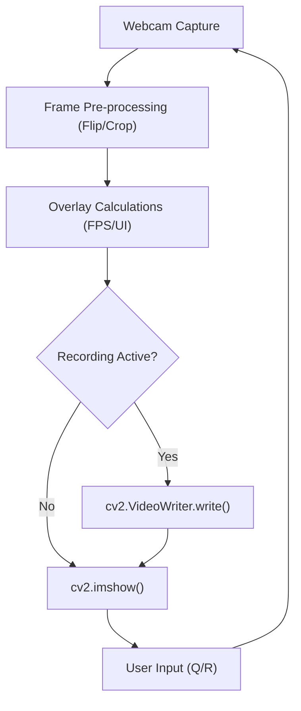

# Motion and Mathematical Animation

This section covers the transition from static image processing to dynamic visual systems. You will learn how to build robust video pipelines, use trigonometry for 2D animations, project 3D coordinates onto a 2D plane, and implement physics-based particle systems.

## Video Pipeline and Recording

A video pipeline is a continuous loop of capturing, processing, and displaying frames. Implementing a recording feature requires synchronizing the capture rate with a `VideoWriter` object to ensure the output video plays back at the correct speed.

### Key Concepts
- **FPS Calculation**: Calculated as the inverse of the time delta between two consecutive frames.
- **FourCC Codec**: A 4-byte code used to specify the video codec (e.g., `MJPG` for Motion JPEG).
- **State Management**: Using boolean flags (like `recording`) to toggle between live preview and disk writing.

## Trigonometry-Based Animation

To create smooth motion, we utilize parametric equations of a circle. By incrementing an angle over time and calculating the sine and cosine, we can position vertices of a polygon to create rotation.

### The Math behind Rotation
For any vertex in a regular polygon:
- $x = c_x + r \cdot \cos(\theta)$
- $y = c_y + r \cdot \sin(\theta)$

Where $(c_x, c_y)$ is the center, $r$ is the radius, and $\theta$ is the current angle in radians. By adding a time-based offset to $\theta$, the object rotates around the center.

## 3D Rotation and Projection

Rendering 3D objects on a 2D screen requires **Orthographic Projection**. This process involves rotating 3D coordinates $(x, y, z)$ using rotation matrices and then simply ignoring the $z$-axis to "flatten" the image.

### Rotation Matrices
To rotate a vertex $v$ around an axis, we use a dot product with a rotation matrix:

**Y-Axis Rotation (Spin):**
$$
\begin{bmatrix} \cos(\theta) & 0 & \sin(\theta) \\ 0 & 1 & 0 \\ -\sin(\theta) & 0 & \cos(\theta) \end{bmatrix}
$$

**X-Axis Rotation (Tilt):**
$$
\begin{bmatrix} 1 & 0 & 0 \\ 0 & \cos(\theta) & -\sin(\theta) \\ 0 & \sin(\theta) & \cos(\theta) \end{bmatrix}
$$

The final 2D screen position is derived by scaling the rotated $x$ and $y$ values and offsetting them by the screen center.

## Particle Systems

Particle systems simulate fluid-like effects (explosions, smoke, fire) by managing a collection of independent objects that follow simple physics rules.

### Particle Life Cycle
Each particle is treated as an object with the following attributes:
1. **Velocity**: Initialized using polar coordinates (random angle and speed) and converted to Cartesian $(v_x, v_y)$.
2. **Gravity**: A constant value added to the vertical velocity ($v_y$) every frame, creating a parabolic arc.
3. **Lifespan**: An integer that decrements every frame. Once it reaches zero, the particle is removed from the system to optimize memory.

### Event-Driven Interaction
By utilizing `cv2.setMouseCallback`, you can trigger the instantiation of multiple `Particle` objects at specific $(x, y)$ coordinates, allowing for interactive visual effects.