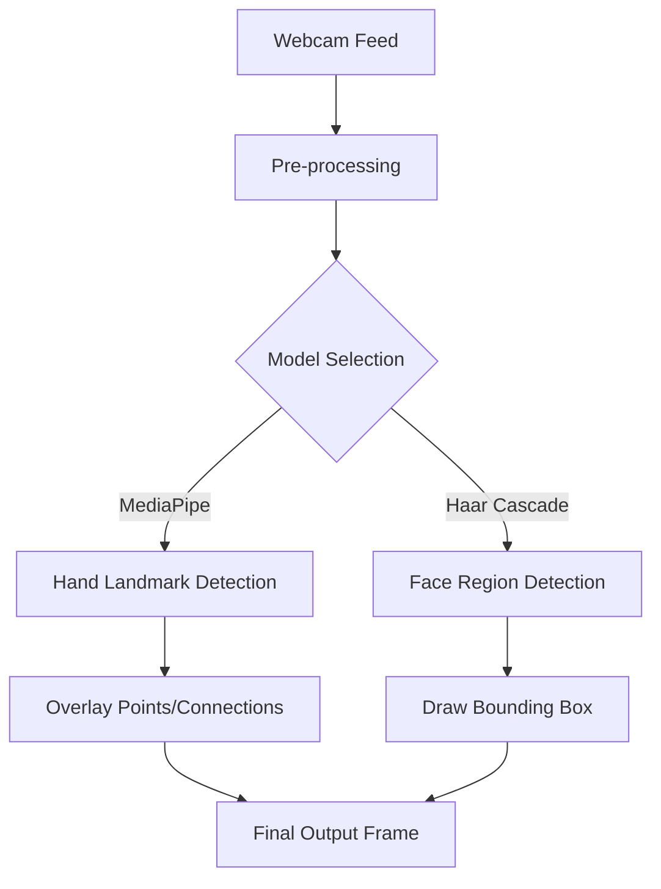

# Computer Vision and Tracking

This section explores the implementation of pre-trained computer vision models to perform real-time object detection and landmark tracking. By leveraging **MediaPipe** and **OpenCV's Haar Cascades**, we can transform raw video frames into actionable spatial data.

## Conceptual Workflow

The following diagram illustrates the pipeline used for both hand and face detection:



---

## Hand Tracking with MediaPipe

MediaPipe provides a high-fidelity hand and finger tracking solution. It identifies **21 3D hand landmarks** on each hand, allowing for complex gesture recognition and interaction.

### Technical Implementation
The implementation follows a specific pipeline to ensure compatibility with the MediaPipe API:

1.  **Color Space Conversion**: OpenCV captures frames in `BGR` format, but MediaPipe requires `RGB`.
2.  **Processing**: The `hands.process()` method analyzes the RGB frame to locate hand landmarks.
3.  **Visualization**: The `mp_draw.draw_landmarks` utility maps the detected coordinates back onto the original BGR frame.

### Code Analysis: `basics/13_mediapipe_hand_tracking.py`

```python
# Key Configuration
hands = mp_hands.Hands(
    model_complexity=0,        # 0 for faster performance, 1 for higher accuracy
    max_num_hands=2,           # Limit detection to two hands
    min_detection_confidence=0.5,
    min_tracking_confidence=0.5
)
```

**Requirements:**
- **Python Version**: $\le$ 3.12
- **Dependency**: `pip install mediapipe==0.10.21`

---

## Face Detection with Haar Cascades

Face detection is implemented using **Haar Cascade Classifiers**, a machine learning object detection method used to identify objects in images or video.

### Technical Implementation
Unlike landmark tracking, Haar Cascades focus on identifying the bounding box of a face by analyzing contrast (light and dark regions) of the image.

1.  **Grayscale Conversion**: To reduce computational complexity and focus on intensity gradients, the frame is converted to grayscale.
2.  **Multi-Scale Detection**: The `detectMultiScale` function scans the image at different scales to find faces of varying sizes.
3.  **Bounding Box**: Once detected, the coordinates $(x, y, w, h)$ are used to draw a rectangle around the face.

### Code Analysis: `basics/18face_detection.py`

```python
# Initialize the classifier with a pre-trained XML file
face_cascade = cv2.CascadeClassifier(str(face_input_img))

# Detect faces in the grayscale image
# 1.3: Scale Factor (how much the image size is reduced at each image scale)
# 5: Min Neighbors (how many neighbors each candidate rectangle should have)
faces = face_cascade.detectMultiScale(gray, 1.3, 5)
```

## Comparison Summary

| Feature | MediaPipe Hand Tracking | Haar Cascade Face Detection |
| :--- | :--- | :--- |
| **Output** | 21 Specific Landmarks | Single Bounding Box |
| **Input Requirement** | RGB Image | Grayscale Image |
| **Complexity** | High (Deep Learning) | Low (Feature-based) |
| **Primary Use Case** | Gesture Control / Sign Language | Presence Detection / Cropping |