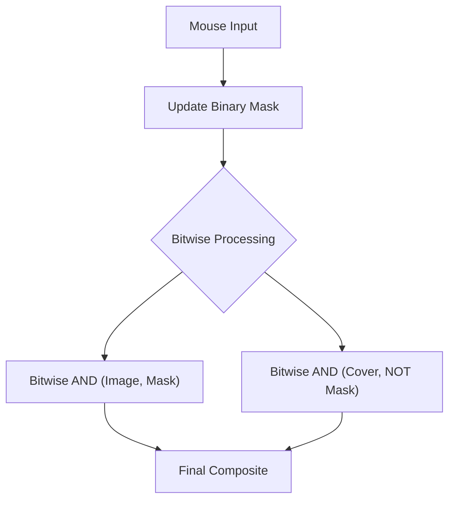

# Creative Interaction Tools

This section explores the transition from static image processing to interactive applications. By combining computer vision with user input and real-time blending, you can create engaging experiences like augmented reality (AR) filters, visual effects (VFX) layers, and interactive games.

## AR Photo Booth

The Photo Booth project demonstrates how to overlay transparent assets onto a live video feed by tracking facial landmarks using Haar Cascades.

### Alpha Blending Logic
Standard OpenCV images are BGR. To handle transparency, we use PNGs with an **Alpha Channel (BGRA)**. The core of the AR effect is the alpha blending formula:

$$\text{Output} = (\text{PNG}_{\text{pixel}} \times \alpha) + (\text{Background}_{\text{pixel}} \times (1 - \alpha))$$

Where $\alpha$ is the normalized transparency value (0.0 to 1.0).

### Face Anchoring
Since the `detectMultiScale` function returns a bounding box $(x, y, w, h)$, assets are positioned using relative offsets to ensure they stay aligned regardless of the user's distance from the camera:

- **Center Point:** $x + w/2$
- **Eye Level:** $\approx y + (h \times 0.38)$
- **Forehead/Crown:** $\approx y$ (top of the Haar box)

```python
# Example of relative positioning for sunglasses
eye_y = y + int(h * 0.38)
cy = eye_y + int(h * SUNGLASSES_OFFSET_Y)
overlay_png(frame, sunglasses_img, cx, cy, int(w * SUNGLASSES_SCALE))
```

## Visual Layering and Glow Effects

Creating "high-end" visuals in OpenCV often requires working with multiple layers rather than drawing directly on the source frame.

### The Layering Pipeline
By creating separate black canvases (`np.zeros_like`) for different effects, we can control the opacity and blending of each element independently using `cv2.addWeighted`.

1. **Ghost Layer:** Uses a `deque` (double-ended queue) to store previous coordinates, drawing circles with decreasing alpha values to create a motion trail.
2. **Core Layer:** The primary high-contrast shape.
3. **Glow Layer:** A heavily blurred version of the core layer created via `cv2.GaussianBlur`.

### Temporal Buffering
The use of `collections.deque` allows the application to "remember" the last $N$ frames of movement, enabling the creation of smooth trails without manually managing list indices.

## Virtual Scratch Cards

The scratch card implementation demonstrates the power of **Binary Masking** and **Bitwise Operations**.

### How it Works
The "Scratch" effect is achieved by maintaining a black-and-white mask where white pixels ($255$) represent areas the user has "scratched" away.



### Key Technical Implementation
- **Revealing:** `cv2.bitwise_and(hidden_img, hidden_img, mask=mask)` extracts only the parts of the hidden image where the mask is white.
- **Covering:** `cv2.bitwise_and(cover_img, cover_img, mask=cv2.bitwise_not(mask))` keeps the cover image everywhere the mask is black.
- **Soft Edges:** To prevent the reveal from looking jagged, a `GaussianBlur` is applied to the mask, and the result is used for linear interpolation between the cover and the hidden image.

## Summary Table: Interaction Techniques

| Tool | Primary OpenCV Function | Core Concept | Use Case |
| :--- | :--- | :--- | :--- |
| **Photo Booth** | `cv2.CascadeClassifier` | Alpha Blending | AR Filters, Face Tracking |
| **Layering** | `cv2.addWeighted` | Additive Compositing | VFX, UI Overlays, Glowing Effects |
| **Scratch Card** | `cv2.bitwise_and` | Binary Masking | Interactive Reveals, Games |