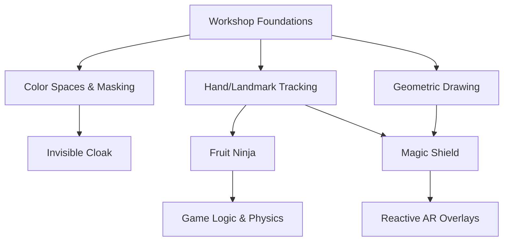

# Capstone Projects

The Capstone Projects section represents the culmination of the OpenCV workshop. Here, we transition from isolated functions to full-scale applications, integrating computer vision, mathematical physics, and real-time state management.

## Project Architecture Overview

The following diagram illustrates how foundational workshop concepts are synthesized into the final capstone applications.



---

## 1. Fruit Ninja Clone
A high-performance interactive game that uses the index fingertip as a blade to slice falling objects.

### Core Implementation Details
The project is built on a modular architecture separating tracking, entity physics, and game state.

*   **Velocity-Based Slicing**: Unlike simple collision detection, slicing requires a minimum movement speed. This is achieved by maintaining a `trail` (deque) of previous coordinates and calculating the Euclidean distance between the current and previous frame.
*   **Physics Engine**: A simple gravity constant (`GRAVITY = 0.8`) is applied to the vertical velocity (`vy`) of fruit objects every frame, creating a realistic parabolic arc.
*   **Visual Feedback**: Uses `cv2.ellipse` to create "sliced halves" that fly apart upon collision and a red overlay flash when a bomb is hit.

### Technical Highlights
| Feature | Implementation |
| :--- | :--- |
| **Input** | MediaPipe Hands (Landmark 8: Index Fingertip) |
| **Collision** | Distance formula between `tip_x, tip_y` and `fruit.x, fruit.y` |
| **Rendering** | `cv2.LINE_AA` for smooth anti-aliased edges |
| **State Machine** | Transitions between `start` $\rightarrow$ `playing` $\rightarrow$ `gameover` |

---

## 2. Invisible Cloak
A real-time "stealth" application that replaces a specific color range with a pre-captured background image.

### The Pipeline
1.  **Background Capture**: The system captures 60 frames of the empty scene to create a reference background.
2.  **Dynamic Color Sampling**: Using `cv2.setMouseCallback`, users can click on the cloak to sample the exact HSV value.
3.  **Color Segmentation**:
    *   A range is created using `selected_hsv` $\pm$ `tolerance`.
    *   `cv2.inRange` creates a binary mask.
4.  **Refinement**: `cv2.morphologyEx` with `MORPH_OPEN` removes salt-and-pepper noise from the mask.
5.  **Bitwise Compositing**:
    *   **Mask**: Extracts background where the cloak is.
    *   **Inverse Mask**: Extracts the live feed where the cloak is *not*.
    *   `cv2.addWeighted` merges the two for the final output.

---

## 3. Magic Shield
A complex Augmented Reality (AR) overlay that responds to specific hand gestures and spatial orientation.

### Advanced Concepts Applied
*   **Gesture Recognition**: The "V-sign" is detected by comparing the distance of the index and middle fingertips from the wrist against the distance of the ring and pinky fingers.
*   **Trigonometric Rendering**: 
    *   **Rotation**: The shield's angle is calculated using `math.atan2(mcp.y - wrist.y, mcp.x - wrist.x)`.
    *   **Geometry**: Mandalas are drawn by iterating through $n$ points on a circle using $\sin$ and $\cos$.
*   **Alpha Blending & Ghosting**: A `deque` stores the last 6 positions of the shield. These are rendered with decreasing `alpha` values to create a motion-blur "ghost" effect.
*   **Particle System**: A custom `particles` list manages the lifecycle of "sparks" that fly outward from the shield's perimeter, updating their velocity and lifespan independently.

### Implementation Logic
```python
# Logic for shield rotation and orientation
angle = np.degrees(math.atan2(mcp.y - wrist.y, mcp.x - wrist.x))
# Rotation speed for the mandala
spin_base = time.time() * 35 
```

---

## Summary of Integrated Skills

| Project | OpenCV Modules | Math/Physics | External Libs |
| :--- | :--- | :--- | :--- |
| **Fruit Ninja** | `cvtColor`, `circle`, `putText` | Euclidean Distance, Gravity | `mediapipe`, `numpy` |
| **Invisible Cloak** | `inRange`, `bitwise_and`, `morphologyEx` | HSV Color Space | `numpy` |
| **Magic Shield** | `GaussianBlur`, `addWeighted` | Trigonometry, Alpha Blending | `mediapipe`, `collections` |