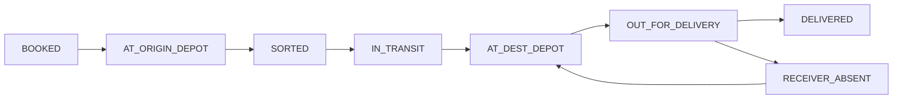
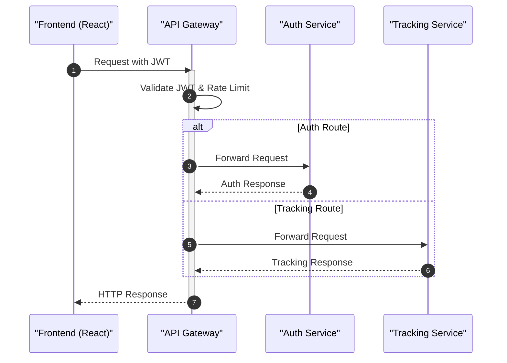

# Project Overview

DaakDash is a specialized depot-to-door parcel courier system designed for the Indian logistics landscape. The platform streamlines the movement of goods from sellers to recipients by leveraging a network of city-based depots, optimized middle-mile transport, and a secure OTP-based last-mile delivery mechanism. 

The project's philosophy is captured in its motto: *"Purani daak, nayi raftaar"* (Old postal relay, new speed).

## Core Value Propositions

DaakDash optimizes the traditional 3PL (Third-Party Logistics) model through three strategic pillars:

*   **First-Mile Efficiency:** By requiring sellers to drop parcels at city depots, the system eliminates the cost and complexity of individual pickups, keeping the first mile free and honest.
*   **Middle-Mile Optimization:** The system batches all parcels on the same origin-to-destination "lane." Depending on the distance, the system automatically selects the most efficient transport mode: **trains** for long-haul lanes and **trucks** for short-haul lanes.
*   **Secure Last-Mile Delivery:** To ensure delivery integrity, DaakDash employs an OTP handover system. Delivery partners trigger an automated call to the receiver, and delivery is only confirmed once the correct OTP is entered.

## Parcel Lifecycle

The movement of a parcel through the DaakDash network is managed by a strict state machine to prevent inconsistencies and ensure traceability.

To prevent race conditions during concurrent updates by multiple operators, the system utilizes a version column on the parcel record, ensuring that conflicts are handled explicitly rather than through silent overwrites.

## User Roles and Responsibilities

The system defines clear boundaries for different stakeholders within the logistics chain:

| Role | Scope | Key Responsibilities |
| :--- | :--- | :--- |
| **Admin** | Global | Network visibility via India map, monitoring depot stock, and tracking active orders. |
| **Seller** | Business | Booking single parcels or bulk uploading via CSV; managing business credentials. |
| **Depot Operator** | City-specific | Scanning dropped parcels, dispatching lanes, and receiving inbound batches. |
| **Delivery Partner** | City-specific | Picking up parcels (max 12), managing delivery status, and verifying OTPs. |
| **Recipient** | Public | Tracking parcel status via a public page using a tracking number (no login required). |

## High-Level System Architecture

DaakDash is implemented as a microservices architecture to ensure scalability and separation of concerns. The system is orchestrated using Docker, as defined in the `docker-compose.yml`.

### Service Map

| Service | Port | Primary Responsibility |
| :--- | :--- | :--- |
| `gateway` | 8080 | Edge security (JWT check), rate limiting, and request routing. |
| `auth` | 8081 | User onboarding, authentication, and credential delivery via SMTP. |
| `tracking` | 8082 | Core business logic for parcels, depots, batches, and OTP integration. |
| `frontend` | 3000 | Multilingual React application (EN, HI, MR, TA, BN, TE). |

### Request Flow

The following sequence illustrates how a client request is handled by the system:

## Infrastructure Stack

The production-ready environment is supported by the following infrastructure components:
- **Database:** PostgreSQL 16 for persistent storage of auth and geo-tracking data.
- **Caching/Messaging:** Redis for high-performance data handling.
- **Observability:** Prometheus and Grafana for real-time system health and monitoring.
- **External Integrations:** 
    - `2factor.in` for OTP voice calls.
    - Gmail SMTP for onboarding credentials.
    - OpenRouteService (ORS) for distance calculations.