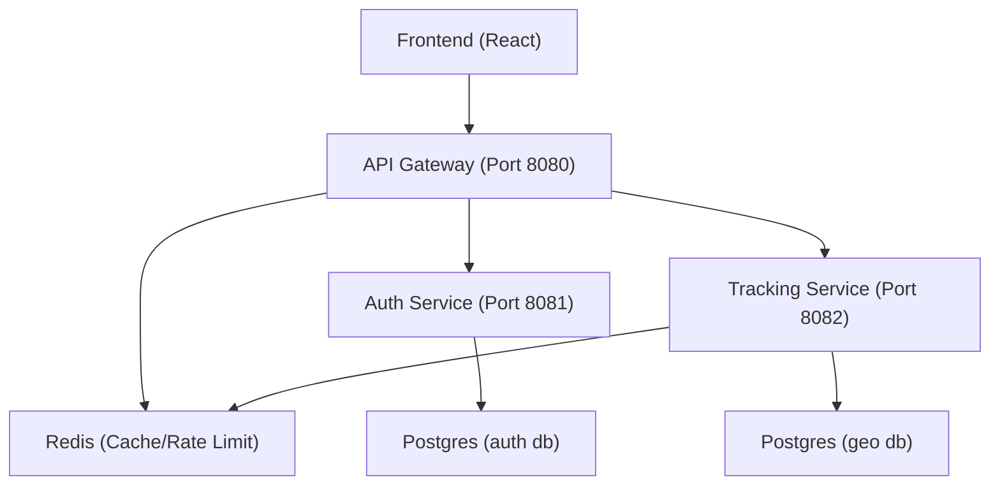
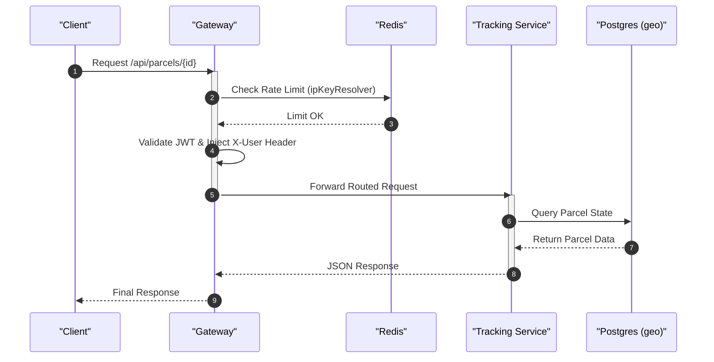

# System Architecture

DaakDash is built on a microservices architecture designed to decouple identity management from core logistics operations. The system utilizes an API Gateway as the single entry point, ensuring that cross-cutting concerns such as security, rate limiting, and request routing are handled centrally before requests reach the downstream business services.

## High-Level Component Overview

The architecture consists of several specialized services, a distributed cache for rate limiting, and a relational database for persistence.



## Service Responsibilities

The following table outlines the core responsibilities and network configurations of each service within the ecosystem:

| Service | Port | Primary Responsibility | Key Dependencies |
| :--- | :--- | :--- | :--- |
| **Gateway** | `8080` | JWT validation, rate limiting, request routing, and header injection. | Redis, Auth, Tracking |
| **Auth** | `8081` | User onboarding, credential management, and Gmail SMTP integration. | Postgres (`auth`) |
| **Tracking** | `8082` | Parcel lifecycle, depot management, batching, and OTP calls via 2factor.in. | Postgres (`geo`), Redis |
| **Frontend** | `3000` | Multilingual UI for Admins, Sellers, Depot Operators, and Partners. | Gateway |

## Request Routing and Interaction

The API Gateway acts as the orchestrator for all incoming traffic. It uses predicates to route requests to the appropriate backend service based on the URL path.

### Routing Logic
Based on the `application.yml` configuration, the routing is mapped as follows:

| Path Predicate | Destination Service | Purpose |
| :--- | :--- | :--- |
| `/api/auth/**` | `auth` | Authentication and session management |
| `/api/admin/sellers` | `auth` | Administrative seller management |
| `/api/parcels/**` | `tracking` | Parcel booking and status updates |
| `/api/depot/**` | `tracking` | Depot-specific operations |
| `/api/partner/**` | `tracking` | Delivery partner workflows |
| `/api/track/**` | `tracking` | Public parcel tracking |
| `/api/admin/**` | `tracking` | Network-wide administrative views |

### Interaction Sequence
The following sequence illustrates the flow of a request from the client through the gateway to a backend service:



## Cross-Cutting Concerns

### Security and Authentication
The system employs a JWT-based security model. The **Gateway** performs the "JWT check at the edge," ensuring that only authenticated requests proceed to the internal services. Once validated, the gateway injects trusted `X-User` headers, allowing downstream services to identify the user without re-validating the token.

### Rate Limiting
To prevent abuse, the Gateway implements a `RequestRateLimiter` backed by Redis. Different routes have varying capacities:
- **Auth Routes:** Replenish rate of 10, burst capacity of 20.
- **Tracking Routes (`/api/track/**`):** Replenish rate of 20, burst capacity of 40.

### Observability Stack
For production-ready monitoring, the architecture includes an optional observability profile:
- **Prometheus:** Scrapes metrics from the Gateway (via `/actuator/prometheus`) to track system health and request latency.
- **Grafana:** Visualizes these metrics through pre-configured dashboards (e.g., `geopulse.json`).

## Infrastructure Configuration

The system is containerized using Docker, ensuring environment parity. The `docker-compose.yml` defines the network dependencies to ensure services start in the correct order:

```yaml
# Example dependency chain from docker-compose.yml
gateway:
  depends_on:
    - auth
    - tracking
    - redis
```

The database layer is split logically, with the `auth` service connecting to the `auth` database and the `tracking` service connecting to the `geo` database, both hosted on a single Postgres 16 instance.