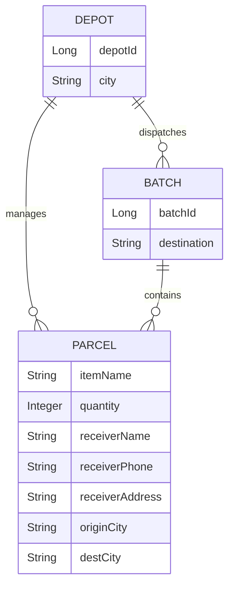

# Database Design

The DaakDash database architecture is designed to support a distributed logistics system, separating concerns between user identity management and geographical tracking operations.

## Architecture Overview

The system employs a multi-database strategy to ensure isolation between the authentication domain and the logistics/tracking domain. This is evident from the initial schema setup which segregates data into distinct logical databases.

### Database Segregation

Based on the `db/init.sql` initialization script, the system initializes two primary databases:

| Database | Purpose |
| :--- | :--- |
| `auth` | Handles user credentials, roles, and authentication-related data. |
| `geo` | Manages geographical data, depot locations, and parcel tracking information. |

```sql
-- From db/init.sql
create database auth;
create database geo;
```

## Entity Analysis

While the physical schema is initialized via SQL, the data model is further defined by the Data Transfer Objects (DTOs) used within the Tracking service.

### Parcel Entity
The `CreateParcelRequest` record defines the core attributes required for a parcel's lifecycle. This indicates that the underlying `geo` database stores parcel information including receiver details and routing cities.

**Core Parcel Attributes:**
- **Item Details:** Item name and quantity.
- **Receiver Info:** Name, phone number, and full address.
- **Routing:** Origin city and destination city.

### Depot and Batch Entities
The `DepotDetail` record reveals a hierarchical relationship between depots, parcels, and outbound batches. A depot acts as a central node in the logistics network, managing multiple categories of parcels.

**Depot Associations:**
- **Active Orders:** Parcels currently being processed.
- **Stock:** Parcels currently held at the depot.
- **Today's Outbound:** Parcels grouped into `BatchResponse` objects for transport.

## Entity-Relationship Diagram

The following diagram illustrates the logical relationship between the primary entities identified in the Tracking service.



## Data Field Mappings

The following tables map the application-level DTOs to their expected data representations in the database.

### Parcel Creation Mapping
Derived from `CreateParcelRequest.java`.

| Field | Type | Constraint | Description |
| :--- | :--- | :--- | :--- |
| `itemName` | String | Not Blank | Name of the shipped item |
| `quantity` | Integer | Optional | Number of units |
| `receiverName` | String | Not Blank | Full name of the recipient |
| `receiverPhone` | String | Not Blank | Contact number of the recipient |
| `receiverAddress`| String | Not Blank | Delivery destination address |
| `originCity` | String | Not Blank | City where the parcel started |
| `destCity` | String | Not Blank | Final destination city |

### Depot Detail Mapping
Derived from `DepotDetail.java`.

| Field | Type | Description |
| :--- | :--- | :--- |
| `depotId` | Long | Unique identifier for the logistics hub |
| `city` | String | The city where the depot is located |
| `activeOrders` | List\<Parcel\> | Collection of parcels in active processing |
| `stock` | List\<Parcel\> | Collection of parcels in storage |
| `todayOutbound` | List\<Batch\> | Collection of batches scheduled for departure |