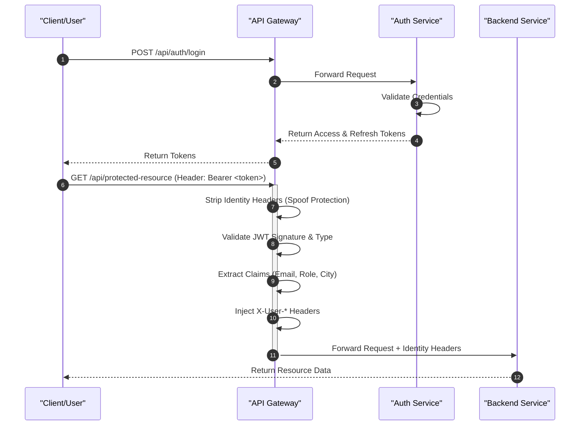

# Authentication and Security

DaakDash employs a stateless, token-based security architecture centered around JSON Web Tokens (JWT). The system utilizes a "Security Gateway" pattern where the API Gateway handles the primary authentication check and identity propagation, allowing backend microservices to remain lean and focus on business logic.

## Security Architecture Overview

The security model is split between the **Auth Service** (the Token Issuer) and the **API Gateway** (the Token Validator).

### Authentication Flow

The following sequence diagram illustrates the lifecycle of a request, from initial authentication to accessing a protected resource.



## JWT Model and Lifecycle

The `JwtService` manages the creation and parsing of tokens using HMAC-SHA keys. The system implements a dual-token strategy to balance security and user experience.

### Token Types

| Token Type | Purpose | Claims | Lifecycle |
| :--- | :--- | :--- | :--- |
| **Access Token** | Grants access to protected API endpoints. | `sub` (email), `role`, `type="access"`, `city` (optional) | Short-lived (`app.jwt.access-ttl-seconds`) |
| **Refresh Token** | Used to obtain a new access token without re-logging. | `sub` (email), `role`, `type="refresh"`, `city` (optional) | Long-lived (`app.jwt.refresh-ttl-seconds`) |

### Token Generation Logic
Tokens are constructed with the following structure in `JwtService.java`:

```java
var builder = Jwts.builder()
        .subject(email)
        .claim("role", role)
        .claim("type", type)
        .issuedAt(Date.from(now))
        .expiration(Date.from(now.plusSeconds(ttlSeconds)))
        .signWith(key);
```

## API Gateway Validation

The `JwtAuthFilter` serves as the primary security guard for the entire system. It operates as a `GlobalFilter` with an order of `-1` to ensure it executes early in the request chain.

### 1. Path Filtering
Certain endpoints are marked as `OPEN` and bypass JWT validation:
- `/api/auth/` (Login, Onboarding, Refresh)
- `/api/track/` (Public parcel tracking)
- `/api/depots` (Public depot information)
- `/actuator/` (System health and monitoring)

### 2. Anti-Spoofing Mechanism
To prevent clients from forging their identity, the gateway explicitly strips any user-identity headers provided by the client before processing the request:

```java
ServerHttpRequest stripped = exchange.getRequest().mutate()
        .headers(h -> {
            h.remove("X-User-Email");
            h.remove("X-User-Role");
            h.remove("X-User-City");
        })
        .build();
```

### 3. Identity Propagation
Once a token is validated and verified as an `access` type, the gateway promotes the JWT claims into HTTP headers. This allows downstream services to identify the user without needing to re-parse the JWT.

| JWT Claim | Injected Header | Description |
| :--- | :--- | :--- |
| `sub` | `X-User-Email` | The unique identifier/email of the user. |
| `role` | `X-User-Role` | The assigned RBAC role. |
| `city` | `X-User-City` | The user's associated city (if applicable). |

## Role-Based Access Control (RBAC)

Access control is managed through a combination of Spring Security configurations in the Auth service and header-based checks in downstream services.

### Auth Service Security Configuration
The `SecurityConfig` defines the baseline access rules for the authentication module:

- **Statelessness:** `SessionCreationPolicy.STATELESS` is used to ensure no server-side session state is maintained.
- **Permissive Endpoints:** `/api/auth/**` and `/api/admin/sellers` are permitted to allow new users to join the system.
- **Password Encoding:** `BCryptPasswordEncoder` is utilized for secure credential storage.

### Authentication Endpoints

The `AuthController` provides the following interface for security operations:

| Endpoint | Method | Description | Access |
| :--- | :--- | :--- | :--- |
| `/api/auth/login` | `POST` | Validates credentials and returns token pair. | Public |
| `/api/auth/refresh` | `POST` | Exchanges a refresh token for a new access token. | Public |
| `/api/auth/onboard/seller` | `POST` | Registers a new seller. Credentials are mailed. | Public |
| `/api/auth/onboard/partner` | `POST` | Registers a delivery partner. Credentials are mailed. | Public |

## Security Configuration Summary

The following properties govern the security behavior of the system:

| Property | Description |
| :--- | :--- |
| `app.jwt.secret` | The secret key used for signing and verifying HMAC-SHA tokens. |
| `app.jwt.access-ttl-seconds` | Duration of validity for access tokens. |
| `app.jwt.refresh-ttl-seconds` | Duration of validity for refresh tokens. |