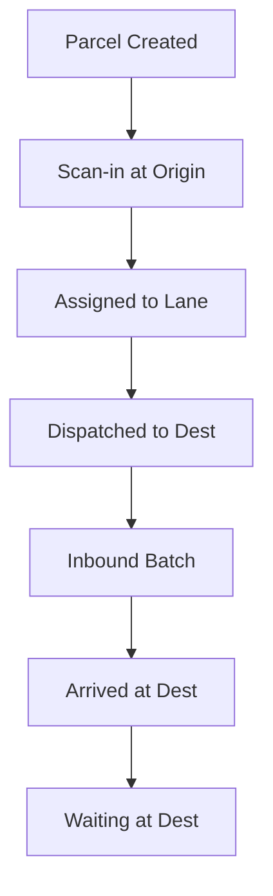
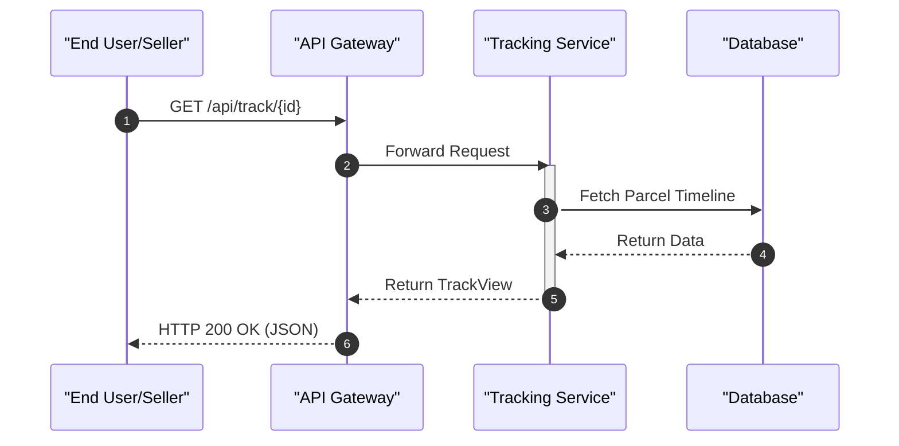

# Tracking Service

The Tracking Service is the core business engine of the DaakDash logistics system. It manages the complete lifecycle of a parcel, from creation and origin scanning to inter-depot dispatch and final arrival at the destination hub.

## Overview

The service is built as a Spring Boot application, utilizing `@EnableScheduling` to handle background tasks. It serves as the source of truth for parcel locations, depot statuses, and shipping timelines.

The service differentiates between public tracking requests and privileged depot operations, ensuring that hub operators can only manage parcels within their assigned city.

## Parcel Lifecycle and State Transitions

A parcel moves through several logical states as it progresses from the seller to the final destination. The business logic within `DepotController` and `ParcelService` governs these transitions.

### State Transition Flow



### Logic Breakdown
1.  **Creation**: Triggered via `CreateParcelRequest` with origin and destination city specifications.
2.  **Origin Processing**: The origin depot operator uses the `/scan-in` endpoint to acknowledge receipt of the parcel.
3.  **Transit**: Parcels are grouped into "lanes" based on their destination depot. The `/dispatch` endpoint moves these parcels from the origin depot toward the destination.
4.  **Destination Arrival**: Upon physical arrival, the destination depot operator uses the `/arrive` endpoint to process a specific `batchId`, moving parcels into the "waiting" state.

## Depot Operations

Depot operations are highly restricted. The service relies on headers injected by the API Gateway (`X-User-Role` and `X-User-City`) to enforce multi-tenancy and role-based access control.

### Access Control Logic
All endpoints in the `DepotController` utilize a private `depot()` helper method to validate permissions:
- **Required Roles**: Only users with the `HUB` or `ADMIN` role are permitted.
- **City Scoping**: Operators are restricted to actions involving the depot ID associated with their specific city claim.

### Depot API Endpoints

| Endpoint | Method | Description | Required Role |
| :--- | :--- | :--- | :--- |
| `/api/depot/inbound` | `GET` | Lists parcels currently inbound at the origin depot. | `HUB`, `ADMIN` |
| `/api/depot/scan-in` | `POST` | Scans a parcel into the origin depot using a tracking number. | `HUB`, `ADMIN` |
| `/api/depot/lanes` | `GET` | Retrieves available shipping lanes for the depot. | `HUB`, `ADMIN` |
| `/api/depot/dispatch` | `POST` | Dispatches all parcels in a lane to a destination depot ID. | `HUB`, `ADMIN` |
| `/api/depot/inbound-batches` | `GET` | Lists batches currently in transit to the depot. | `HUB`, `ADMIN` |
| `/api/depot/arrive` | `POST` | Marks a specific batch as arrived at the destination depot. | `HUB`, `ADMIN` |
| `/api/depot/waiting` | `GET` | Lists parcels waiting for final pickup at the destination. | `HUB`, `ADMIN` |

## Public Tracking and Discovery

The `TrackController` provides endpoints accessible to end-users and sellers, requiring no specialized roles.

### Public API Endpoints

| Endpoint | Method | Description |
| :--- | :--- | :--- |
| `/api/track/{trackingNumber}` | `GET` | Returns a `TrackView` containing the timeline of the parcel. |
| `/api/depots` | `GET` | Returns a list of all serviced cities (`DepotResponse`) for use in booking forms. |

### Tracking Request Flow



## Data Models

### Parcel Creation
When a seller books a shipment, the system expects a `CreateParcelRequest` containing the following validated fields:

```java
public record CreateParcelRequest(
    @NotBlank String itemName,
    Integer quantity,
    @NotBlank String receiverName,
    @NotBlank String receiverPhone,
    @NotBlank String receiverAddress,
    @NotBlank String originCity,
    @NotBlank String destCity
) {}
```

### Key Business Logic Components
- **`TrackingApplication`**: The entry point that initializes the Spring context and enables scheduled tasks.
- **`ParcelService`**: The internal service layer (invoked by controllers) that handles the actual state changes, depot ID mapping, and database interactions.
- **`DepotController`**: The administrative interface for hub managers to move parcels through the logistics pipeline.