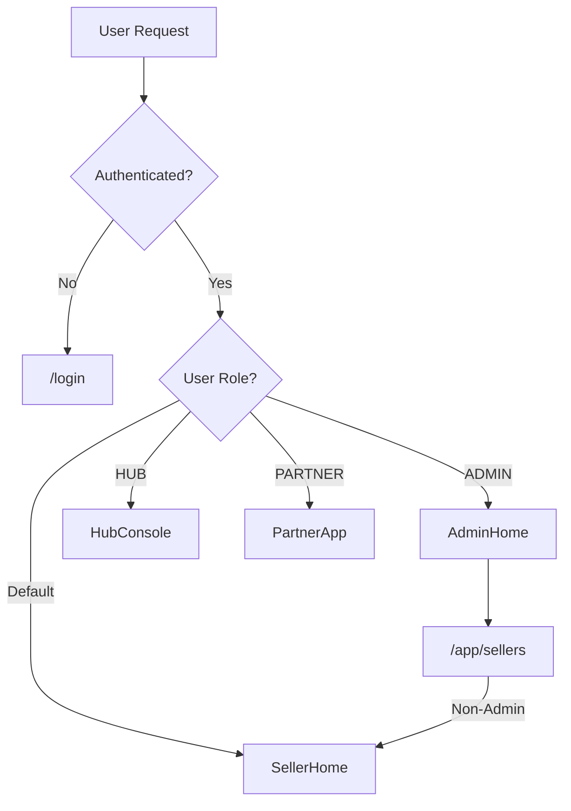
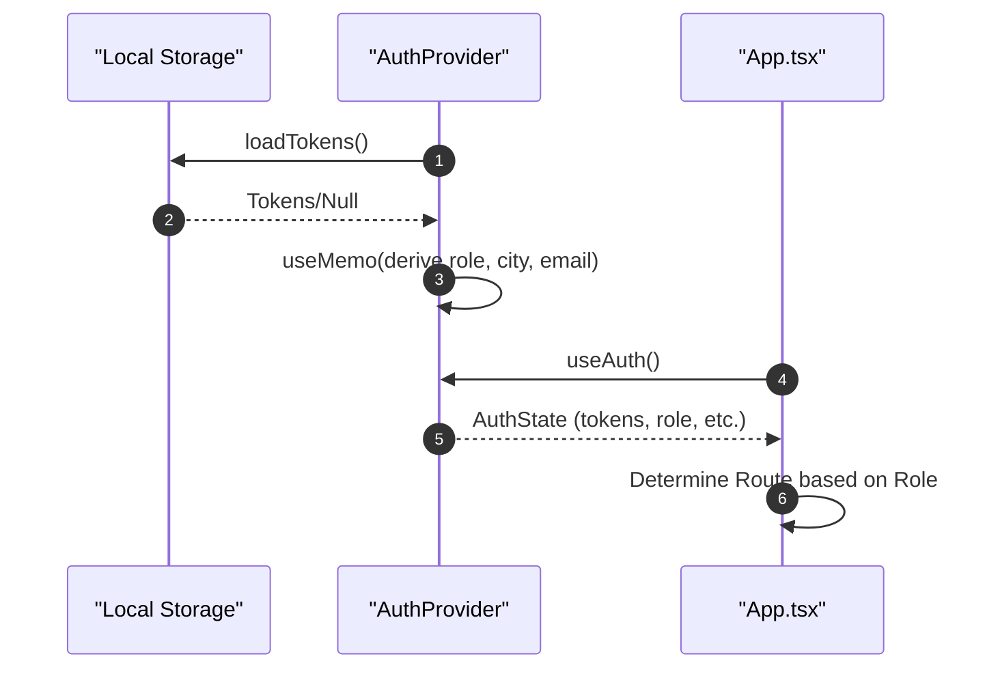

# Frontend Application

The DaakDash frontend is a modern single-page application (SPA) built with React and TypeScript. It serves as the primary interface for multiple user personas—including Sellers, Hub operators, Partners, and Administrators—providing a role-based dashboard for logistics tracking and management.

## Technical Stack

The application leverages a high-performance build toolchain and a utility-first styling approach to ensure a responsive and type-safe user experience.

| Category | Technology | Version | Purpose |
| :--- | :--- | :--- | :--- |
| **Core Framework** | React | `^18.3.1` | UI Component library and state management |
| **Language** | TypeScript | `^5.6.3` | Static type checking and developer productivity |
| **Build Tool** | Vite | `^5.4.10` | Fast bundling and Hot Module Replacement (HMR) |
| **Styling** | Tailwind CSS | `^3.4.14` | Utility-first CSS for rapid UI development |
| **Routing** | React Router DOM | `^6.27.0` | Client-side navigation and route guarding |
| **Mapping** | MapLibre GL | `^4.7.1` | Interactive map rendering for tracking |
| **Real-time** | StompJS | `^7.0.0` | WebSocket communication for live updates |

## Routing and Navigation

The application implements a centralized routing system in `App.tsx` that manages public access and role-based protected routes.

### Route Configuration

| Path | Component | Access Level | Description |
| :--- | :--- | :--- | :--- |
| `/` | `Landing` | Public | Marketing and general information |
| `/track` | `Track` | Public | Public parcel tracking interface |
| `/login` | `Login` | Public | Authentication entry point |
| `/app` | Dynamic | Authenticated | Role-specific home page |
| `/app/sellers` | `Sellers` | Admin Only | Seller management console |

### Role-Based Access Control (RBAC)

The `/app` route acts as a dispatcher, resolving to different components based on the user's role extracted from the authentication token:

```tsx
function home() {
  if (!tokens) return <Navigate to="/login" replace />;
  switch (role) {
    case "ADMIN": return <AdminHome />;
    case "HUB": return <HubConsole />;
    case "PARTNER": return <PartnerApp />;
    default: return <SellerHome />;
  }
}
```



## State Management

### Authentication Context

The application utilizes the React Context API via `AuthContext.tsx` to manage the global authentication state. This avoids "prop drilling" and ensures that user identity is available across all components.

**Managed State Fields:**
- `tokens`: The JWT access and refresh tokens.
- `role`: Derived from the token (e.g., `ADMIN`, `HUB`).
- `city`: The operational city associated with the user.
- `email`: The user's registered email address.

### Auth Flow Logic

The `AuthProvider` handles the lifecycle of the user session, utilizing helper functions from the API library for persistence:



## Brand Component Library

The frontend includes a dedicated brand directory to ensure visual consistency across the application.

### Wordmark Component

The `Wordmark` component represents the DaakDash logotype. It uses a custom font strategy (`font-display`) and specific brand colors (`text-ink`, `bg-inkred`).

**Features:**
- **Visual Identity**: Implements the "ink stamp dot" design between "Daak" and "Dash".
- **Optional Tagline**: Supports a `withTagline` prop to display the brand slogan: *"purani daak, nayi raftaar"*.
- **Dynamic Styling**: Uses a `cn` utility (combining `clsx` and `tailwind-merge`) for flexible CSS class merging.

```tsx
// Example Usage
<Wordmark withTagline={true} className="mt-4" />
```

## Component Hierarchy

The application structure follows a modular pattern separating pages from reusable brand components and global context providers.

```mermaid
graph TD
    Root["App.tsx"] --> AuthCtx["AuthProvider"]
    AuthCtx --> Router["Routes"]
    Router --> Public["Public Pages"]
    Router --> Private["Protected Pages"]
    
    Public --> Landing["Landing Page"]
    Public --> Track["Track Page"]
    Public --> Login["Login Page"]
    
    Private --> Admin["AdminHome / Sellers"]
    Private --> Hub["HubConsole"]
    Private --> Partner["PartnerApp"]
    Private --> Seller["SellerHome"]
    
    Admin & Hub & Partner & Seller --> Brand["Brand Components (Wordmark)"]