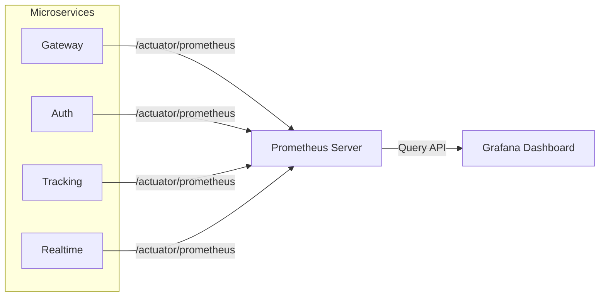

# Monitoring and Observability

DaakDash employs a robust observability stack based on Prometheus and Grafana. This setup enables real-time monitoring of system health, performance bottlenecks, and resource utilization across all microservices.

## Observability Architecture

The monitoring system operates on a pull-based model where Prometheus periodically scrapes metrics from the application services via Spring Boot Actuator endpoints. These metrics are then visualized in Grafana using predefined dashboards.



## Prometheus Configuration

Prometheus is configured to scrape metrics every 15 seconds from the various components of the DaakDash ecosystem. Each service exposes its metrics at the `/actuator/prometheus` path.

### Scrape Targets

| Job Name | Target Endpoint | Port | Metrics Path |
| :--- | :--- | :--- | :--- |
| `gateway` | `gateway:8080` | 8080 | `/actuator/prometheus` |
| `auth` | `auth:8081` | 8081 | `/actuator/prometheus` |
| `tracking` | `tracking:8082` | 8082 | `/actuator/prometheus` |
| `realtime` | `realtime:8083` | 8083 | `/actuator/prometheus` |

### Configuration Snippet
The global scrape interval is defined in `prometheus.yml`:

```yaml
global:
  scrape_interval: 15s

scrape_configs:
  - job_name: gateway
    metrics_path: /actuator/prometheus
    static_configs:
      - targets: ['gateway:8080']
  # ... other services follow same pattern
```

## Grafana Visualization

Grafana serves as the visualization layer, connecting to Prometheus as its primary data source to generate real-time health reports.

### Data Source Setup
The connection is established via `datasources.yml`, mapping the Prometheus UID to the internal network URL:

```yaml
datasources:
  - name: Prometheus
    uid: prometheus
    type: prometheus
    url: http://prometheus:9090
    isDefault: true
```

### Dashboard Provisioning
Dashboards are provisioned automatically via the `daakdash` provider, which loads JSON definitions from the `/var/lib/grafana/dashboards` directory.

## GeoPulse Dashboard

The **GeoPulse** dashboard provides a high-level overview of the system's operational health. It focuses on four critical dimensions: throughput, latency, messaging lag, and memory pressure.

### Monitored Metrics

| Panel Title | Unit | PromQL Expression | Description |
| :--- | :--- | :--- | :--- |
| **Request rate** | req/s | `sum by (job) (rate(http_server_requests_seconds_count[1m]))` | Measures the number of incoming requests per second per service. |
| **p99 latency** | s | `histogram_quantile(0.99, sum by (job, le) (rate(http_server_requests_seconds_bucket[5m])))` | Tracks the 99th percentile of request latency to identify tail latency issues. |
| **Kafka consumer lag** | short | `sum by (job) (kafka_consumer_fetch_manager_records_lag)` | Monitors the delay between message production and consumption in Kafka. |
| **JVM heap used** | bytes | `sum by (job) (jvm_memory_used_bytes{area="heap"})` | Tracks memory consumption to detect potential memory leaks. |

### Dashboard Settings
- **Refresh Interval**: 10 seconds
- **Time Range**: Last 30 minutes (`now-30m` to `now`)
- **Timezone**: Browser default