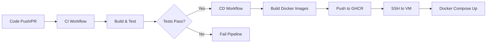
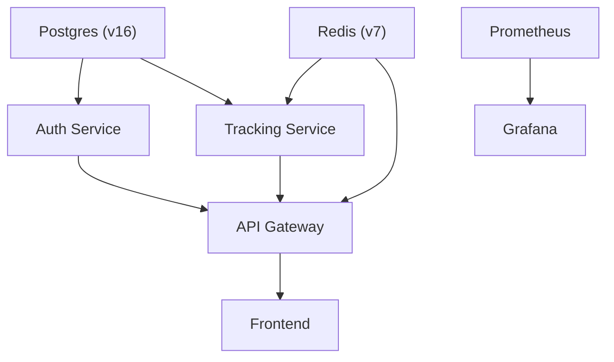

# Deployment and CI/CD

This section details the automated pipelines and containerization strategies used to build, test, and deploy the DaakDash ecosystem. The project employs a Continuous Integration and Continuous Deployment (CI/CD) architecture leveraging GitHub Actions, Docker, and GitHub Container Registry (GHCR).

## CI/CD Pipeline Overview

The DaakDash pipeline is split into two primary workflows: **Continuous Integration (CI)**, which validates code quality and build stability, and **Continuous Deployment (CD)**, which handles containerization and remote orchestration.

### Pipeline Workflow Diagram



---

## Continuous Integration (CI)

The CI pipeline is triggered by any push to the `main` branch or any pull request. It ensures that all microservices and the frontend application are buildable and pass their respective test suites.

### Service Validation
The backend services (`auth`, `gateway`, and `tracking`) are processed via a build matrix to enable parallel execution.

| Module | Environment | Toolchain | Key Action | Coverage |
| :--- | :--- | :--- | :--- | :--- |
| `auth` | Java 21 (Temurin) | Maven | `mvn verify` | Uploaded to Codecov |
| `gateway` | Java 21 (Temurin) | Maven | `mvn verify` | N/A |
| `tracking` | Java 21 (Temurin) | Maven | `mvn verify` | Uploaded to Codecov |

### Frontend Validation
The frontend is validated in a separate job using Node.js 20.
- **Install:** `npm ci`
- **Build:** `npm run build`

---

## Continuous Deployment (CD)

The deployment pipeline is triggered exclusively on pushes to the `main` branch. It follows a two-stage process: Image Distribution and Remote Release.

### 1. Image Distribution
The pipeline builds Docker images for every component of the system and pushes them to the GitHub Container Registry (`ghcr.io`).

- **Registry:** `ghcr.io`
- **Tagging Strategy:** `ghcr.io/${owner}/daakdash-${service}:latest`
- **Services Containerized:** `auth`, `gateway`, `tracking`, `frontend`

### 2. Remote Release
The `release` job orchestrates the update on the production Virtual Machine (VM). It first verifies if a `DEPLOY_HOST` secret is configured before executing the deployment script via SSH.

**Deployment Script:**
```bash
cd ~/daakdash
docker compose -f docker-compose.prod.yml pull
docker compose -f docker-compose.prod.yml up -d
```

---

## Production Infrastructure

Production orchestration is managed via `docker-compose.prod.yml`. The system is designed with strict dependency ordering to ensure that databases and caches are available before application services start.

### Service Dependency Graph



### Production Configuration Details

| Service | Image Source | Critical Dependencies | Key Environment Variables |
| :--- | :--- | :--- | :--- |
| **Postgres** | `postgres:16` | None | `POSTGRES_PASSWORD` |
| **Redis** | `redis:7` | None | N/A |
| **Auth** | `ghcr.io/.../daakdash-auth` | `postgres` (healthy) | `JWT_SECRET`, `DB_PASSWORD` |
| **Tracking** | `ghcr.io/.../daakdash-tracking` | `postgres` (healthy), `redis` | `ORS_API_KEY`, `JWT_SECRET` |
| **Gateway** | `ghcr.io/.../daakdash-gateway` | `auth`, `tracking`, `redis` | `JWT_SECRET`, `REDIS_HOST` |
| **Frontend** | `ghcr.io/.../daakdash-frontend` | `gateway` | N/A |

### Observability Stack
The monitoring tools are grouped under the `observability` profile, meaning they can be toggled independently of the core application.
- **Prometheus:** Configured via `./monitoring/prometheus.yml`.
- **Grafana:** Provisioned with specific datasources and dashboards via `/etc/grafana/provisioning`. It is exposed on port `3001`.

---

## Secrets Management

The following secrets must be configured in the GitHub repository settings for the CI/CD pipeline to function correctly:

| Secret Name | Purpose | Used In |
| :--- | :--- | :--- |
| `CODECOV_TOKEN` | Uploading test coverage reports | `ci.yml` |
| `DEPLOY_HOST` | Destination VM IP/Hostname | `deploy.yml` |
| `DEPLOY_USER` | SSH Username for VM | `deploy.yml` |
| `DEPLOY_KEY` | SSH Private Key for VM | `deploy.yml` |
| `POSTGRES_PASSWORD`| Database authentication | `docker-compose.prod.yml` |
| `JWT_SECRET` | Token signing and validation | `docker-compose.prod.yml` |
| `GRAFANA_PASSWORD` | Admin access to Grafana | `docker-compose.prod.yml` |