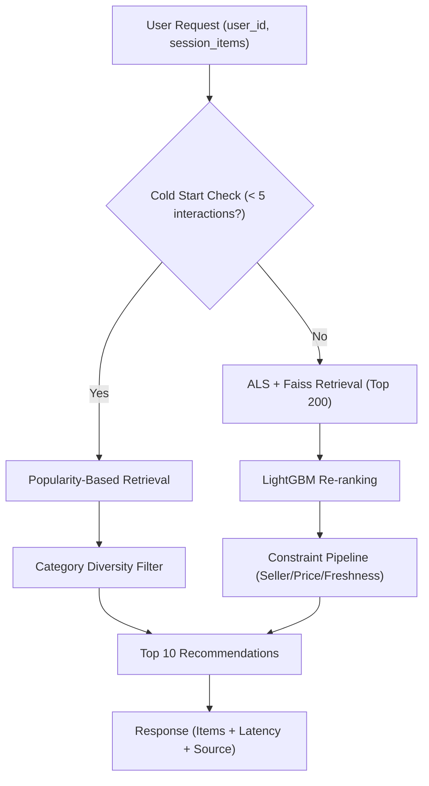

# Introduction and Setup

FeedRank is a production-oriented recommendation system designed to demonstrate the full lifecycle of a recommender, moving beyond simple model training to address real-world engineering challenges such as retrieval latency, cold-start users, and system reliability.

Built using Amazon review data across three product categories (Clothing, Beauty, and Sports), the system implements a two-stage retrieval and ranking architecture to deliver personalized product recommendations in under 200ms.

## System Overview

The system distinguishes between "cold" users (those with limited interaction history) and "warm" users to ensure that every request returns a high-quality result, regardless of the user's profile.

### High-Level Architecture



### Core Design Principles

- **Two-Stage Pipeline**: Separates candidate generation (Retrieval) from precision scoring (Ranking) to maintain low latency while processing millions of items.
- **Graceful Degradation**: If the primary retrieval/ranking pipeline exceeds the SLA (200ms) or Redis fails, the system automatically falls back to cached feeds or global popularity baselines.
- **CPU-Optimized**: The entire stack is designed to run efficiently on CPU, utilizing sparse matrix operations and vector indexing.

## Technical Stack

| Component | Technology | Purpose |
| :--- | :--- | :--- |
| **Collaborative Filtering** | ALS (Implicit) | Generates user and item embeddings for retrieval. |
| **Vector Search** | Faiss | Performs exact inner product search on 1.2M items in $\approx 15$ms. |
| **Re-ranking** | LightGBM | Scores candidates using user/item features in $\approx 2\text{--}4$ms. |
| **Feature Engineering** | DuckDB | Processes 54M+ rows of Parquet data with minimal RAM overhead. |
| **API Layer** | FastAPI | Handles asynchronous requests and Pydantic validation. |
| **Caching** | Redis | Stores user feeds for 30 minutes to reduce compute load. |

## Environment Setup

### Prerequisites

- Python 3.9+
- Docker and Docker Compose
- A machine with at least 16GB RAM (required for DuckDB feature computation)

### Installation

1. **Clone and Initialize**:
   ```bash
   git clone https://github.com/sohamukute/feedrank && cd feedrank
   ```

2. **Install Dependencies**:
   Ensure specific versions of `numpy` and `scipy` are installed to avoid compatibility issues with the `implicit` library:
   ```bash
   pip install numpy==1.26.4 scipy==1.13.1
   pip install -r requirements.txt
   ```

3. **Data Acquisition**:
   Download the six required Parquet files (Reviews and Metadata for Clothing, Beauty, and Sports) from the McAuley Lab HuggingFace repository and place them in the `data/raw/` directory.

4. **Build and Run**:
   ```bash
   make all
   docker-compose up
   ```

## Configuration Management

FeedRank uses a centralized configuration pattern. All hyperparameters, directory paths, and SLA thresholds are defined in `config.yaml` and loaded via a singleton pattern in `src/config.py`.

### Key Configuration Sections

- **`preprocessing`**: Defines the minimum thresholds for users (5 interactions) and items (10 interactions) to ensure signal quality.
- **`als` & `faiss`**: Controls the dimensionality of embeddings (`factors: 64`) and the number of candidates retrieved for the ranker (`n_neighbors: 200`).
- **`constraints`**: Business logic parameters, including `max_per_seller` to prevent feed monopoly and `price_band_tolerance` to filter irrelevant price points.
- **`serving`**: Defines strict latency budgets:
  - `total_sla_ms`: 100ms (Target)
  - `abort_sla_ms`: 200ms (Hard limit before fallback)

### Testing the API

Once the containers are running, you can request recommendations using `curl`:

```bash
curl -X POST http://localhost:8000/recommend \
  -H "Content-Type: application/json" \
  -d '{"user_id": "AG73BVBKUOH22USSFJA5ZWL7AKXA", "session_items": [], "n": 10}'