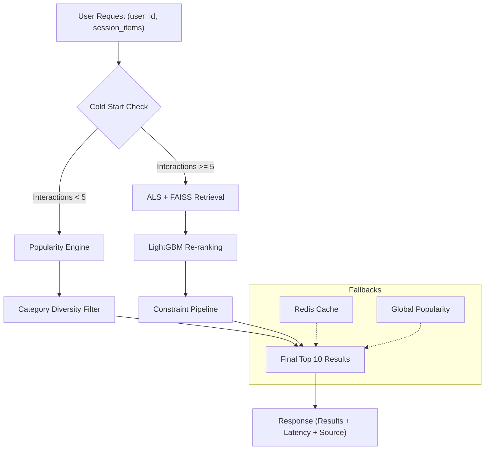

# Project Overview & Setup

FeedRank is a production-oriented recommendation system designed to demonstrate the end-to-end lifecycle of a discovery engine. Unlike typical ML tutorials that focus solely on model accuracy, FeedRank implements the full serving infrastructure, including candidate retrieval, re-ranking, business constraint application, and multi-layered fallback mechanisms to ensure high availability and low latency.

The system is trained on Amazon review data across three product categories: Clothing, Shoes and Jewelry; Beauty and Personal Care; and Sports and Outdoors.

## System Architecture

FeedRank utilizes a two-stage recommendation pipeline (Retrieval $\rightarrow$ Ranking) to balance recall and precision while maintaining a strict latency budget.



### Pipeline Logic
1.  **Cold Start Path**: For new users with fewer than 5 interactions, the system bypasses the ML models to avoid the "cold start" problem, serving popular items filtered for category diversity.
2.  **Warm Start Path**: 
    *   **Retrieval**: Uses Alternating Least Squares (ALS) embeddings and a FAISS index to quickly pull $\sim 200$ candidate items.
    *   **Ranking**: A LightGBM model scores these candidates based on user and item features.
    *   **Constraints**: A final pipeline applies business logic: limiting items per seller, penalizing specific price bands, and boosting fresh content.
3.  **Resilience**: If the system exceeds the total SLA (200ms) or Redis is unavailable, it gracefully falls back to cached feeds or the global popularity baseline.

## Technical Stack

| Component | Technology | Purpose |
| :--- | :--- | :--- |
| **Retrieval** | `implicit` (ALS) + `faiss` | High-speed approximate nearest neighbor search on CPU. |
| **Ranking** | `LightGBM` | Fast gradient boosting for precise re-ranking of candidates. |
| **Serving** | `FastAPI` | Asynchronous API layer with Pydantic validation. |
| **Caching** | `Redis` | Storage for user feeds (30m TTL) and fallback state. |
| **Processing** | `DuckDB` | SQL-based feature engineering on large Parquet files (54M+ rows). |

## Configuration

The system is configured via `config.yaml`, allowing for tuning of the pipeline without code changes.

### Key Configuration Sections
- **Preprocessing**: Defines thresholds for data quality, such as `min_user_interactions` and `min_item_interactions`.
- **Model Hyperparameters**: 
    - `als`: Controls embedding dimensionality (`factors`) and `regularization`.
    - `lightgbm`: Tunes tree depth (`num_leaves`) and `learning_rate`.
- **Constraints**: Business rules like `max_per_seller` (default: 2) and `freshness_boost`.
- **Serving SLAs**: 
    - `total_sla_ms`: The target response time.
    - `abort_sla_ms`: The hard limit before the system triggers a fallback.

## Environment Setup

### Prerequisites
- Docker and Docker Compose
- Python 3.10+ (for local training/preprocessing)

### Installation & Orchestration
1. **Clone and Install Dependencies**:
   ```bash
   git clone https://github.com/sohamukute/feedrank && cd feedrank
   pip install numpy==1.26.4 scipy==1.13.1
   pip install -r requirements.txt
   ```

2. **Data Preparation**:
   Download the 6 required parquet files from HuggingFace (Amazon Reviews 2023) and place them in `data/raw/`.

3. **Build and Run**:
   The project uses a `Makefile` to orchestrate the training and indexing pipeline before launching the services.
   ```bash
   make all
   docker-compose up
   ```

### Testing the API
Once the containers are healthy, you can request recommendations via the `/recommend` endpoint:

```bash
curl -X POST http://localhost:8000/recommend \
  -H "Content-Type: application/json" \
  -d '{"user_id": "AG73BVBKUOH22USSFJA5ZWL7AKXA", "session_items": [], "n": 10}'