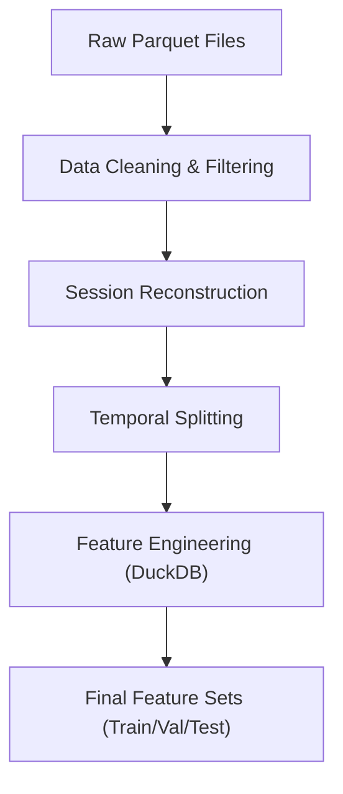

# Data Engineering Pipeline

The `feedrank` data pipeline is designed to transform raw e-commerce interaction logs into a high-density feature set suitable for ranking models. It prioritizes memory efficiency—utilizing `pyarrow` for typed data loading and `DuckDB` for complex analytical joins—to handle millions of interactions without overflowing system RAM.

## Pipeline Architecture

The workflow follows a linear sequence of transformations, moving from raw unstructured files to split, feature-rich datasets.

## 1. Data Cleaning & Filtering
The cleaning phase (`src/data/clean.py`) focuses on noise reduction and ensuring a minimum level of interaction density (k-core filtering).

### Key Processes
- **Iterative K-Core Filtering**: To avoid the "cold start" problem during training, the pipeline iteratively removes users with fewer than `min_user_interactions` and items with fewer than `min_item_interactions`. This repeats until the user/item sets stabilize.
- **Price Normalization**: The `parse_price` utility handles messy string data, converting currency symbols and range-based prices (e.g., "$10 - $20") into a single floating-point average.
- **Metadata Deduplication**: Items appearing across multiple categories are deduplicated based on their `parent_asin` to ensure a unique item registry.

## 2. Session Reconstruction
Because interaction logs are often a stream of events, `src/data/sessions.py` groups these events into discrete user sessions.

- **Inactivity Gaps**: A session is defined by a sequence of interactions by the same user. If the time difference between two consecutive interactions exceeds the `session_gap_minutes` (default 30), a new `session_id` is assigned.
- **Ordering**: Data is sorted by `user_id` and `timestamp` before the cumulative sum operation assigns unique session identifiers.

## 3. Temporal Splitting
To prevent data leakage and simulate a production environment, `src/data/split.py` implements a strict temporal split.

- **Cutoff Logic**: Data is split into Training, Validation, and Test sets based on specific timestamp cut-offs rather than random shuffling.
- **Leakage Validation**: The pipeline explicitly asserts that the maximum timestamp in the training set is strictly less than the minimum timestamp in the validation set.
- **Cold Start Analysis**: The split process logs the percentage of "cold" users and items (those appearing in Val/Test but not in Train) to quantify the model's generalization challenge.

## 4. Feature Engineering
The final stage (`src/data/features.py`) uses **DuckDB** to perform high-performance aggregations and joins that would be memory-prohibitive in standard Pandas.

### Computed Features
The pipeline generates a rich set of behavioral and content features:

| Feature | Logic | Purpose |
| :--- | :--- | :--- |
| `target` | Binary/Soft label based on rating ($\ge 4 \rightarrow 1.0, 3 \rightarrow 0.3$) | Ranking objective |
| `user_avg_spend` | Average price of items interacted with by the user in the training set | User spending power |
| `brand_affinity` | Ratio of user interactions with a specific brand vs. total interactions | Brand loyalty |
| `price_band_match` | A decay function calculating how close an item's price is to the user's average spend | Price sensitivity |
| `review_quality` | $\text{avg\_rating} \times \ln(1 + \text{rating\_count})$ | Item popularity/trust |
| `item_age_days` | Days elapsed since the item first appeared in the dataset | Recency/Trend |
| `session_position` | The index of the interaction within its specific session | Sequential behavior |

### Memory Optimization
To handle large-scale joins, the feature engineer:
1. Calculates a `global_median_price` as a fallback for users with no history.
2. Dynamically calculates available system RAM to set the `memory_limit` for the DuckDB instance.
3. Processes splits (Train, Val, Test) sequentially to minimize peak memory usage.