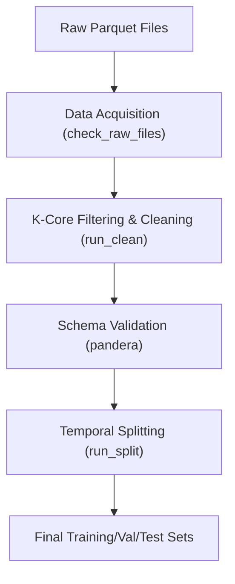

# Data Pipeline

The `feedrank` data pipeline is designed to transform large-scale raw Amazon product review and metadata datasets into a high-quality, filtered, and temporally split dataset ready for recommendation model training.

## Pipeline Overview

The pipeline follows a strict sequence to ensure memory efficiency and data integrity, particularly when handling millions of interaction rows.

## 1. Data Acquisition
The pipeline begins by verifying the presence of the required raw assets. Instead of implementing a downloader, `src/data/download.py` acts as a gatekeeper that validates that all `review_files` and `meta_files` defined in the configuration are present in the `raw_dir`.

## 2. Cleaning and Preprocessing
The cleaning process in `src/data/clean.py` is the most computationally intensive phase, utilizing `pyarrow` and `pandas` with a specific focus on memory management to avoid Out-of-Memory (OOM) errors.

### K-Core Filtering
To ensure the model learns from meaningful patterns, the pipeline implements an iterative filtering process (similar to a k-core decomposition) via `_compute_valid_sets`:
1. **Initial Count**: Aggregates interaction counts for all users and items across all category files.
2. **Iterative Pruning**: 
   - Removes users with fewer than `min_user_interactions`.
   - Removes items with fewer than `min_item_interactions`.
   - Repeats the process until the set of valid users and items stabilizes.

### Price Parsing
Since Amazon metadata often contains prices as strings (e.g., `"$10.99 - $39.99"`), the `parse_price` utility:
- Identifies price ranges and calculates the average.
- Strips currency symbols and commas.
- Coerces unparsable values to `None`.

### Memory Optimization
To handle datasets that exceed available RAM, the pipeline:
- Uses `dtype_backend="pyarrow"` for efficient string storage.
- Processes category files one at a time.
- Employs `gc.collect()` and `del` to explicitly free memory after large DataFrame operations.

## 3. Schema Validation
`src/data/validate.py` uses `pandera` to enforce strict data types and value constraints. This prevents "silent failures" where corrupted data enters the training loop.

| Schema | Key Constraints |
| :--- | :--- |
| `RawReviewSchema` | Ratings $\in [1.0, 5.0]$, non-empty IDs, positive timestamps. |
| `CleanedInteractionSchema` | Strict float/str/int typing for processed interactions. |
| `FeatureMatrixSchema` | Ranges $\in [0.0, 1.0]$ for affinity and match scores. |

Validated rows that fail constraints are not simply deleted; they are exported to the `quality_dir` as `_failures.parquet` for debugging and auditing.

## 4. Temporal Splitting
To prevent data leakage and simulate real-world deployment, `src/data/split.py` implements a temporal split rather than a random one.

### Splitting Logic
Data is partitioned based on the `timestamp` field using two configured cut-off dates:
- **Train**: $\text{timestamp} < \text{train\_cutoff}$
- **Validation**: $\text{train\_cutoff} \le \text{timestamp} < \text{val\_cutoff}$
- **Test**: $\text{timestamp} \ge \text{val\_cutoff}$

### Quality Assurance
The splitting module performs two critical checks:
1. **Leakage Check**: Asserts that the maximum timestamp in the training set is strictly less than the minimum timestamp in the validation set.
2. **Cold Start Analysis**: Calculates the percentage of users and items in the validation/test sets that were never seen during training, providing a metric for the model's generalization capability.