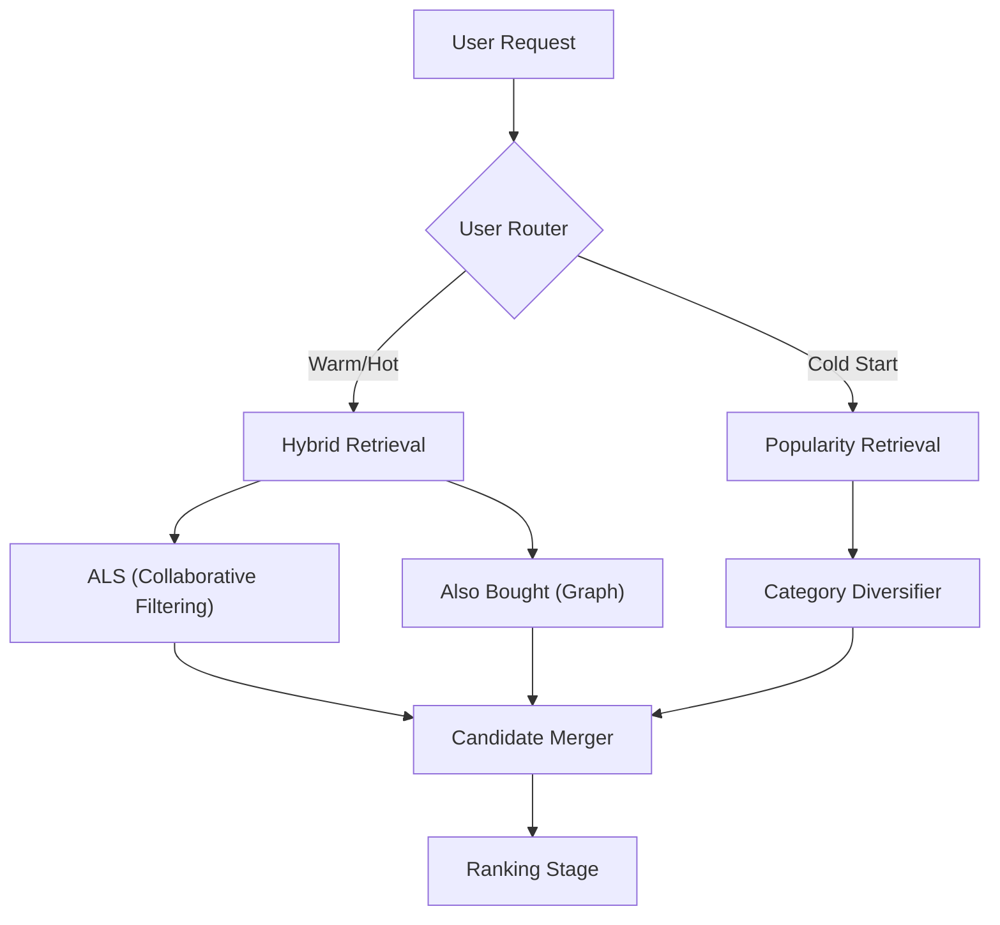

# Candidate Retrieval

The Candidate Retrieval layer is the first stage of the `feedrank` recommendation pipeline. Its primary goal is to efficiently narrow down the entire item catalog (millions of items) to a small set of high-potential candidates (hundreds) that are then passed to the ranking stage.

## Retrieval Architecture

The system employs a hybrid retrieval strategy that routes users based on their interaction history to ensure both personalization for active users and discovery for new users.



## Retrieval Strategies

### 1. Collaborative Filtering (ALS)
Implemented in `src/retrieval/als.py`, the system uses **Alternating Least Squares (ALS)** to learn latent factors for users and items.

- **Training**: The `train_als()` function builds a sparse interaction matrix from training data and fits the `implicit.als.AlternatingLeastSquares` model.
- **Indexing**: To enable sub-millisecond retrieval, item factors are normalized and loaded into a **Faiss** `IndexFlatIP` (Inner Product) index. Because factors are normalized, the inner product effectively computes **Cosine Similarity**.
- **Retrieval**: `retrieve_als(user_id, n)` looks up the user's latent vector and performs an Approximate Nearest Neighbor (ANN) search against the Faiss index.

### 2. Co-purchase Graph (Also Bought)
Implemented in `src/retrieval/also_bought.py`, this strategy leverages item-to-item relationships derived from Amazon's `bought_together` metadata.

- **Mechanism**: It builds a graph where nodes are items and edges represent "bought together" signals.
- **Retrieval**: Given a set of items in the current user session, `retrieve_also_bought` finds all items linked to those session items.
- **Scoring**: Candidates are scored by **frequency**—the more session items that point to a specific candidate, the higher its score. This provides a strong "cross-category discovery" signal.

### 3. Popularity-based Retrieval
Implemented in `src/retrieval/popularity.py`, this serves as a baseline and a fallback for cold-start scenarios.

- **Scoring Formula**:
  The system calculates a popularity score that balances volume, quality, and freshness:
  $$\text{Score} = \frac{\text{Interaction Count} \times \text{Avg Rating}}{\log(1 + \text{Item Age in Days})}$$
- **Storage**: Scores are precomputed and stored in `popularity_global.json` and `popularity_by_category.json` for $O(1)$ lookup.

## Cold Start Logic

The `src/retrieval/cold_start.py` module handles users with insufficient history to generate personalized embeddings.

### User Routing
The `route_user` function determines if a user is "cold" based on the `min_history` configuration. 
- **Cold**: Users with interactions $< \text{min\_history}$.
- **Warm/Hot**: Users with sufficient data for ALS retrieval.

### Diversified Cold Start Feed
To avoid showing only the most generic items, `cold_start_feed` implements a **category-capping mechanism**:
1. It pulls a large pool of popular items.
2. It applies a `max_per_category` limit to ensure the feed contains a diverse set of product categories.
3. If the target count $n$ is not met, it relaxes the cap to ensure a full feed.

## Evaluation

The retrieval quality is measured using **Recall@K** via `evaluate_retrieval`. The system segments performance by user "temperature" to track how well different strategies perform:

| Bucket | Definition | Primary Strategy |
| :--- | :--- | :--- |
| **Cold** | $< 5$ interactions | Popularity Diversified |
| **Warm** | $5 - 20$ interactions | Hybrid (ALS + Graph) |
| **Hot** | $> 20$ interactions | Hybrid (ALS + Graph) |

## Configuration

Relevant settings in `config.yaml`:

```yaml
als:
  factors: 64          # Latent dimensions
  iterations: 15       # Training epochs
  regularization: 0.01  # Lambda regularization

cold_start:
  min_history: 5       # Threshold to be considered "warm"
  max_per_category: 2  # Diversity cap for cold-start feed