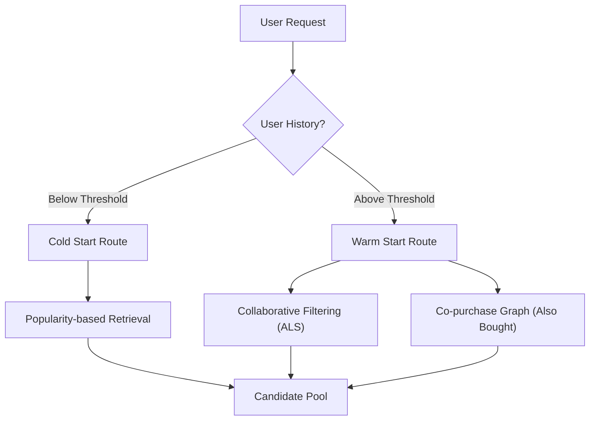

# Candidate Retrieval

The Candidate Retrieval stage is the first phase of the `feedrank` recommendation pipeline. Its primary objective is to efficiently narrow down the entire item universe (potentially millions of items) into a manageable pool of a few hundred high-quality candidates for the subsequent ranking stage.

## Overview

`feedrank` employs a multi-strategy retrieval approach to balance personalization, serendipity, and the "cold start" problem. Depending on the user's history, the system routes them to different retrieval engines.

## Retrieval Strategies

### 1. Collaborative Filtering (ALS)
The system uses **Alternating Least Squares (ALS)** to learn latent factors for users and items. This captures implicit preferences based on interaction history.

- **Training**: The `train_als()` function builds a sparse interaction matrix and decomposes it into user and item factors.
- **Fast Retrieval**: To avoid linear scans, item factors are indexed using **FAISS (Facebook AI Similarity Search)**. 
- **Similarity**: Factors are normalized to unit length, transforming the Inner Product search (`IndexFlatIP`) into **Cosine Similarity**.
- **Cold Start Handling**: Users not present in the training set are identified as cold-start users and bypass ALS retrieval to avoid empty results.

### 2. Co-purchase Graph (Also Bought)
To complement latent factors with explicit item-to-item relationships, `feedrank` implements a graph-based retrieval strategy.

- **Logic**: It leverages metadata (e.g., `bought_together`) to identify items frequently purchased with the user's current session items.
- **Scoring**: Candidates are scored based on frequency—the more session items that point to a candidate, the higher its score.
- **Discovery**: This strategy is particularly effective for cross-category discovery and session-based recommendations.

### 3. Popularity-based Retrieval
For users with no history or as a fallback, the system retrieves globally and category-specifically popular items.

- **Popularity Score**: A custom heuristic is used to calculate item popularity:
  $$\text{Score} = \frac{\text{Interaction Count} \times \text{Average Rating}}{\log(1 + \text{Item Age in Days})}$$
- **Age Decay**: The logarithmic penalty on item age ensures that the feed remains fresh and prevents old "blockbuster" items from dominating indefinitely.
- **Category Tiers**: Popularity is precomputed both globally and per-category to allow for targeted fallback feeds.

## Cold Start Logic

The `cold_start.py` module manages the routing of users based on their interaction count.

1. **Routing**: The `route_user()` function checks if a user's history is below the `min_history` threshold defined in the config.
2. **Diversified Feed**: For cold-start users, `cold_start_feed()` retrieves popular items but applies a **Category Cap**. This prevents the feed from being saturated by a single dominant category, ensuring the user is exposed to a diverse set of offerings to help the system learn their preferences faster.

## Evaluation

Retrieval quality is measured using **Recall@K**. The `evaluate_retrieval()` function assesses how many of the actual items a user interacted with in the test set were successfully captured in the top $K$ retrieved candidates.

Performance is bucketed by user history length:
- **Cold**: < 5 interactions.
- **Warm**: 5–20 interactions.
- **Hot**: > 20 interactions.

This granularity allows developers to identify if retrieval failures are systemic or specific to new users.

## Implementation Details

| Component | Technology | Primary File |
| :--- | :--- | :--- |
| Latent Factors | `implicit` (ALS) | `src/retrieval/als.py` |
| ANN Search | `faiss` | `src/retrieval/als.py` |
| Data Structures | `scipy.sparse.csr_matrix` | `src/retrieval/als.py` |
| Graph Store | Python Dictionary | `src/retrieval/also_bought.py` |
| Popularity | `pandas` / JSON | `src/retrieval/popularity.py` |