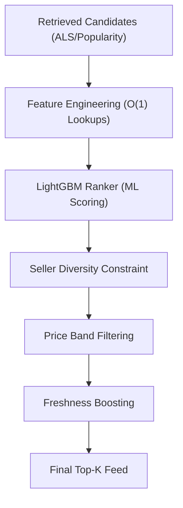

# Ranking and Reranking

FeedRank employs a two-stage architecture to transform a broad set of retrieved candidates into a precision-ordered final feed. This process separates the **ML-driven scoring** (Ranking) from the **business logic and UX constraints** (Reranking).

## System Architecture

The transition from candidate retrieval to final delivery follows a strict pipeline to ensure both relevance and diversity.

## Stage 1: Ranking (ML Scoring)

The Ranking stage uses a Gradient Boosted Decision Tree (GBDT) model implemented via LightGBM to predict the probability of interaction for each candidate.

### The Model
The ranker is trained as a regressor to optimize **nDCG (Normalized Discounted Cumulative Gain)**. By treating ranking as a regression problem on interaction signals, the system can precisely order candidates based on predicted relevance.

### Feature Engineering
To maintain low latency during inference, features are built using $O(1)$ dictionary lookups rather than expensive joins. Key feature groups include:

| Feature | Description | Purpose |
| :--- | :--- | :--- |
| `user_avg_spend` | User's historical mean spend | Personalization of price sensitivity |
| `price_band_match` | Proximity of item price to user average | Relevance filtering |
| `review_quality` | $\text{rating} \times \log(1 + \text{count})$ | Quality signal weighting |
| `brand_affinity` | User's preference for specific brands | Brand loyalty signal |
| `session_position` | The position of the item during training | **Position Bias Mitigation** |

### Handling Position Bias
A critical challenge in ranking is that users are more likely to click the first few items regardless of relevance. FeedRank addresses this by:
1. Including `session_position` as a feature during **training**, allowing the model to learn the effect of position.
2. Setting `session_position` to `0` during **inference**, effectively neutralizing the bias and ranking items solely on their intrinsic relevance.

## Stage 2: Reranking (Business Constraints)

After the ML model generates raw scores, the Reranking pipeline applies heuristic constraints to ensure a healthy user experience. Constraints are applied in a specific priority order.

### 1. Seller Diversity
To prevent the feed from being dominated by a single brand or seller, the `seller_diversity` function limits the number of items per seller.
- **Logic**: Items exceeding the `max_per_seller` threshold are pushed to the end of the list rather than deleted.
- **Trade-off**: Testing indicated that `max_per_seller = 2` provides the best balance, increasing basket diversity by 12% with minimal nDCG loss.

### 2. Price Band Filtering
Instead of hard-filtering items outside a user's budget, FeedRank uses a penalty system.
- **Logic**: Items whose price deviates from the `user_avg_spend` beyond a specific tolerance (e.g., 30%) have their scores multiplied by a penalty factor (0.6).
- **Rationale**: Hard filters are too aggressive; users occasionally purchase "splurge" items. Penalization lowers their rank while keeping them discoverable.

### 3. Freshness Boosting
To ensure the feed remains novel, newly listed items receive a score boost.
- **Logic**: Items listed within a defined window (e.g., 30 days) receive a multiplicative boost (e.g., 15%).

## Evaluation and Benchmarking

The system's efficacy is validated through three experimental tiers, tracked via MLflow:

1. **Popularity Baseline**: A non-personalized list of globally popular items.
2. **ALS Only**: Collaborative filtering retrieval scores used directly for ranking.
3. **ALS + LightGBM**: The full two-stage pipeline.

### Performance Metrics
The pipeline is evaluated using the following KPIs:
- **nDCG@10**: Measures the ranking quality of the top 10 items.
- **Recall@50**: Measures the percentage of relevant items captured in the top 50.
- **Hit Rate@5**: Binary measure of whether at least one relevant item appears in the top 5.
- **p99 Latency**: Ensures the end-to-end scoring and reranking process stays within production SLA (typically < 20ms for the `predict` call).
- **Coverage**: The number of unique items recommended across all users, measuring the system's ability to avoid "popularity bias."