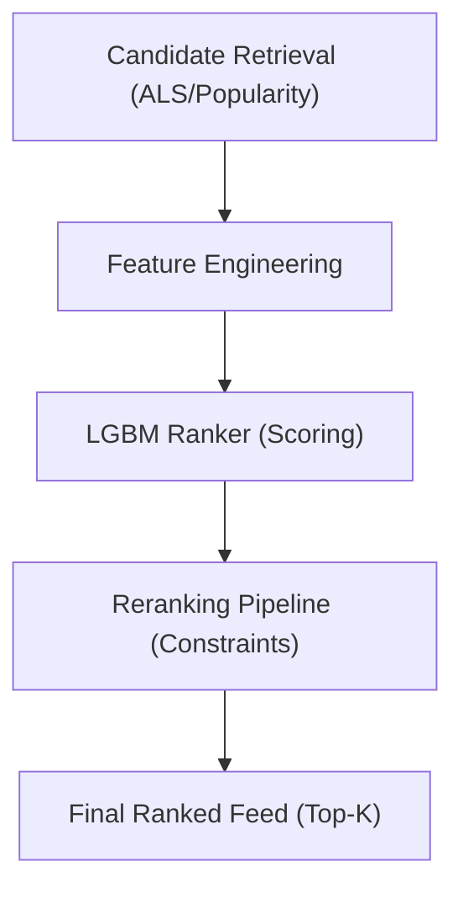

# Ranking & Reranking

The Ranking and Reranking stage transforms a coarse list of candidate items retrieved from the ALS model into a high-precision, business-aligned feed. FeedRank employs a two-stage architecture: a machine-learning-based **Ranker** for relevance scoring and a **Reranking Pipeline** for applying business constraints.

## System Architecture

The transition from retrieval to the final output follows a linear pipeline designed to balance latency with recommendation quality.

## Stage 1: ML Ranking

The ranker uses a Gradient Boosted Decision Tree (LightGBM) to predict the probability of interaction based on user and item features.

### Feature Engineering
The model utilizes a specific set of features to score candidates. To ensure high performance, features are precomputed in lookups for $O(1)$ access during inference.

| Feature | Description | Logic/Notes |
| :--- | :--- | :--- |
| `user_avg_spend` | User's historical average purchase price. | Defaults to global median if unknown. |
| `price_band_match` | Similarity between item price and user's average spend. | Computed via a tolerance-based decay function. |
| `review_quality` | Combined signal of rating and volume. | $\text{rating} \times \log(1 + \text{rating\_number})$. |
| `brand_affinity` | User's historical preference for the brand. | Binary or count-based signal. |
| `category_match` | Alignment between item category and user interests. | Binary signal. |
| `session_position` | Position of the item during training. | **Training only**: Used to neutralize position bias. |

### Handling Position Bias
To prevent the model from simply learning that "items at the top are clicked more," `session_position` is included during training. At inference time, this value is set to `0` (neutralized), forcing the model to rank items based on intrinsic relevance rather than their previous display position.

### Inference Performance
The `predict` function is optimized for low-latency serving:
- **Type Casting**: Features are cast to `np.float32` to optimize LGBM inference.
- **Fallback**: If required features are missing from the candidate dataframe, they are zero-filled to prevent runtime crashes.
- **Latency Monitoring**: A warning is logged if inference exceeds 20ms.

## Stage 2: Reranking Pipeline

After the LGBM ranker produces raw scores, the Reranking Pipeline applies business constraints to ensure the feed is diverse, affordable, and fresh.

### Constraint Implementation

The pipeline applies constraints in a strict priority order: **Seller Diversity $\rightarrow$ Price Band $\rightarrow$ Freshness**.

#### 1. Seller Diversity
Prevents a single brand or seller from dominating the feed.
- **Logic**: Limits items per seller to a maximum (default: 2).
- **Behavior**: Excess items are not deleted but moved to the end of the list to maintain recall.
- **Trade-off**: Testing indicates that `max_per_seller=2` provides the best balance between NDCG and basket diversity.

#### 2. Price Band Filter
Ensures recommended items are within a reasonable price range for the user.
- **Logic**: If the price difference exceeds the `price_band_tolerance`, the score is penalized (multiplied by 0.6).
- **Behavior**: Items are penalized rather than removed. This allows "aspirational" purchases (e.g., a high-ticket item for a birthday) to remain in the list but at a lower rank.

#### 3. Freshness Boost
Increases the visibility of newly listed items to encourage discovery.
- **Logic**: Items listed within the `freshness_days` window receive a score boost (default: +15%).

## Experimental Validation

The effectiveness of this pipeline is validated against two baselines using MLflow for tracking.

### Evaluation Metrics
- **NDCG@10**: Normalized Discounted Cumulative Gain (measures ranking quality).
- **Recall@50**: Proportion of actual interactions captured in the top 50.
- **Hit Rate@5**: Binary indicator of whether at least one relevant item is in the top 5.
- **Coverage**: The number of unique items recommended across all users.
- **p99 Latency**: The 99th percentile of the end-to-end ranking time.

### Comparison Summary
Typical experiment results demonstrate the lift provided by the two-stage approach:

| Approach | NDCG@10 | Recall@50 | p99 Latency | Coverage |
| :--- | :--- | :--- | :--- | :--- |
| Popularity Baseline | Low | Low | Lowest | Lowest |
| ALS Only | Medium | Medium | Low | Medium |
| **ALS + LGBM** | **Highest** | **Highest** | **Medium** | **Highest** |