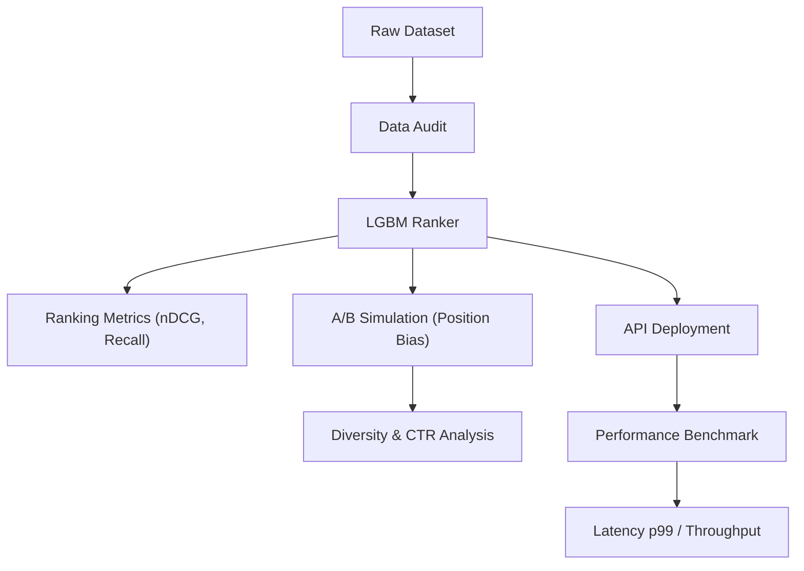

# Evaluation and Benchmarking

The `feedrank` evaluation framework provides a comprehensive suite of tools to measure recommendation quality, validate data integrity, and benchmark API performance. It transitions from offline metric calculation to simulation-based A/B testing and real-time latency profiling.



## Ranking Metrics

The core of the offline evaluation resides in `src/evaluation/metrics.py`. These metrics measure how well the ranker positions relevant items at the top of the list.

| Metric | Description | Use Case |
| :--- | :--- | :--- |
| **nDCG@K** | Normalized Discounted Cumulative Gain. Rewards placing relevant items higher. | Measuring overall ranking quality. |
| **Recall@K** | Percentage of all relevant items captured in the top-K results. | Measuring retrieval effectiveness. |
| **Hit Rate@K** | Binary indicator: 1 if at least one relevant item is in the top-K. | Measuring "success" per user session. |
| **MRR** | Mean Reciprocal Rank. The average of $1/\text{rank}$ of the first relevant item. | Measuring first-hit precision. |
| **Coverage** | Percentage of the total item catalog recommended across all users. | Measuring catalog utilization and avoiding "popularity bias". |

## Data Auditing

Before training, `src/evaluation/data_audit.py` is used to detect anomalies that could bias the model or indicate data corruption.

### Audit Categories
1. **Timestamp Anomalies**: Detects "impossible" user behavior, such as cross-category interactions occurring within the same second.
2. **Price Distribution**: Identifies items with `0.0` prices (data errors) versus `null` prices (parsing failures).
3. **Bot Detection**: Flags users who provide exclusively 5-star ratings (minimum 3 reviews), which often indicates inorganic activity.
4. **Cold Start Severity**: Calculates the percentage of users and items in the validation/test sets that never appeared in the training set.
5. **Category Imbalance**: Measures the distribution of items and interactions per category to identify long-tail sparsity.

**Execution:**
```bash
python src/evaluation/data_audit.py
```

## A/B Simulation

To predict the impact of reranking constraints (like seller diversity) without deploying to production, `src/evaluation/ab_sim.py` implements a simulation environment.

### Position-Biased Click Model
Rather than treating all top-K results equally, the simulator applies a decay function to simulate human behavior:
$$P(\text{click} \mid \text{position } k) = \text{relevance} \times \frac{1}{\log_2(k + 2)}$$

### Experimental Setup
The simulation compares two arms:
- **Arm A**: Standard LGBM ranker predictions.
- **Arm B**: LGBM predictions passed through the `seller_diversity` constraint.

### Statistical Validation
To ensure results are not due to chance, the framework uses:
- **Independent T-Tests**: Comparing CTR, Diversity, and nDCG between arms.
- **Bonferroni Correction**: Adjusts the significance threshold ($\alpha$) to $\alpha/n$ (where $n$ is the number of metrics) to prevent Type I errors from multiple comparisons.

## Performance Benchmarking

The `scripts/benchmark.py` script profiles the `/recommend` endpoint under load to ensure production readiness.

### Benchmark Workflow
1. **Health Check**: Verifies server availability via `/health`.
2. **Concurrent Requests**: Sends 1,000 requests using `httpx` and `asyncio` with a configurable concurrency semaphore.
3. **Randomized Input**: Generates random `user_id`s and varying numbers of `session_items` to simulate realistic traffic.

### Key Performance Indicators (KPIs)
The benchmark reports the following:

- **Latency**: p50, p95, and p99 response times in milliseconds.
- **Throughput**: Requests per second (RPS).
- **Fallback Rate**: The percentage of requests that triggered the fallback mechanism (indicated in response metadata).
- **Cold Start Rate**: The percentage of requests that were handled by the "cold" user path.

**Execution:**
```bash
python scripts/benchmark.py