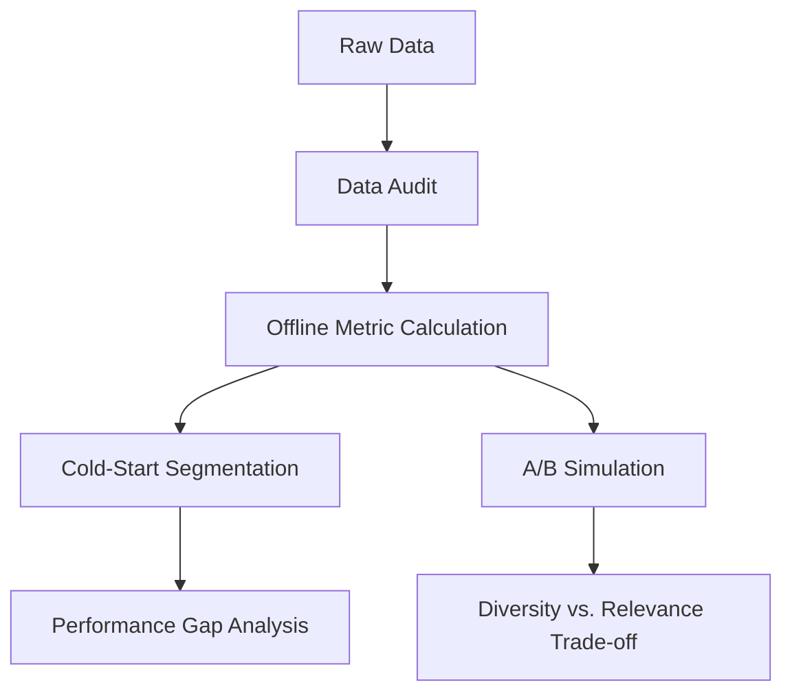

# Evaluation Framework

The Evaluation Framework in `feedrank` provides a comprehensive suite of tools to validate ranking performance beyond simple offline metrics. It integrates rigorous data auditing, user-segmentation analysis (cold-start), and a behavioral simulation engine to estimate the real-world impact of ranking constraints.

## Evaluation Pipeline Overview

The framework follows a multi-stage validation process to ensure that model improvements are statistically significant and data-driven.



## Core Ranking Metrics

The system implements several industry-standard metrics in `src/evaluation/metrics.py` to measure the quality of the recommended lists.

| Metric | Description | Use Case |
| :--- | :--- | :--- |
| **nDCG@K** | Normalized Discounted Cumulative Gain. Rewards relevant items appearing higher in the list. | Measuring ranking quality. |
| **Recall@K** | The fraction of relevant items captured in the top-K results. | Measuring retrieval effectiveness. |
| **Hit Rate@K** | Binary indicator (1/0) if at least one relevant item is in the top-K. | Measuring basic "success" rate. |
| **MRR** | Mean Reciprocal Rank. The average of the reciprocal rank of the first relevant item. | Measuring time-to-first-hit. |
| **Coverage** | The percentage of the total item catalog that appears across all user recommendations. | Measuring catalog utilization/filter bubbles. |

## A/B Simulation Engine

To bridge the gap between offline metrics and online behavior, `src/evaluation/ab_sim.py` implements a behavioral simulation that models how users actually interact with a ranked feed.

### Position-Biased Click Model
The simulator uses a position-bias function to model the reality that users are less likely to scroll deep into a list:

$$P(\text{click} | \text{position } k) = \text{relevance} \times \frac{1}{\log_2(k + 2)}$$

### Experimental Design
The simulation compares two arms:
- **Arm A (Baseline):** Predictions from the LGBM ranker.
- **Arm B (Constrained):** Predictions from the LGBM ranker passed through the `seller_diversity` constraint.

### Statistical Validation
To prevent "p-hacking" across multiple metrics (CTR, Diversity, nDCG), the framework applies the **Bonferroni Correction**. The significance threshold $\alpha$ is adjusted as:
$$\alpha_{corrected} = \frac{0.05}{\text{number of metrics}}$$

## Cold-Start Analysis

`src/evaluation/by_coldstart.py` evaluates model robustness across different user profiles by bucketizing users based on their interaction history:

- **Cold:** $< 5$ interactions.
- **Warm:** $5$ to $19$ interactions.
- **Hot:** $\ge 20$ interactions.

This analysis identifies the "Performance Gap"—the relative drop in nDCG for cold users compared to hot users—helping developers determine if the system needs a stronger popularity-based fallback or content-based retrieval.

## Data Audit Framework

The `src/evaluation/data_audit.py` module serves as a quality gate to identify anomalies before they pollute the training process.

### Automated Checks
1. **Timestamp Anomalies:** Detects "impossible" interactions (e.g., multiple interactions across different categories within 1 second), which often indicate bot activity or logging errors.
2. **Price Distribution:** Identifies items with exactly `0.0` price vs. `null` prices to distinguish between data errors and missing information.
3. **Bot Detection:** Flags users who provide only 5-star ratings across multiple reviews.
4. **Cold Start Severity:** Calculates the percentage of users and items in the test set that never appeared in the training set.
5. **Category Imbalance:** Measures the skew of items and interactions across categories to detect potential bias.

## Usage

To run the full evaluation suite:

```bash
# Run the data quality audit
python -m src.evaluation.data_audit

# Run cold-start performance analysis
python -m src.evaluation.by_coldstart

# Run A/B simulation for diversity constraints
python -m src.evaluation.ab_sim