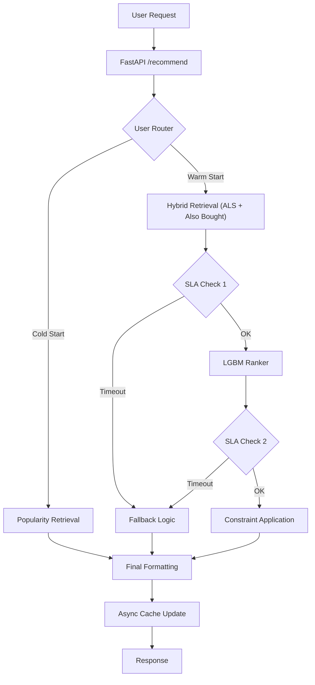

# Serving & Infrastructure

The serving layer of `feedrank` is a high-performance API designed to deliver personalized item recommendations with strict latency guarantees. It implements a multi-stage pipeline (Retrieval $\rightarrow$ Ranking $\rightarrow$ Re-ranking) with integrated fallback mechanisms to ensure availability even during system degradation or for cold-start users.

## System Architecture

The serving layer is built on **FastAPI** and utilizes **Redis** for low-latency caching of embeddings and pre-computed feeds.

## The Recommendation Lifecycle

### 1. User Routing
Every request is first routed based on the user's historical activity:
- **Cold Path**: Users with insufficient history are routed to the `cold_start_feed`, which provides a diverse set of popular items.
- **Warm Path**: Users with known history enter the full retrieval and ranking pipeline.

### 2. Warm Path Execution
For warm users, the system follows a sophisticated pipeline to balance precision and latency:

1.  **Hybrid Retrieval**: Candidates are fetched from two sources:
    - **ALS (Alternating Least Squares)**: Collaborative filtering for user-item affinity.
    - **Also Bought**: Graph-based retrieval based on the current session's items.
2.  **Deduplication**: Candidates are merged, prioritizing ALS results.
3.  **ML Ranking**: The merged candidates are passed through a LightGBM model (`predict`) which scores items based on real-time features.
4.  **Business Constraints**: The `apply_constraints` module ensures the final list meets production requirements:
    - **Seller Diversity**: Prevents a single seller from dominating the feed.
    - **Price Band**: Filters items based on the user's average spend.
    - **Freshness**: Prioritizes newer items.

### 3. SLA & Circuit Breaking
To prevent API timeouts, the system implements "Abort SLAs." At critical junctions (post-retrieval and post-ranking), the system checks the elapsed time:
- **`total_sla_ms`**: Triggers a warning log if exceeded.
- **`abort_sla_ms`**: If reached, the system immediately terminates the pipeline and serves a fallback feed to ensure the user receives a response.

## Caching Strategy

The infrastructure uses Redis as a sidecar for state management and latency reduction.

| Cache Key | Content | Purpose |
| :--- | :--- | :--- |
| `user_emb:{id}` | Numpy Array | Stores pre-computed user embeddings for fast retrieval. |
| `feed:{id}` | JSON List | Stores the last successfully generated feed for rapid fallback. |
| `hist_count:{id}` | Integer | Tracks user activity levels for routing. |

**Reliability Note**: The cache layer is designed for **graceful degradation**. All Redis calls are wrapped in try-except blocks; if the Redis cluster is unavailable, the system logs a warning and continues serving via the primary pipeline or global popularity fallback.

## Fallback Mechanisms

If the primary pipeline fails (no candidates found) or is aborted due to SLA breaches, the `get_fallback_feed` logic triggers a tiered recovery:

1.  **Tier 1 (User Cache)**: Attempts to retrieve the most recent successfully generated feed for that specific user from Redis.
2.  **Tier 2 (Global Popularity)**: If no user cache exists, it returns a globally popular item list to ensure the UI is never empty.

## Infrastructure Monitoring

### Latency Tracking
A custom `LatencyMiddleware` wraps every request, maintaining a rolling buffer of the last 1,000 requests. This allows the `/metrics` endpoint to provide real-time performance telemetry:
- **P50**: Median response time.
- **P95/P99**: Tail latency monitoring to identify bottlenecks.
- **Mean**: Average throughput performance.

### Health Checks
The `/health` endpoint provides a heartbeat for three critical components:
- **API Status**: Basic service availability.
- **Redis Connectivity**: Validates the cache layer via `ping()`.
- **Model Readiness**: Confirms that all Parquet artifacts and ML models were successfully loaded into memory during the `lifespan` startup.