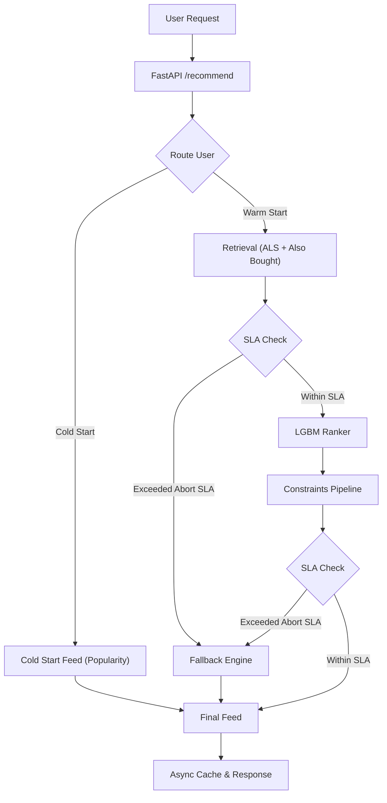

# Serving Infrastructure

The serving layer of `feedrank` is a high-performance FastAPI implementation designed to deliver personalized recommendations with strict latency guarantees. It employs a tiered retrieval-and-ranking architecture, integrating multiple candidate generation sources with a fallback mechanism to ensure high availability.

## Request Flow

The serving pipeline routes users based on their history and applies a multi-stage process to generate the final feed.

## API Implementation

### `/recommend`
The primary endpoint for generating personalized item feeds.

**Request Schema:**
- `user_id` (str): Unique identifier for the user.
- `session_items` (list, optional): Items currently in the user's session for real-time context.
- `n` (int, default=10): Number of recommendations to return.

**Processing Logic:**
1. **Routing**: Users are categorized as `cold` or `warm` based on their interaction history.
2. **Retrieval (Warm Path)**: 
   - Fetches candidates from Collaborative Filtering (`ALS`) and graph-based `Also Bought` logic.
   - Candidates are merged and deduplicated, prioritizing ALS scores.
3. **Ranking**: 
   - Valid candidates are transformed into a feature dataframe.
   - The LGBM ranker predicts the probability of interaction.
4. **Post-processing**: 
   - Applies business constraints (Seller Diversity, Price Band, Freshness).
5. **SLA Enforcement**: The system checks elapsed time against `abort_sla_ms` at critical junctions. If exceeded, it bypasses remaining steps and triggers the fallback engine.

### `/health` & `/metrics`
- **`/health`**: Reports API status, Redis connectivity, and model loading state.
- **`/metrics`**: Returns rolling latency statistics (P50, P95, P99, Mean) calculated via the `LatencyMiddleware`.

## Caching Strategy

To minimize latency and reduce load on the ranker, `feedrank` utilizes Redis for three primary purposes:

| Cache Type | Key Pattern | Description | Strategy |
| :--- | :--- | :--- | :--- |
| **Embeddings** | `user_emb:{uid}` | Stores NumPy arrays of user latent vectors. | Binary serialization via `io.BytesIO` |
| **Feeds** | `feed:{uid}` | Stores the final ranked item list. | JSON serialization |
| **Stats** | `hist_count:{uid}` | Stores user interaction counts for routing. | Integer value |

**Async Caching**: To avoid blocking the HTTP response, the final feed is cached asynchronously using `asyncio.create_task` after the response is prepared.

## Fallback Mechanism

When a request fails to produce candidates or exceeds the `abort_sla_ms`, the `get_fallback_feed` logic is triggered:

1. **Cached Feed**: The system first attempts to retrieve a previously generated feed for the user from Redis.
2. **Global Popularity**: If no cache exists, it returns a globally popular item set to ensure the user never sees an empty screen.

## Latency & Timing

The infrastructure implements a `LatencyMiddleware` that tracks every request's duration.

- **Monitoring**: A rolling buffer of the last 1,000 requests is maintained in memory.
- **SLA Tiers**:
    - `total_sla_ms`: Threshold for warning logs.
    - `abort_sla_ms`: Hard limit that triggers the fallback mechanism to prevent request timeouts.

## Deployment Configuration

The serving layer loads critical artifacts during the FastAPI `lifespan` event to ensure zero-latency overhead during the first request:
- Item metadata (`items.parquet`) loaded into a dictionary for $O(1)$ lookup.
- Precomputed user average spend and global median prices.
- ALS Faiss indices and Popularity maps.
- Item category mappings for diversity constraints.