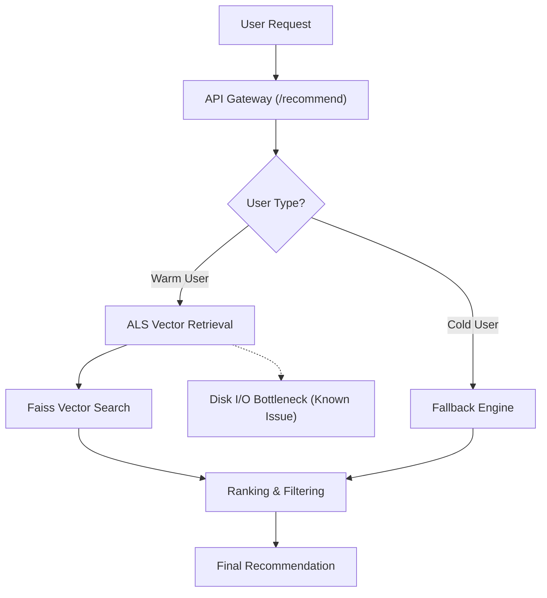

# Operations & Troubleshooting

This guide provides instructions for performance benchmarking and a knowledge base of known issues encountered during the development and scaling of the FeedRank system.

## Benchmarking Performance

To ensure the recommendation engine meets production latency requirements, use the provided benchmarking utility. This script simulates high-concurrency traffic to the `/recommend` endpoint and measures the distribution of response times.

### Running the Benchmark

Execute the benchmark script from the root directory:

```bash
python scripts/benchmark.py
```

### Key Metrics Measured

The benchmark tracks several critical performance indicators:

- **Latency Percentiles (p50, p95, p99):** Measures the response time for the 50th, 95th, and 99th percentiles. This helps identify "long tail" latency issues that affect a small percentage of users.
- **Throughput (req/s):** The number of requests the server can handle per second given the defined concurrency.
- **Fallback Rate:** Percentage of requests that could not be served by the primary model and relied on the fallback mechanism.
- **Cold Start Rate:** Percentage of requests for users with no historical data.

### Request Flow & Latency Path

The following diagram illustrates the request lifecycle and where latency bottlenecks typically occur.



## Troubleshooting Known Errors

### Performance Issues

#### High Latency in ALS Retrieval
**Symptom:** Warm user requests take 700-800ms, while cold users respond instantly.

**Cause:** The system was loading the `als_user_factors.npy` file (approx. 1.5GB) from disk on every single request within the `retrieve_als` function instead of utilizing the in-memory cache.

**Resolution:**
Ensure that user factors are loaded once during the application startup sequence via `_load_artifacts()` and referenced from a module-level variable.

```python
# INCORRECT: Loading from disk per request
user_factors = np.load(Path(cfg["data"]["models_dir"]) / "als_user_factors.npy")

# CORRECT: Using pre-loaded memory variable
user_vec = _user_factors[user_idx].astype(np.float32)
```

### Memory & Scale Issues

#### OOM (Out of Memory) During Dataset Loading
**Symptom:** Python process is killed by the kernel (OOM) when loading large datasets (e.g., Amazon Reviews 2023), often peaking around 15GB RSS.

**Cause:** Attempting to load 100M+ rows across multiple categories into a single pandas DataFrame exceeds available system RAM.

**Resolution:**
1. **Two-Pass Filtering:** 
   - **Pass 1:** Read files individually to count interactions and identify users/items that meet the minimum threshold.
   - **Pass 2:** Read files again and filter rows based on the identified valid IDs before concatenating.
2. **Off-heap Aggregation:** Use **DuckDB** to perform SQL aggregations directly on Parquet files. DuckDB streams data, allowing the processing of 50M+ rows using only a few hundred MB of RAM.

#### PyArrow String Offset Overflow
**Symptom:** `pyarrow.lib.ArrowInvalid: offset overflow while concatenating arrays`.

**Cause:** PyArrow's default `string` type uses 32-bit integers for offsets, limiting the total size of string data in a single array to 2GB. Large datasets (e.g., concatenating 100M user/product IDs) exceed this limit.

**Resolution:**
Cast string columns to `large_string`, which utilizes 64-bit offsets, before performing concatenation.

```python
import pyarrow as pa
import pandas as pd

large_str = pd.ArrowDtype(pa.large_string())
df["user_id"] = df["user_id"].astype(large_str)
df["parent_asin"] = df["parent_asin"].astype(large_str)