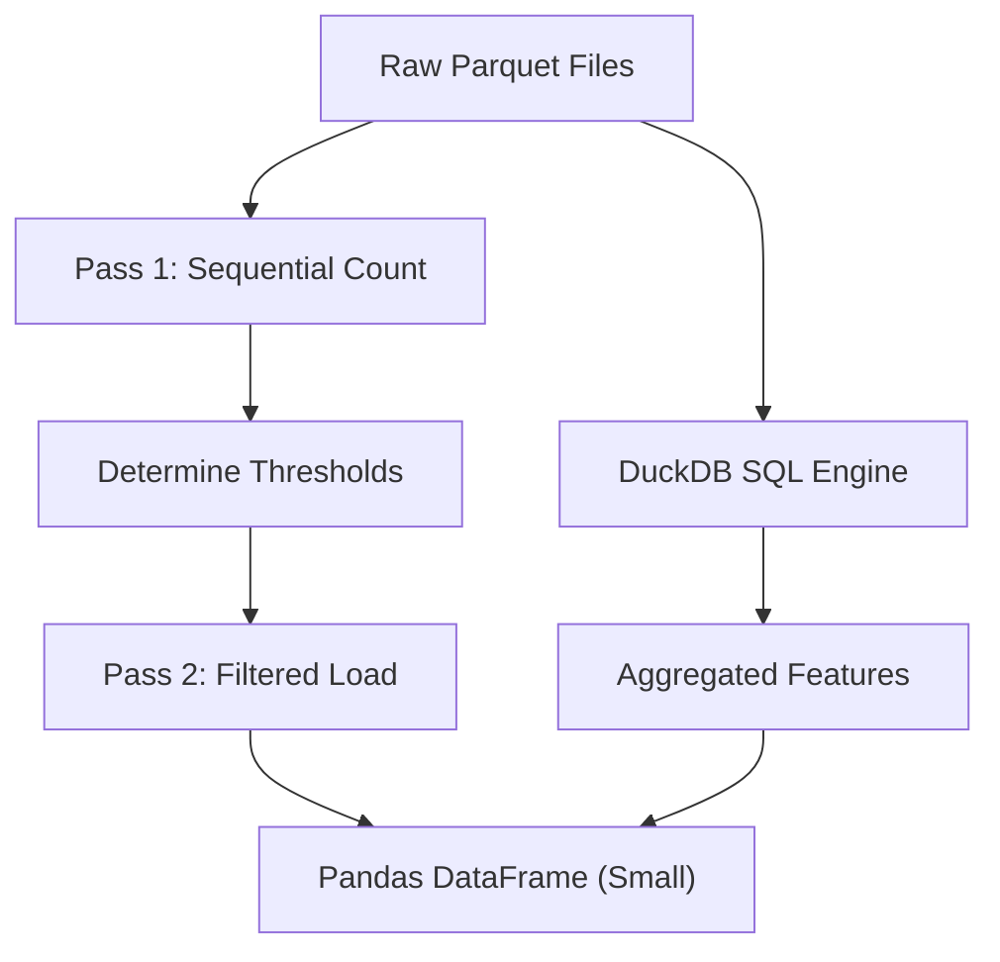

# Troubleshooting and Errors

This section documents common pitfalls, system errors, and performance bottlenecks encountered during the development and scaling of `feedrank`.

## Performance Bottlenecks

### High Latency in ALS Retrieval
If you notice that the `/recommend` endpoint is significantly slower for "warm" users (users with existing history) compared to "cold" users, it is likely due to an inefficient artifact loading pattern.

**The Symptom:**
Retrieval latency spikes to 700-800ms per request, even though the Faiss search itself should only take 10-20ms.

**The Cause:**
Loading heavy NumPy files (e.g., `als_user_factors.npy`) inside the request function. When the `retrieve_als` function loads the 1.5GB user factors file from disk on every single request, the I/O overhead dominates the execution time.

**The Fix:**
Ensure all model artifacts are loaded once during server startup and stored in a module-level variable.

```python
# ❌ AVOID: Loading from disk inside the request handler
def retrieve_als(user_idx):
    user_factors = np.load(Path(cfg["data"]["models_dir"]) / "als_user_factors.npy")
    return user_factors[user_idx].astype(np.float32)

# ✅ RECOMMENDED: Use pre-loaded memory buffers
def retrieve_als(user_idx):
    # _user_factors is loaded once during _load_artifacts() at startup
    return _user_factors[user_idx].astype(np.float32)
```

---

## Memory and Data Overflows

### Out-of-Memory (OOM) during Dataset Loading
When working with massive datasets (e.g., 100M+ rows from Amazon Reviews 2023), loading raw data directly into a pandas DataFrame often triggers an OOM kill.

**The Solution: Two-Pass Filtering & DuckDB**
To handle datasets that exceed available RAM, implement a two-pass approach and offload aggregations to an out-of-core engine.

1.  **Pass 1 (Analysis):** Read files sequentially to count interactions per user/item.
2.  **Pass 2 (Filtering):** Re-read files and keep only rows that meet the minimum interaction threshold.
3.  **Feature Engineering:** Use **DuckDB** to run SQL aggregations directly on Parquet files. DuckDB streams data from disk, allowing you to process 50M+ rows with only a few hundred MB of RAM.



### PyArrow String Offset Overflow
When concatenating multiple large datasets using PyArrow-backed strings, you may encounter the following error:
`pyarrow.lib.ArrowInvalid: offset overflow while concatenating arrays`

**The Cause:**
PyArrow's default `string` type uses 32-bit integers for offsets, limiting the total string data per column to 2GB. If your concatenated columns (e.g., `user_id` or `product_id`) exceed 2GB, the offset overflows.

**The Fix:**
Cast string columns to `large_string`, which utilizes 64-bit offsets.

```python
import pyarrow as pa
import pandas as pd

# Cast to large_string before concatenation
large_str = pd.ArrowDtype(pa.large_string())
df["user_id"] = df["user_id"].astype(large_str)
df["parent_asin"] = df["parent_asin"].astype(large_str)
```

---

## Data Integrity and Types

### Timestamp Unit Mismatch
A common error during temporal splitting is the `pandas._libs.tslibs.np_datetime.astype_overflowsafe` crash.

**The Symptom:**
`pd.to_datetime(df["timestamp"], unit="s")` crashes or produces dates in the far future (e.g., year 31888).

**The Cause:**
The dataset provides timestamps in **milliseconds**, but the code assumes **seconds**. 

**The Fix:**
1. Update the pandas conversion unit to `ms`.
2. Update all time-based constants (e.g., change seconds-per-day `86400` to milliseconds-per-day `86400000`).
3. Adjust session gap thresholds to reflect milliseconds.

| Unit | Value | Pandas Unit |
| :--- | :--- | :--- |
| Seconds | $1,694,573,980$ | `unit="s"` |
| Milliseconds | $1,694,573,980,820$ | `unit="ms"` |