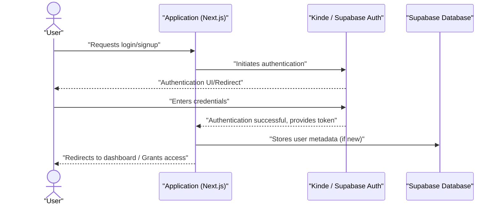

 # Introduction and Setup

Track-Vault is a robust and secure file storage and analytics platform built with **Next.js**. Its core purpose is to provide users with a seamless experience for uploading, tracking, and managing their digital files. Leveraging the power of **AWS S3** for secure and scalable storage, Track-Vault also offers detailed analytics on file interactions, such as views and downloads, enabling better data management and insights.

## Key Features

Track-Vault is designed with a comprehensive set of features to meet diverse file management needs:

-   🔐 **Secure Authentication**: Robust user login and session management to protect user data.
-   ☁️ **File Uploads to AWS S3**: Supports efficient uploading of various file sizes, including large files, through multipart upload capabilities.
-   🔒 **Private File Access**: Ensures files are stored securely and privately in AWS S3, accessible only via signed URLs for enhanced security.
-   📊 **File Analytics Dashboard**: A dedicated dashboard providing granular insights into file performance:
    -   Track unique visitors.
    -   Device and browser statistics for access patterns.
    -   Time-series charts visualizing views over time.
-   📥 **Download Tracking**: Monitor when and how many times files are downloaded, offering valuable usage metrics.
-   🎨 **Responsive UI**: A modern, adaptable user interface built with Next.js and Tailwind CSS, ensuring a consistent experience across devices.
-   ⚡ **Deployment on AWS EC2**: Optimized for cloud deployment using Caddy as a reverse proxy for efficient traffic management.

## Technical Stack

Track-Vault is built using a modern and powerful tech stack to ensure performance, scalability, and security:

| Category                | Technology                                                                                                                                                                             | Purpose                                                                                |
| :---------------------- | :------------------------------------------------------------------------------------------------------------------------------------------------------------------------------------- | :------------------------------------------------------------------------------------- |
| **Frontend & Server**   | [Next.js](https://nextjs.org/) (App Router)                                                                                                                                            | React framework for building fast web applications with server-side rendering.         |
| **Storage**             | [AWS S3](https://aws.amazon.com/s3/)                                                                                                                                                   | Scalable object storage for all uploaded files.                                        |
| **Database**            | [Supabase](https://supabase.com/)                                                                                                                                                      | PostgreSQL database for metadata, user information, and analytics data.                |
| **Authentication**      | Kinde / Supabase Auth                                                                                                                                                                  | Manages user authentication, including sign-up, login, and session management.         |
| **Deployment**          | AWS EC2 + Caddy                                                                                                                                                                        | Cloud computing instance for hosting the application, with Caddy as a reverse proxy.   |
| **Styling**             | Tailwind CSS                                                                                                                                                                           | Utility-first CSS framework for rapid and responsive UI development.                   |
| **Process Management**  | PM2                                                                                                                                                                                    | Production process manager for Node.js applications, ensuring high availability.       |
| **AWS S3 Client**       | [`@aws-sdk/client-s3`](https://github.com/sumedhcharjan/Track-Vault/blob/main/package.json#L17)                                                                                       | JavaScript SDK for interacting with AWS S3 services.                                   |
| **Frontend UI/UX**      | [`@radix-ui/react-avatar`](https://github.com/sumedhcharjan/Track-Vault/blob/main/package.json#L19), [`@radix-ui/react-checkbox`](https://github.com/sumedhcharjan/Track-Vault/blob/main/package.json#L20), etc. | Headless UI components for building accessible and customizable user interfaces.       |
| **Real-time/Messaging** | [`socket.io`](https://github.com/sumedhcharjan/Track-Vault/blob/main/package.json#L31), [`socket.io-client`](https://github.com/sumedhcharjan/Track-Vault/blob/main/package.json#L32) | Enables real-time, bidirectional communication for interactive features.               |
| **State/Data Layer**    | [`@upstash/redis`](https://github.com/sumedhcharjan/Track-Vault/blob/main/package.json#L26)                                                                                           | Fast, serverless Redis for caching and temporary data storage.                         |
| **Environment Config**  | [`dotenv`](https://github.com/sumedhcharjan/Track-Vault/blob/main/package.json#L29)                                                                                                   | Loads environment variables from a `.env` file into `process.env`.                     |

## Getting Started

To set up the Track-Vault project locally, follow these steps:

### Prerequisites

Ensure you have the following installed on your development machine:

-   **Node.js**: Version 18 or higher.
-   **AWS S3 bucket**: Configured with appropriate credentials (Access Key ID and Secret Access Key).
-   **Supabase project**: For managing file metadata, user data, and analytics.
-   **EC2 instance (for deployment)**: Required if you plan to deploy the application to AWS.

### Installation

1.  **Clone the Repository**:
    Begin by cloning the Track-Vault repository to your local machine:

    ```bash
    git clone https://github.com/your-username/track-vault.git
    cd track-vault
    ```

    _Note: Replace `your-username` with the actual GitHub username or organization where the `track-vault` repository is hosted. For this example, we assume `sumedhcharjan` as per the implicit context of the prompt's GitHub links._

2.  **Install Dependencies**:
    Navigate into the project directory and install the necessary Node.js dependencies using npm:

    ```bash
    npm install
    ```

    This command reads the `dependencies` and `devDependencies` listed in your `package.json` and installs them, creating a `node_modules` directory and updating `package-lock.json`.

## Project Structure Insights

Understanding the purpose of key configuration files is crucial for development and maintenance.

### `README.md`

The `README.md` file (View on GitHub) serves as the primary introduction to the Track-Vault project. It provides a high-level overview, lists core features, details the technical stack, and outlines initial setup instructions. This file is often the first point of contact for new contributors or users to understand the project's scope and how to get started.

### `package.json`

The `package.json` file (View on GitHub) is the heart of any Node.js/Next.js project. It contains metadata about the project, defines scripts for various development and build tasks, and lists all project dependencies and development dependencies.

-   **`name`**: `track-vault` - The name of the project.
-   **`version`**: `0.1.0` - The current version of the project.
-   **`private`**: `true` - Indicates that the package is not intended to be published to a public npm registry.
-   **`scripts`**:
    -   `dev`: `next dev` - Starts the development server.
    -   `build`: `next build` - Creates an optimized production build.
    -   `start`: `next start` - Starts the Next.js production server.
    -   `lint`: `next lint` - Runs ESLint for code quality checks.
-   **`dependencies`**: Lists packages required for the application to run in production. For example, `@aws-sdk/client-s3` for AWS S3 interactions, `@kinde-oss/kinde-auth-nextjs` for authentication, and `@supabase/supabase-js` for database and other Supabase services.
-   **`devDependencies`**: Lists packages only required for development and build processes, such as `@eslint/eslintrc` for linting and `tailwindcss` for styling.

```json
// package.json (excerpt)
{
  "name": "track-vault",
  "version": "0.1.0",
  "private": true,
  "scripts": {
    "dev": "next dev",
    "build": "next build",
    "start": "next start",
    "lint": "next lint"
  },
  "dependencies": {
    "@aws-sdk/client-s3": "^3.873.0",
    "@kinde-oss/kinde-auth-nextjs": "^2.8.6",
    // ... other dependencies
  },
  "devDependencies": {
    "@eslint/eslintrc": "^3",
    "@tailwindcss/postcss": "^4",
    // ... other devDependencies
  }
}
```

### `package-lock.json`

The `package-lock.json` file (View on GitHub) is automatically generated by npm and records the exact version of every dependency, including nested dependencies, that was installed. This ensures that anyone installing the project's dependencies gets the exact same dependency tree, leading to reproducible builds across different environments. It guarantees consistency by locking down the entire dependency graph.

```json
// package-lock.json (excerpt)
{
  "name": "track-vault",
  "version": "0.1.0",
  "lockfileVersion": 3,
  "requires": true,
  "packages": {
    "": {
      "name": "track-vault",
      "version": "0.1.0",
      "dependencies": {
        "@aws-sdk/client-s3": "^3.873.0",
        "@kinde-oss/kinde-auth-nextjs": "^2.8.6",
        // ... more direct dependencies
      },
      "devDependencies": {
        "@eslint/eslintrc": "^3",
        "eslint": "^9",
        // ... more dev dependencies
      }
    },
    "node_modules/@aws-sdk/client-s3": {
      "version": "3.873.0",
      "resolved": "https://registry.npmjs.org/@aws-sdk/client-s3/-/client-s3-3.873.0.tgz",
      "integrity": "sha512-b+1lSEf+obcC508blw5qEDR1dyTiHViZXbf8G6nFospyqLJS0Vu2py+e+LG2VDVdAouZ8+RvW+uAi73KgsWl0w==",
      // ... its dependencies
    },
    // ... extensive list of all nested dependencies and their exact versions
  }
}
```

### `jsconfig.json`

The `jsconfig.json` file (View on GitHub) is used to define a JavaScript project, similar to how `tsconfig.json` defines a TypeScript project. It specifies compiler options, especially useful for configuring path aliases in Next.js applications, which helps with cleaner import paths.

```json
// jsconfig.json
{
  "compilerOptions": {
    "paths": {
      "@/*": ["./src/*"]
    }
  }
}
```

In this configuration, `@/*` maps to `./src/*`, meaning that any import starting with `@/` will resolve to a path inside the `src` directory. For example, `import { Button } from '@/components/ui/button';` would resolve to `./src/components/ui/button.tsx`. This improves readability and maintainability by avoiding long relative paths like `../../../components/ui/button`.

## Key Integration Points

### User Authentication Flow

The Track-Vault platform integrates Kinde and Supabase Auth for a secure and streamlined user authentication experience. This ensures that only authorized users can access their private files and analytics dashboard.





### File Upload and Access Workflow

Files in Track-Vault are securely stored in AWS S3 and accessed via signed URLs, ensuring privacy and controlled access. This process involves multiple components working together:


```mermaid
graph TD
    A["User Uploads File"] --> B["Next.js Backend API"]
    B -->|"Generate Signed URL"| C["AWS S3"]
    C -->|"Upload via Signed URL"| B
    B -->|"Store Metadata in Supabase"| D["Supabase Database"]
    D --> B
    B -->|"Confirmation"| A
    
    SubGraph File Access Flow
        E["User Requests File"] --> F["Next.js Backend API"]
        F -->|"Retrieve Metadata"| D
        D --> F
        F -->|"Generate Signed Download URL"| C
        C --> F
        F -->|"Return Signed URL"| E
        E -->|"Access File"| C
    End
```