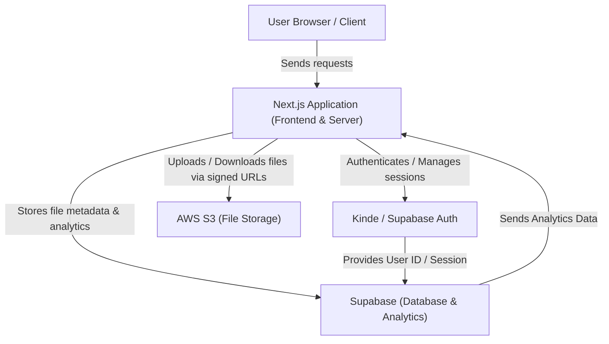
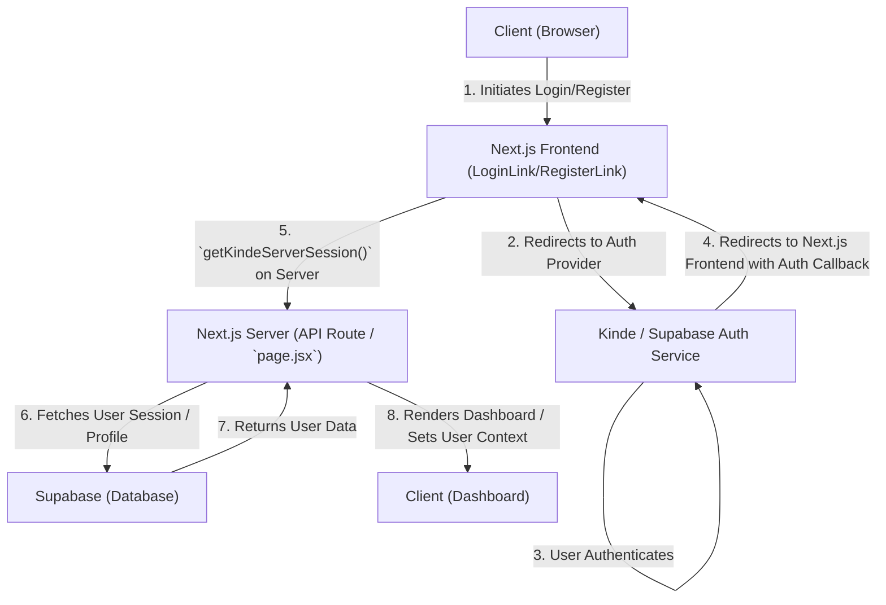

 # Introduction to Track-Vault

Track-Vault is a robust and secure file storage and analytics platform developed with **Next.js**. Its primary goal is to provide users with a seamless and secure experience for uploading, tracking, and managing digital files. The application integrates deeply with **AWS S3** for secure, scalable storage and offers detailed analytics on file views and downloads, enabling granular control and insights over shared content.

## Core Purpose and Functionality

Track-Vault addresses the need for a modern file-sharing solution that prioritizes security, user control, and data insights. It allows users to securely store files in the cloud, manage access permissions, and monitor file engagement through an intuitive dashboard.

### Key Features

Track-Vault boasts a comprehensive set of features designed to enhance file management and security:

*   **Secure Authentication:** Robust user login and session management powered by Kinde / Supabase Auth.
*   **AWS S3 File Uploads:** Supports efficient uploading of files, including large files via multipart upload, directly to AWS S3.
*   **Private File Access:** Ensures files are stored privately and can only be accessed through secure, signed URLs.
*   **File Analytics Dashboard:** Offers an insightful dashboard to track:
    *   Unique visitors
    *   Device and browser statistics
    *   Views over time with interactive charts
*   **Download Tracking:** Monitors when and how many times files are downloaded, providing clear usage metrics.
*   **Responsive User Interface:** Built with Next.js and Tailwind CSS for a modern, adaptable user experience across various devices.
*   **Deployment Ready:** Configured for deployment on AWS EC2, utilizing Caddy as a performant reverse proxy.

## Architecture Overview

The Track-Vault application leverages a modern, server-rendered approach with Next.js, integrating various cloud services for a scalable and secure architecture.





## Technical Stack

Track-Vault is built upon a robust and modern technology stack, combining leading frameworks and cloud services to deliver its functionalities:

| Category        | Technology / Service                                                | Description                                                                                             |
| :-------------- | :------------------------------------------------------------------ | :------------------------------------------------------------------------------------------------------ |
| **Frontend**    | [Next.js](https://nextjs.org/) (App Router), [React](https://react.dev/) | Server-rendered React framework for UI and API routes.                                                  |
| **Styling**     | [Tailwind CSS](https://tailwindcss.com/)                            | Utility-first CSS framework for rapid and responsive UI development.                                    |
| **Storage**     | [AWS S3](https://aws.amazon.com/s3/)                                | Scalable object storage for all user files.                                                             |
| **Database**    | [Supabase](https://supabase.com/)                                   | Open-source alternative to Firebase for database (PostgreSQL) and real-time features.                   |
| **Authentication** | [Kinde](https://kinde.com/) / [Supabase Auth](https://supabase.com/docs/guides/auth) | Provides secure user authentication, registration, and session management.                            |
| **Deployment**  | [AWS EC2](https://aws.amazon.com/ec2/), [Caddy](https://caddyserver.com/), [PM2](https://pm2.keymetrics.io/) | Virtual servers for hosting, an automated reverse proxy with HTTPS, and production process management. |
| **Dependencies** | `@aws-sdk/client-s3`, `@kinde-oss/kinde-auth-nextjs`, `@supabase/supabase-js`, `@upstash/redis` | SDKs for AWS S3, Kinde authentication, Supabase interactions, and Redis for caching/rate limiting.    |

The `package.json` file details the project's dependencies, highlighting key integrations:

```json showLineNumbers {5,7,12,14}
// package.json snippet
{
  "name": "track-vault",
  "version": "0.1.0",
  "private": true,
  "scripts": { /* ... */ },
  "dependencies": {
    "@aws-sdk/client-s3": "^3.873.0",
    "@kinde-oss/kinde-auth-nextjs": "^2.8.6",
    // ... other dependencies
    "@supabase/supabase-js": "^2.55.0",
    // ...
    "@upstash/redis": "^1.35.3",
    "next": "15.4.7",
    "react": "19.1.0",
    "react-dom": "19.1.0",
    // ...
  },
  "devDependencies": { /* ... */ }
}
```
<small>[View on GitHub](https://github.com/sumedhcharjan/Track-Vault/blob/main/package.json)</small>

## Application Structure

Track-Vault follows the Next.js App Router structure, organizing components and routes logically. The core layout and homepage provide a clear entry point into the application's design.

### Root Layout (`src/app/layout.jsx`)

The main layout wraps the entire application, providing common elements like navigation, a footer, and global providers. It also sets up global styling and metadata.

```jsx showLineNumbers {13-24}
// src/app/layout.jsx
import Footer from "@/components/Footer";
import "../styles/globals.css";
import Navbar from "@/components/Navbar";
import { Providers } from "@/components/Provider";
import { Inter } from "next/font/google";
import { cn } from "@/lib/utils";
import { Toaster } from "sonner";

const inter = Inter({ subsets: ["latin"] });

export const metadata = {
  title: "Track Vault - Secure File Sharing",
  description: "Share files securely with expiry rules and real-time analytics",
};

export default function RootLayout({ children }) {
  return (
    <html lang="en" suppressHydrationWarning>
      <body
        className={cn(
          "min-h-screen flex flex-col bg-background font-sans antialiased",
          inter.className
        )}
      >
        <Providers>
            <Toaster/>
          <Navbar />
          <main className="flex-1">{children}</main>
          <Footer />
        </Providers>
      </body>
    </html>
  );
}
```
<small>[View on GitHub](https://github.com/sumedhcharjan/Track-Vault/blob/main/src/app/layout.jsx)</small>

### Homepage (`src/app/page.jsx`)

The application's landing page serves as the entry point for unauthenticated users, showcasing key features and prompting login/registration. For authenticated users, it redirects to the dashboard, indicating an authenticated state managed by Kinde.

```jsx showLineNumbers {7-11,29-41}
// src/app/page.jsx
import { getKindeServerSession } from "@kinde-oss/kinde-auth-nextjs/server";
import { redirect } from "next/navigation";
import { RegisterLink, LoginLink } from "@kinde-oss/kinde-auth-nextjs/components";
import { Button } from "@/components/ui/button";
import { Card } from "@/components/ui/card";
import { ArrowRight, ShieldCheck, BarChart, Zap } from "lucide-react";
import { FlickeringGrid } from "@/components/ui/flickering-grid";

export default async function Home() {
  const { getUser } = getKindeServerSession();
  const user = await getUser();

  if (user) {
    redirect("/dashboard");
  }

  return (
    <main className="relative flex flex-col items-center justify-center min-h-screen overflow-hidden bg-background pt-16">
      <div className="absolute inset-0 z-0">
        <FlickeringGrid
          squareSize={6}
          gridGap={5}
          className="w-full h-full opacity-70"
          color="#1a17b3"
          maxOpacity={0.2}
        />
      </div>

      <div className="relative z-10 px-6 py-24 w-full">
        <section className="text-center max-w-4xl mx-auto mb-24">
          <h1 className="text-6xl font-bold tracking-tight mb-6 bg-clip-text text-transparent bg-gradient-to-r from-primary to-primary/60">
            Share Files with Power & <span className="text-primary">Security</span>
          </h1>
          <p className="text-xl text-muted-foreground mb-12 max-w-2xl mx-auto">
            Upload, share, and control your files with enterprise-grade security features
            and real-time analytics.
          </p>
          <div className="flex gap-6 justify-center">
            <LoginLink>
              <Button size="lg" className="h-12 px-8 font-medium">
                Get Started
                <ArrowRight className="ml-2 h-5 w-5" />
              </Button>
            </LoginLink>
            <RegisterLink>
              <Button
                size="lg"
                variant="outline"
                className="h-12 px-8 font-medium border-2"
              >
                Create Account
              </Button>
            </RegisterLink>
          </div>
        </section>

        <section className="grid grid-cols-1 md:grid-cols-3 gap-8 max-w-6xl mx-auto">
          <Card className="p-6 backdrop-blur-sm bg-card/50 border-2">
            <ShieldCheck className="h-12 w-12 mb-5 text-primary" />
            <h3 className="text-2xl font-semibold mb-3">Access Control</h3>
            <p className="text-muted-foreground">
              Set passwords, expiry dates, and one-time links to keep your files secure.
            </p>
          </Card>

          <Card className="p-6 backdrop-blur-sm bg-card/50 border-2">
            <BarChart className="h-12 w-12 mb-5 text-primary" />
            <h3 className="text-2xl font-semibold mb-3">Analytics</h3>
            <p className="text-muted-foreground">
              Track views, downloads, and devices accessing your files in real time.
            </p>
          </Card>

          <Card className="p-6 backdrop-blur-sm bg-card/50 border-2">
            <Zap className="h-12 w-12 mb-5 text-primary" />
            <h3 className="text-2xl font-semibold mb-3">Self-Destruct</h3>
            <p className="text-muted-foreground">
              Files can auto-delete after a set number of views or days.
            </p>
          </Card>
        </section>
      </div>
    </main>
  );
}
```
<small>[View on GitHub](https://github.com/sumedhcharjan/Track-Vault/blob/main/src/app/page.jsx)</small>

## Getting Started

To set up Track-Vault for development or deployment, certain prerequisites must be met, followed by the standard installation process.

### Prerequisites

Before you begin, ensure you have the following:

*   **Node.js:** Version 18 or higher.
*   **AWS S3 Bucket:** An Amazon S3 bucket configured with appropriate credentials for file storage.
*   **Supabase Project:** A Supabase project set up for managing file metadata, user information, and analytics.
*   **EC2 Instance (for deployment):** An AWS EC2 instance if you plan to deploy the application in a production environment.

### Installation

Follow these steps to get a local copy of Track-Vault running:

1.  **Clone the repository:**
    ```bash
    git clone https://github.com/your-username/track-vault.git
    cd track-vault
    ```
2.  **Install dependencies:**
    ```bash
    npm install
    ```
    This command installs all necessary project dependencies listed in `package.json`.

## Key Integration Points

Track-Vault relies heavily on seamless integration between its Next.js frontend/backend and various external services.

### Authentication Flow

User authentication is a critical component, managed through Kinde or Supabase Auth. This ensures secure access to file management and analytics features.





The `getKindeServerSession` function, as seen in `src/app/page.jsx`, is central to verifying user authentication on the server side, enabling protected routes and personalized content.

### File Storage and Access

Files are securely stored in AWS S3, with access mediated by signed URLs generated by the Next.js backend to ensure private access control. This method prevents direct public access to files while allowing authenticated users to download or view them temporarily.

### Data Management

Supabase acts as the central database for user profiles, file metadata, and analytics data. This allows for real-time tracking of file interactions (views, downloads) and provides the foundation for the analytics dashboard.

Next: [Backend Services and APIs](./2_backend-services-and-apis.mdx)