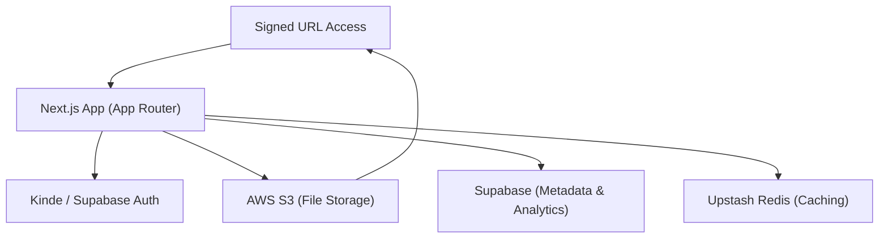

# Introduction

Track Vault is a professional-grade secure file storage and analytics platform. It is designed to bridge the gap between simple cloud storage and actionable data insights, allowing users to not only host files securely but also monitor how those files are being accessed and consumed in real-time.

At its core, Track Vault provides a centralized vault for file management, leveraging industry-standard cloud infrastructure to ensure scalability, security, and high availability.

## Core Purpose

The primary objective of Track Vault is to provide users with total visibility over their shared assets. While traditional storage services offer basic upload and download capabilities, Track Vault implements a tracking layer that captures granular metadata on every interaction.

### Key Capabilities
- **Secure Asset Management**: Effortless uploading and organizing of files with support for large-scale data via multipart uploads.
- **Controlled Access**: Implementation of private storage patterns where files are never exposed publicly, instead served via time-limited signed URLs.
- **Deep Analytics**: A comprehensive dashboard that tracks unique visitors, browser/device demographics, and temporal view patterns.
- **Interaction Tracking**: Precise monitoring of download events to measure the actual utility and reach of shared files.

## System Architecture

The following diagram illustrates the high-level flow of data and authentication within the Track Vault ecosystem:

## Technical Stack

Track Vault is built using a modern, decoupled architecture to ensure performance and maintainability.

### Frontend & Application Logic
| Technology | Purpose |
| :--- | :--- |
| **Next.js 15** | Full-stack framework utilizing the App Router for optimized routing and rendering. |
| **Tailwind CSS** | Utility-first styling for a fully responsive, modern user interface. |
| **Lucide React** | Consistent and lightweight iconography across the dashboard. |
| **Radix UI** | Accessible primitive components for complex UI elements like dropdowns and tabs. |

### Backend & Infrastructure
| Technology | Purpose |
| :--- | :--- |
| **AWS S3** | Primary object storage for secure file persistence. |
| **Supabase** | PostgreSQL database used for storing file metadata and analytics events. |
| **Kinde** | Robust identity and access management (IAM) for secure user authentication. |
| **Upstash Redis** | High-performance key-value store for transient data and caching. |
| **AWS EC2** | Virtualized computing environment for hosting the application. |
| **Caddy** | Modern web server acting as a reverse proxy for SSL termination and request routing. |
| **PM2** | Production process manager to ensure zero-downtime and automatic restarts. |