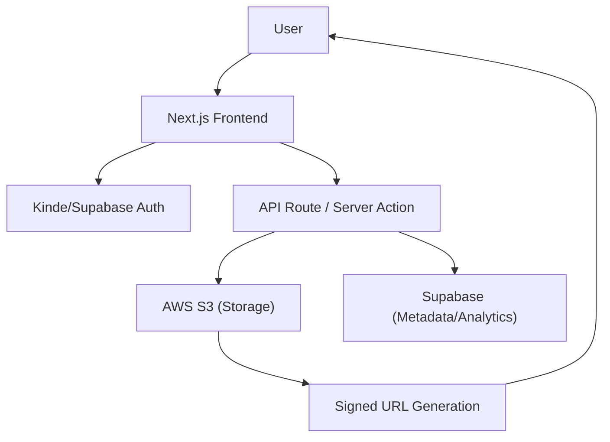

# Introduction

Track Vault is a high-performance, secure file storage and analytics platform. It is engineered to bridge the gap between simple cloud storage and actionable data, allowing users to not only host files securely via AWS S3 but also monitor how those files are interacted with in real-time.

By leveraging signed URLs and a robust metadata tracking system, Track Vault ensures that files remain private while providing granular insights into visitor demographics, device usage, and download patterns.

## Core Value Proposition

- **Secure Distribution**: Files are stored privately in S3 and served via time-limited signed URLs to prevent unauthorized hotlinking.
- **Actionable Analytics**: Integrated tracking for unique visitors and download counts, visualized through a dedicated dashboard.
- **Enterprise-Ready Stack**: Built with Next.js 15, Supabase, and AWS, ensuring scalability and low latency.

## System Architecture

The following diagram illustrates the data flow from the user request to the storage layer and the analytics engine.



## Project Setup

### Prerequisites

Before initializing the project, ensure your environment meets the following requirements:

- **Node.js**: v18.0.0 or higher
- **AWS Account**: S3 bucket configured with appropriate IAM permissions for `PutObject` and `GetObject`.
- **Supabase Account**: A project instance for storing file metadata and analytics events.
- **Authentication**: A Kinde or Supabase Auth configuration.

### Installation

1. **Clone the Repository**
   ```bash
   git clone https://github.com/sumedhcharjan/track-vault.git
   cd track-vault
   ```

2. **Install Dependencies**
   ```bash
   npm install
   ```

3. **Environment Configuration**
   Create a `.env.local` file in the root directory and populate it with the following keys:
   - `AWS_ACCESS_KEY_ID` & `AWS_SECRET_ACCESS_KEY`
   - `AWS_S3_BUCKET_NAME` & `AWS_REGION`
   - `SUPABASE_URL` & `SUPABASE_ANON_KEY`
   - `KINDE_SITE_URL`, `KINDE_CLIENT_ID`, & `KINDE_CLIENT_SECRET`

### Development Workflow

To launch the application in development mode:

```bash
npm run dev
```

The application will be available at `http://localhost:3000`.

## Technical Stack

| Layer | Technology | Purpose |
| :--- | :--- | :--- |
| **Framework** | Next.js 15 (App Router) | Server-side rendering and API routing |
| **Storage** | AWS S3 | Durable object storage for large files |
| **Database** | Supabase | PostgreSQL for analytics and metadata |
| **Auth** | Kinde / Supabase Auth | Identity management and session security |
| **Styling** | Tailwind CSS | Responsive utility-first UI |
| **Deployment** | AWS EC2 + Caddy | Production hosting and reverse proxy |
| **Process Mgmt** | PM2 | Application uptime and clustering |