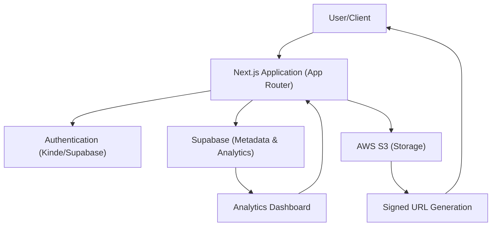

# Project Overview

Track Vault is a professional-grade secure file storage and analytics platform designed to bridge the gap between simple cloud storage and actionable data insights. Built with **Next.js**, the platform allows users to host files privately while gaining granular visibility into how those files are consumed.

## Goals and Objectives

The primary objective of Track Vault is to provide a centralized hub for file distribution where security and observability are first-class citizens. The project focuses on three core pillars:

- **Secure Distribution**: Leveraging AWS S3 private buckets and signed URLs to ensure files are never exposed to the public internet without authorization.
- **Deep Analytics**: Transforming a simple download into a data point, tracking unique visitors, device types, browser statistics, and temporal trends.
- **Enterprise-Ready Infrastructure**: Utilizing a scalable stack including Supabase for metadata and an EC2-based deployment strategy with Caddy for optimized traffic routing.

## High-Level Architecture

Track Vault employs a decoupled architecture where the application logic is handled by Next.js, storage is offloaded to AWS, and relational data/analytics are managed by Supabase.

## Core Technical Components

### Storage & Security
Unlike public hosting, Track Vault utilizes **AWS S3** with strict access controls. Files are uploaded via multipart uploads to support large binaries and are served via time-limited signed URLs, preventing unauthorized hotlinking and ensuring data privacy.

### Analytics Engine
The analytics layer is powered by **Supabase**, which tracks every interaction with a file. By capturing request headers and session data, the platform generates comprehensive reports on:
- **Traffic Volume**: Total views and unique visitor counts.
- **Client Intelligence**: Breakdown of operating systems and browser versions.
- **Temporal Data**: Time-series analysis of download spikes.

### Deployment Stack
The production environment is optimized for performance and stability:
- **Runtime**: Node.js 18+ managed by **PM2** for process persistence.
- **Reverse Proxy**: **Caddy** is used on AWS EC2 to handle SSL termination and request forwarding.
- **Styling**: A modern, responsive interface built with **Tailwind CSS** and **Radix UI** for accessibility.