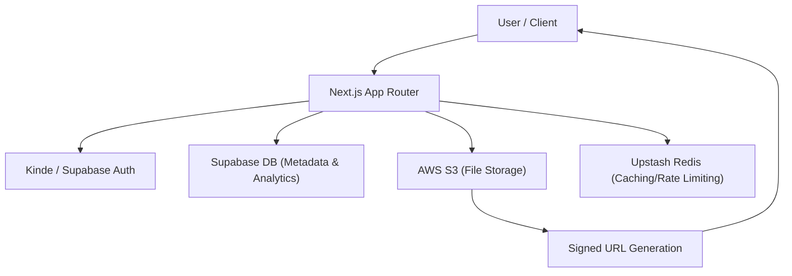

# Project Overview

Track Vault is a high-performance, secure file storage and analytics platform designed to bridge the gap between simple file sharing and enterprise-grade content tracking. Unlike traditional cloud storage, Track Vault provides granular control over how files are accessed and comprehensive insights into how they are consumed.

The platform allows users to upload files to a secure cloud environment, generate shareable links, and monitor real-time interaction metrics, making it ideal for professionals who need to track the distribution of sensitive documents or marketing assets.

## Core Purpose

The primary objective of Track Vault is to provide **secure distribution with visibility**. It solves the "black box" problem of file sharing by providing:

- **Enhanced Security**: Private storage via AWS S3 with access granted only through time-limited signed URLs.
- **Access Governance**: Implementation of self-destruct mechanisms, password protection, and expiration dates.
- **Actionable Analytics**: Real-time tracking of unique visitors, device types, browser statistics, and download counts.

## High-Level Architecture

The application follows a modern decoupled architecture where the frontend and server-side logic are handled by Next.js, while specialized services manage storage, identity, and data.

## Technical Stack

Track Vault is built using a bleeding-edge stack to ensure scalability, type safety, and rapid performance.

### Core Framework & UI
- **Next.js 15 (App Router)**: Serves as the full-stack foundation, handling both the client-side UI and server-side API routes.
- **Tailwind CSS 4**: Utilized for a responsive, modern utility-first design.
- **Radix UI**: Provides accessible, unstyled components for complex UI elements like dropdowns and tabs.
- **Lucide React**: Consistent iconography across the dashboard and landing pages.

### Backend & Infrastructure
- **AWS S3**: The primary storage engine, utilizing multipart uploads for large files and signed URLs for secure, temporary access.
- **Supabase**: Acts as the primary database for storing file metadata, user preferences, and detailed analytics logs.
- **Kinde**: Manages secure user authentication and session handling.
- **Upstash Redis**: Employed for high-speed data caching and managing real-time state.
- **Socket.io**: Enables real-time communication for live analytics updates.

### Deployment & DevOps
- **AWS EC2**: The hosting environment for the production application.
- **Caddy**: Used as a high-performance reverse proxy and automatic SSL provider.
- **PM2**: Ensures process management and zero-downtime restarts for the Node.js runtime.