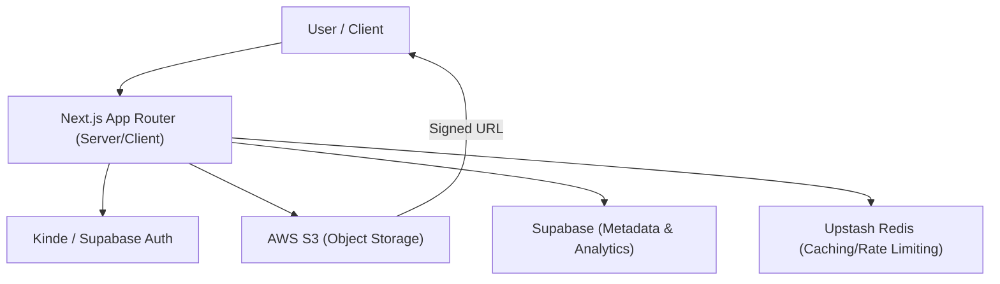

# Project Overview

Track Vault is a high-performance, secure file storage and analytics ecosystem designed to bridge the gap between simple cloud storage and actionable data insights. Unlike standard storage solutions, Track Vault doesn't just host files; it provides a comprehensive tracking layer that monitors how files are accessed, who is interacting with them, and the technical demographics of the visitors.

## Core Purpose

The platform is engineered for users who need a private, secure way to distribute files while maintaining full visibility into engagement metrics. By leveraging **AWS S3** for scalable storage and **Supabase** for metadata management, Track Vault ensures that files remain private by default and are only accessible via time-limited signed URLs.

## High-Level Architecture

Track Vault utilizes a modern full-stack architecture centered around the **Next.js App Router**. The system separates the concerns of storage (AWS), metadata/analytics (Supabase), and real-time state/caching (Upstash Redis), all coordinated through a secure server-side layer.

## Technical Foundation

### 🏗️ Infrastructure & Storage
- **AWS S3**: Handles the heavy lifting of file storage. It supports multipart uploads for large files and ensures security via private buckets, meaning files are never exposed to the public internet without a cryptographically signed request.
- **AWS EC2 & Caddy**: The production environment is hosted on EC2, utilizing Caddy as a high-performance reverse proxy for SSL termination and request routing.

### 📊 Analytics & Data
- **Supabase**: Acts as the primary relational database for storing file metadata, user ownership, and granular analytics events (views, browser types, and device signatures).
- **Upstash Redis**: Integrated for high-speed data retrieval and potential rate-limiting to protect the analytics pipeline.

### 🛠️ Application Layer
- **Next.js 15**: Provides the framework for both the responsive frontend and the API routes that handle the logic for signed URL generation and analytics logging.
- **Tailwind CSS & Radix UI**: Ensures a professional, accessible, and responsive interface across all device types.
- **Socket.io**: Enables real-time capabilities for monitoring file interactions as they happen.

## Key Capabilities

| Capability | Implementation | Purpose |
| :--- | :--- | :--- |
| **Secure Access** | S3 Signed URLs | Prevents unauthorized direct access to files. |
| **Large File Support** | Multipart Uploads | Allows efficient uploading of massive datasets. |
| **Traffic Insight** | Device/Browser Tracking | Provides demographic data on file consumers. |
| **Session Management** | Kinde / Supabase Auth | Ensures only authorized users can manage their "Vault". |
| **Process Stability** | PM2 | Ensures the Next.js server remains online with automatic restarts. |