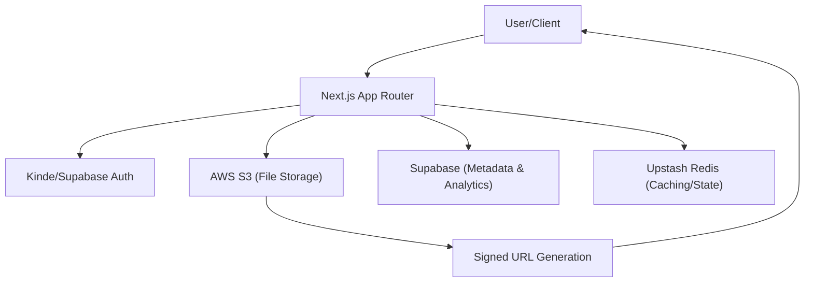

# Project Overview

Track Vault is a production-grade, secure file storage and analytics platform. It is engineered to provide users with a centralized hub for uploading, managing, and tracking the lifecycle of their files. Unlike standard cloud storage, Track Vault integrates deep analytics, allowing users to monitor unique visitors, device statistics, and download frequency in real-time.

## Core Purpose

The primary objective of Track Vault is to bridge the gap between simple file hosting and data-driven content distribution. By leveraging **AWS S3** for scalable storage and **Supabase** for metadata management, the platform ensures that files remain private and are only accessible via secure, time-limited signed URLs.

## System Architecture

The following diagram illustrates the data flow and integration between the client, the application server, and the cloud infrastructure.




## Key Features

- **Secure Asset Management**: Files are stored privately in AWS S3. Access is gated by authentication and served via signed URLs to prevent unauthorized hotlinking.
- **Advanced Analytics Dashboard**: A comprehensive suite of tracking tools that monitor:
  - **Traffic**: Unique visitor counts and view trends over time.
  - **Demographics**: Browser and device-level statistics.
  - **Engagement**: Precise tracking of file download events.
- **Enterprise-Grade Infrastructure**: Deployed on AWS EC2 using **Caddy** as a high-performance reverse proxy and **PM2** for seamless process management.
- **Modern UI/UX**: A responsive interface built with Tailwind CSS and Radix UI primitives for accessibility and performance.

## Technical Stack

| Layer | Technology | Purpose |
| :--- | :--- | :--- |
| **Framework** | Next.js 15 (App Router) | Full-stack React framework |
| **Storage** | AWS S3 | Object storage for large files |
| **Database** | Supabase | Relational data and analytics storage |
| **Authentication** | Kinde / Supabase Auth | Identity and session management |
| **Caching** | Upstash Redis | High-performance key-value store |
| **Styling** | Tailwind CSS | Utility-first responsive design |
| **Deployment** | AWS EC2 + Caddy | Virtual server and reverse proxy |

## Getting Started

### Prerequisites

Before installation, ensure your environment meets the following requirements:
- **Node.js**: version 18 or higher.
- **AWS Account**: An active S3 bucket and IAM credentials.
- **Supabase Account**: A project configured for metadata and analytics tables.
- **Deployment Target**: An AWS EC2 instance (for production builds).

### Local Installation

1. **Clone the repository**
   ```bash
   git clone https://github.com/sumedhcharjan/track-vault.git
   cd track-vault
   ```

2. **Install dependencies**
   ```bash
   npm install
   ```

3. **Environment Configuration**
   Create a `.env` file in the root directory and populate it with your AWS, Supabase, and Kinde credentials.

4. **Run the development server**
   ```bash
   npm run dev
   ```

The application will be available at `http://localhost:3000`.