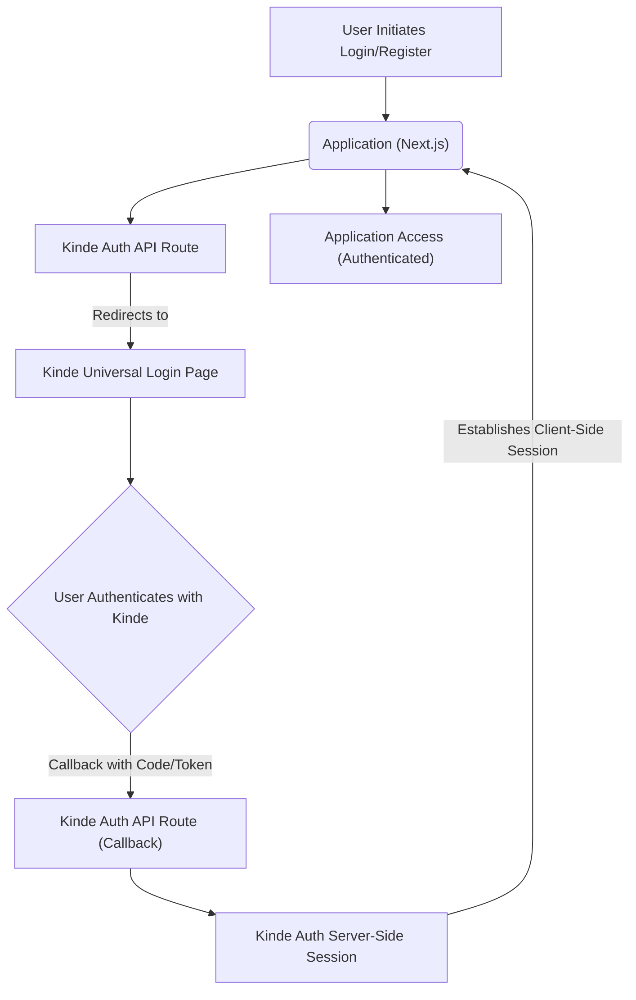
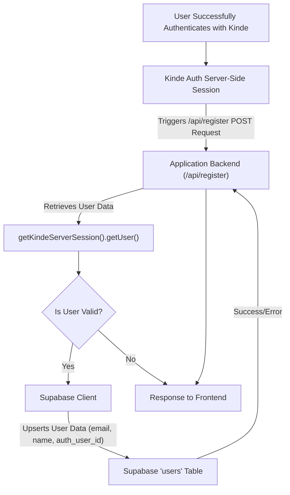

 # Authentication and User Management

Track Vault leverages a robust authentication and user management system built around [Kinde Auth](https://kinde.com/) for secure authentication flows and [Supabase](https://supabase.com/) for managing user profiles and metadata within the application's database. This dual-layer approach ensures secure user access and seamless integration with the application's data storage.

## Core Authentication Flow with Kinde Auth

Kinde Auth provides a streamlined, secure way to handle user sign-up, sign-in, and session management. It acts as the primary identity provider, abstracting away the complexities of OAuth and session handling.

The core Kinde Auth integration in Track Vault is handled by a catch-all API route, which intercepts all authentication-related requests. This route, specified as `src/app/api/auth/[kindeAuth]/route.js`, uses the `handleAuth` function from `@kinde-oss/kinde-auth-nextjs/server` to process various authentication endpoints (e.g., login, register, logout, callback).

```javascript filename="src/app/api/auth/[kindeAuth]/route.js"
import {handleAuth} from "@kinde-oss/kinde-auth-nextjs/server";

export const GET = handleAuth();
```
<small>[View on GitHub](https://github.com/sumedhcharjan/Track-Vault/blob/main/src/app/api/auth/%5BkindeAuth%5D/route.js)</small>

This minimal setup ensures that Kinde Auth can manage the entire authentication lifecycle, from redirecting users to the Kinde Universal Login page to handling the callback and establishing a secure session within the Next.js application.

### KindeProvider Integration

For Kinde Auth to function correctly across the application, the `KindeProvider` component must wrap the application's main content. This is typically done in the root layout or a dedicated provider component. In Track Vault, a `Providers` component encapsulates `KindeProvider` along with other context providers, making it available throughout the application.

```javascript filename="src/components/Provider.jsx"
// app/providers.js
"use client";
import { KindeProvider } from "@kinde-oss/kinde-auth-nextjs";

export function Providers({ children }) {
  return (
    <KindeProvider
      clientId={process.env.NEXT_PUBLIC_KINDE_CLIENT_ID}
      domain={process.env.NEXT_PUBLIC_KINDE_DOMAIN}
      redirectUri={process.env.NEXT_PUBLIC_KINDE_REDIRECT_URI}
      logoutUri={process.env.NEXT_PUBLIC_KINDE_LOGOUT_URI}
    >
      {children}
    </KindeProvider>
  );
}
```
<small>[View on GitHub](https://github.com/sumedhcharjan/Track-Vault/blob/main/src/components/Provider.jsx)</small>

The `KindeProvider` requires several environment variables (`clientId`, `domain`, `redirectUri`, `logoutUri`) to correctly configure the connection to your Kinde Auth application. These variables are crucial for identifying your application to Kinde and directing users to the correct post-authentication/logout destinations.

The `Providers` component is then integrated into the root `layout.jsx`, ensuring that all pages and components within the application tree have access to the Kinde Auth context.

```javascript filename="src/app/layout.jsx" {12-16}
// ... other imports
import { Providers } from "@/components/Provider";
// ... other imports

export default function RootLayout({ children }) {
  return (
    <html lang="en" suppressHydrationWarning>
      <body
        className={cn(
          "min-h-screen flex flex-col bg-background font-sans antialiased",
          inter.className
        )}
      >
        <Providers>
            <Toaster/>
          <Navbar />
          <main className="flex-1">{children}</main>
          <Footer />
        </Providers>
      </body>
    </html>
  );
}
```
<small>[View on GitHub](https://github.com/sumedhcharjan/Track-Vault/blob/main/src/app/layout.jsx#L12-L16)</small>

This setup ensures that Kinde Auth manages user sessions client-side and server-side, providing helpers to access user information and authentication status throughout the application.

### Authentication Flow Diagram

The following diagram illustrates the high-level authentication flow using Kinde Auth:





## User Registration and Profile Management with Supabase

While Kinde Auth handles the primary authentication, Track Vault uses Supabase to store additional user profile information specific to the application. This allows for custom user data (like names, unique IDs, and future application-specific settings) to be associated with an authenticated Kinde user.

The `src/app/api/register/route.js` API endpoint is responsible for taking a newly authenticated Kinde user's information and persisting it into the Supabase `users` table. This `POST` endpoint is likely triggered after a successful Kinde sign-up or first-time login.

```javascript filename="src/app/api/register/route.js"
import { supabase }  from "@/lib/supabase";
import { getKindeServerSession } from "@kinde-oss/kinde-auth-nextjs/server";
import { NextRequest , NextResponse } from "next/server";

export async function POST() {
  const { getUser } = getKindeServerSession();
  const user = await getUser();

  if (user) {
    // Try inserting into Supabase if not exists
    const { data, error } = await supabase
      .from("users")
      .upsert({
        email: user.email,
        name: user.given_name + " " + user.family_name,
        auth_user_id: user.id
      }, { onConflict: "email" });

    if (error) {
      console.error("Supabase error:", error.message);
    } else {
      console.log("User registered:", data);
    }
  }

  return NextResponse.json(user) ;
}
```
<small>[View on GitHub](https://github.com/sumedhcharjan/Track-Vault/blob/main/src/app/api/register/route.js)</small>

Here's a breakdown of this critical registration process:

1.  **Get Kinde User Session**: `getKindeServerSession()` and `getUser()` are used to retrieve the currently authenticated user's details from Kinde Auth on the server side. This ensures that only successfully authenticated users can proceed with registration.
2.  **Supabase Upsert**: If a Kinde user object is successfully retrieved, the code attempts to `upsert` (update or insert) their details into the `users` table in Supabase.
    *   `email`: The user's email, typically used as the unique identifier for `onConflict`.
    *   `name`: Constructed from Kinde's `given_name` and `family_name`.
    *   `auth_user_id`: Kinde's unique `user.id`, essential for linking the Supabase user record back to the Kinde Auth identity.
    *   `onConflict: "email"`: This option is crucial. It ensures that if a user with the same email already exists in the Supabase `users` table, their record will be updated rather than a new one created. This prevents duplicate entries and allows for seamless first-time login or subsequent profile updates.
3.  **Error Handling**: Basic error logging is included to catch any issues during the Supabase operation.

This pattern decouples primary authentication (Kinde) from application-specific user data storage (Supabase), providing flexibility and clear separation of concerns.

### User Data Synchronization Flow

This diagram illustrates how user data is synchronized from Kinde Auth to Supabase after successful authentication.





## Key Integration Points

*   **Centralized Authentication Logic**: By using `src/app/api/auth/[kindeAuth]/route.js`, all Kinde-related authentication logic is neatly encapsulated and managed by the Kinde SDK, minimizing custom code and potential vulnerabilities.
*   **Decoupled User Profiles**: Kinde Auth handles identity, while Supabase stores application-specific user profiles. The `auth_user_id` acts as the foreign key, linking the two systems. This allows for custom user fields in Supabase without modifying the Kinde identity store.
*   **Automatic User Registration/Update**: The `src/app/api/register/route.js` endpoint with `upsert` ensures that every user who successfully authenticates via Kinde has a corresponding record in the Supabase `users` table, created or updated on demand. This simplifies onboarding and profile synchronization.
*   **Environment Variables**: Secure management of Kinde API keys and domain through environment variables (`.env.local`) is critical for security and deployment flexibility.
*   **`"use client"` for KindeProvider**: The `KindeProvider` component uses the `"use client"` directive, indicating it's a client-side component. This is necessary because it relies on browser APIs and context that are unavailable on the server.

Next: [Analytics Tracking and Management](./2.2_analytics-tracking-management.mdx)