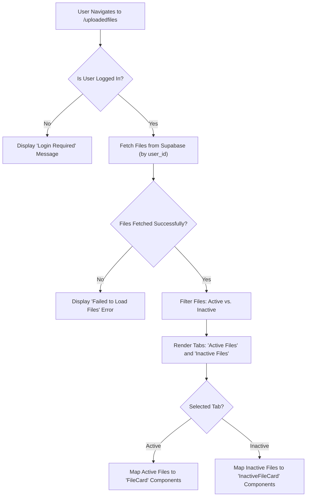
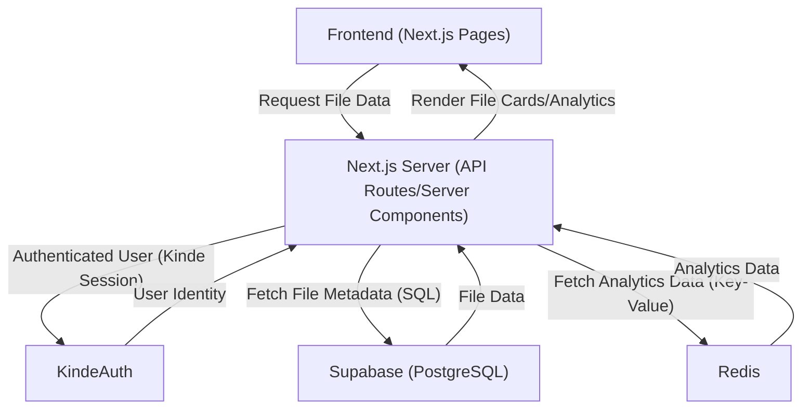

 # File Management and Display

This section provides an in-depth look at how files are managed, displayed, and interacted with across the application. From the initial listing of user-uploaded content to detailed analytics and management for individual files, we explore the components and logic that facilitate a seamless user experience.

The core functionality revolves around two main pages: the **Uploaded Files Dashboard** (`/uploadedfiles`) which lists all files, and the **Individual File Analytics Page** (`/uploadedfiles/[id]`) for managing specific files. These pages leverage reusable components like `FileCard` and `InactiveFileCard` to present file information consistently and efficiently.

## Core Components and Functionality

### Uploaded Files Dashboard (`src/app/uploadedfiles/page.jsx`)

The `/uploadedfiles` page serves as the central hub for users to view and manage all their uploaded files. It provides a comprehensive overview, separating files into "Active" and "Inactive" categories through a tabbed interface. This separation helps users quickly identify which files are publicly accessible and which require attention or activation.

Upon loading, the page first authenticates the user using `getKindeServerSession`. If the user is not logged in, an appropriate message is displayed. For authenticated users, it fetches all files associated with their `user_id` from the Supabase database.

```jsx title="src/app/uploadedfiles/page.jsx"
import { getKindeServerSession } from "@kinde-oss/kinde-auth-nextjs/server";
import { supabase } from "@/lib/supabase";

export default async function Uploadedfiles() {
  const { getUser } = getKindeServerSession();
  const user = await getUser();

  if (!user) {
    return (
      <main className="container mx-auto px-4 py-16 mt-20">
        <Card className="p-8 text-center">
          <p className="text-red-500 font-medium">
            You must be logged in to view files.
          </p>
        </Card>
      </main>
    );
  }

  const { data: files, error } = await supabase
    .from("files")
    .select("*")
    .eq("user_id", user.id)
    .order("created_at", { ascending: false });

  // ... error handling and file filtering
}
```

[View on GitHub](https://github.com/sumedhcharjan/Track-Vault/blob/main/src/app/uploadedfiles/page.jsx#L10-L30)

Once files are fetched, they are filtered based on their `is_active` status. The active files are rendered using the `FileCard` component, while inactive files use the `InactiveFileCard` component. This ensures that each file type receives appropriate visual treatment and functionality.





### Individual File Analytics Page (`src/app/uploadedfiles/[id]/page.jsx`)

For a deeper dive into a specific file, the `/uploadedfiles/[id]` page provides detailed analytics and management options. This page is dynamic, fetching file details based on the `id` parameter from the URL.

Similar to the main file listing page, it performs user authentication and then retrieves the specific file's metadata from Supabase. Crucially, it also verifies that the fetched file belongs to the authenticated user to prevent unauthorized access.

```jsx title="src/app/uploadedfiles/[id]/page.jsx"
import { getKindeServerSession } from "@kinde-oss/kinde-auth-nextjs/server";
import { supabase } from "@/lib/supabase";
import { redirect } from "next/navigation";
import { redis } from "@/lib/redis";

export default async function FileAnalyticsPage({ params }) {
  const { id } = await params;
  const { getUser } = getKindeServerSession();
  const user = await getUser();

  if (!user) {
    redirect("/api/auth/login");
  }

  const { data: file, error } = await supabase
    .from("files")
    .select("*")
    .eq("id", id)
    .single();

  if (error || !file || file.user_id !== user.id) {
    console.error("Supabase error or unauthorized access:", error);
    redirect("/uploadedfiles"); // Redirect if error or unauthorized
  }

  // Fetching analytics from Redis
  const [views, downloads, lastAccess] = await Promise.all([
    redis.get(`file:${id}:views`),
    redis.get(`file:${id}:downloads`),
    redis.get(`file:${id}:lastAccess`),
  ]);

  // ... rendering of components like Preview, Analytics, Editanalytics
}
```

[View on GitHub](https://github.com/sumedhcharjan/Track-Vault/blob/main/src/app/uploadedfiles/[id]/page.jsx#L14-L44)

Beyond basic file data, this page integrates with Redis to fetch real-time analytics such as `views`, `downloads`, and `lastAccess` for the file. This data is then passed to the `Analytics` component for display. The page also includes a `Preview` component to show the file content and an `Editanalytics` component for modifying file settings.

### FileCard Component (`src/components/filecard/Filecard.jsx`)

The `FileCard` component is responsible for visually representing an *active* uploaded file. Its primary function is to display a thumbnail or a relevant icon for the file, along with its name and options for interaction. The `getThumbnail` function within this component is particularly sophisticated, designed to provide intelligent previews based on the file's extension.

For common media types like images, PDFs, and videos, it attempts to render actual previews. For other types, it dynamically selects an appropriate Lucide React icon and a label, offering a clear visual cue about the file's nature.

```jsx title="src/components/filecard/Filecard.jsx"
import { 
  FileText, 
  FileSpreadsheet, 
  FileCode, 
  FileVideo, 
  FileImage, 
  FileJson, 
  FileArchive, 
  FileAudio,
  File
} from "lucide-react";

export default function FileCard({ file }) {
  const getThumbnail = () => {
    if (!file.file_url) { /* ... handle no URL */ }
    const ext = file.file_name.split(".").pop().toLowerCase();

    // ✅ Images
    if (["jpg", "jpeg", "png", "gif", "webp"].includes(ext)) {
      return (
        
      );
    }
    // ✅ PDFs
    if (ext === "pdf") {
      return (
        
      );
    }
    // ✅ Videos
    if (["mp4", "webm", "ogg"].includes(ext)) {
      return (
        <video src={file.file_url + "#t=1"} className="object-cover w-full h-full" muted playsInline preload="metadata" poster="/icons/video-icon.png" />
      );
    }

    // ✅ Enhanced file type placeholders (simplified for snippet)
    const getFileTypeInfo = () => {
      switch(true) {
        case ['csv', 'xlsx', 'xls'].includes(ext): return { icon: <FileSpreadsheet />, label: 'Spreadsheet', color: 'text-emerald-500' };
        case ['mp4', 'webm'].includes(ext): return { icon: <FileVideo />, label: 'Video', color: 'text-blue-500' };
        // ... other file types
        default: return { icon: <File />, label: ext.toUpperCase(), color: 'text-gray-500' };
      }
    };
    const { icon, label, color } = getFileTypeInfo();
    return (
      <div className="flex flex-col items-center justify-center w-full h-full bg-gradient-to-b from-gray-50 to-gray-100">
        <div className={color}>{icon}</div>
        <p className="text-sm font-medium text-gray-600">{label}</p>
        <p className="text-xs text-gray-400 mt-1">{ext.toUpperCase()}</p>
      </div>
    );
  };

  return (
    <Card className="w-full mt-0 pt-0 overflow-hidden">
      <CardContent className="p-0 h-full flex flex-col">
        <div className="h-48 flex items-center justify-center overflow-hidden">
          {getThumbnail()}
        </div>
        <h4 className="px-3 py-2 truncate text-sm font-medium">{file.file_name}</h4>
        <div className="mt-auto border-t p-3">
          <Options file={file} />
        </div>
      </CardContent>
    </Card>
  );
}
```

[View on GitHub](https://github.com/sumedhcharjan/Track-Vault/blob/main/src/components/filecard/Filecard.jsx#L10-L121)

### InactiveFileCard Component (`src/components/filecard/InactiveFileCard.jsx`)

The `InactiveFileCard` component is specifically designed to display files that are no longer active, meaning they might be expired, disabled, or awaiting activation. Unlike `FileCard`, it does not show a visual preview but instead focuses on key statistics retrieved from Redis, such as views, downloads, and last access time, alongside the expiration date.

```jsx title="src/components/filecard/InactiveFileCard.jsx"
import { Card, CardHeader, CardTitle, CardContent } from "@/components/ui/card";
import { redis } from "@/lib/redis";

export default async function InactiveFileCard({ file }) {
  const [views, downloads, lastAccess] = await Promise.all([
    redis.get(`file:${file.id}:views`),
    redis.get(`file:${file.id}:downloads`),
    redis.get(`file:${file.id}:lastAccess`),
  ]);

  return (
    <Card className="w-full border rounded-2xl shadow hover:shadow-md transition-all duration-200">
      <CardHeader className="pb-2">
        <CardTitle className="text-base font-semibold text-gray-800 truncate">
          {file.file_name}
        </CardTitle>
      </CardHeader>

      <CardContent className="space-y-2 text-sm text-gray-600">
        <div className="flex justify-between">
          <span className="font-medium">Views:</span>
          <span>{views ?? 0}</span>
        </div>

        <div className="flex justify-between">
          <span className="font-medium">Downloads:</span>
          <span>{downloads ?? 0}</span>
        </div>

        <div className="flex justify-between">
          <span className="font-medium">Last accessed:</span>
          <span>{lastAccess ? new Date(lastAccess).toLocaleString() : "—"}</span>
        </div>

        <div className="flex justify-between">
          <span className="font-medium">Expired at:</span>
          <span>{file.expires_at ? new Date(file.expires_at).toLocaleString() : "—"}</span>
        </div>
      </CardContent>
    </Card>
  );
}
```

[View on GitHub](https://github.com/sumedhcharjan/Track-Vault/blob/main/src/components/filecard/InactiveFileCard.jsx#L5-L42)

This component highlights critical information without offering interactive options typically associated with active files, providing a clear distinction and informative summary for inactive content.

## Key Integration Points

### Data Flow and Storage

The file management system relies heavily on a robust data architecture:

*   **Supabase (PostgreSQL)**: Stores primary file metadata such as `file_name`, `file_url`, `user_id`, `is_active`, `expires_at`, and `created_at`. This serves as the single source of truth for file configuration and ownership.
*   **Redis**: Utilized for fast, real-time tracking of file interactions like `views`, `downloads`, and `lastAccess`. This offloads high-volume, transient data from the primary database, improving performance for analytics queries.
*   **KindeAuth**: Handles user authentication and session management, ensuring that only authenticated users can access and manage their own files.





### File Preview and Display Logic

The `FileCard` component showcases best practices for dynamic content display. By intelligently parsing file extensions and leveraging different rendering techniques (e.g., `` for actual images, `docs.google.com` for PDF previews, `<video />` for videos), it ensures a rich and informative user interface. For less common or non-renderable file types, it falls back to descriptive icons and labels, maintaining clarity without requiring complex client-side rendering for every file type.

### Authorization and Access Control

A critical aspect of file management is ensuring that users can only access and modify their own files. Both the `/uploadedfiles` and `/uploadedfiles/[id]` pages implement server-side checks using `getKindeServerSession` and Supabase queries filtered by `user_id`. This prevents unauthorized access attempts and ensures data privacy and security. The redirect logic (`redirect('/uploadedfiles')` or `redirect('/api/auth/login')`) is crucial for guiding users appropriately when access is denied.