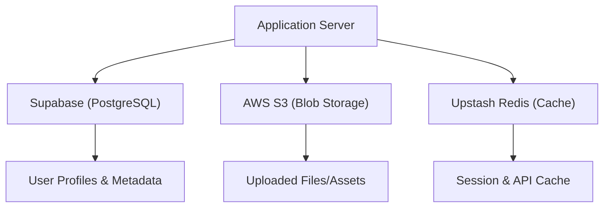

# Storage and Database

Track-Vault employs a decoupled storage architecture to ensure scalability, high availability, and low-latency data retrieval. The system leverages a combination of a relational database for structured data, object storage for files, and an in-memory store for caching.



## Database: Supabase

The application uses **Supabase** as its primary backend-as-a-service, providing a PostgreSQL database for structured data management. This allows for robust relational queries and integrated authentication.

### Implementation
The Supabase client is initialized as a singleton to be reused across the application.

```javascript
import { createClient } from '@supabase/supabase-js'

export const supabase = createClient(
  process.env.NEXT_PUBLIC_SUPABASE_URL,
  process.env.NEXT_PUBLIC_SUPABASE_ANON_KEY
)
```

**Required Environment Variables:**
- `NEXT_PUBLIC_SUPABASE_URL`: The unique endpoint for your Supabase project.
- `NEXT_PUBLIC_SUPABASE_ANON_KEY`: The public API key for client-side access.

---

## File Storage: AWS S3

For unstructured data and file uploads, Track-Vault integrates **Amazon S3 (Simple Storage Service)**. This ensures that files are stored durably and can be served via CDN for optimal performance.

### Implementation
The system utilizes the `@aws-sdk/client-s3` package to interact with S3 buckets.

```javascript
import { S3Client } from "@aws-sdk/client-s3";

export const s3 = new S3Client({
  region: process.env.AWS_REGION,
  credentials: {
    accessKeyId: process.env.AWS_ACCESS_KEY_ID,
    secretAccessKey: process.env.AWS_SECRET_ACCESS_KEY,
  },
});
```

**Required Environment Variables:**
- `AWS_REGION`: The AWS region where the bucket is hosted (e.g., `us-east-1`).
- `AWS_ACCESS_KEY_ID`: IAM user access key.
- `AWS_SECRET_ACCESS_KEY`: IAM user secret key.

---

## Caching: Upstash Redis

To reduce database load and minimize API response times, **Upstash Redis** is implemented as a serverless caching layer. It is specifically used for storing transient data and frequently accessed records.

### Implementation
The integration uses the `@upstash/redis` SDK, which operates over HTTP, making it ideal for serverless environments (like Next.js Edge functions).

```javascript
import { Redis } from "@upstash/redis";

export const redis = new Redis({
  url: process.env.UPSTASH_REDIS_REST_URL,
  token: process.env.UPSTASH_REDIS_REST_TOKEN,
});
```

**Required Environment Variables:**
- `UPSTASH_REDIS_REST_URL`: The REST endpoint provided by Upstash.
- `UPSTASH_REDIS_REST_TOKEN`: The authentication token for the Redis instance.