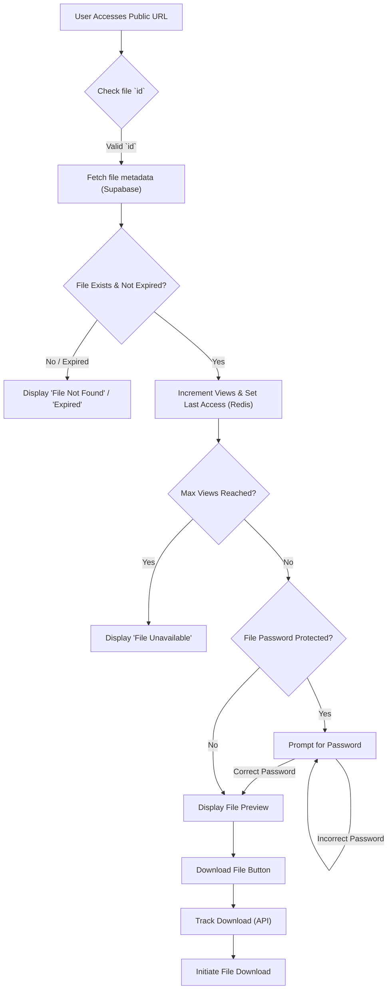

 # Analytics Control and Visualization

This section provides a detailed guide on how analytics data for tracked files is managed, displayed, and how file access rules are enforced and edited within the DeepWiki system. It covers the components responsible for visualizing real-time analytics, setting granular access controls, previewing files, and the logic governing public file access.

## Real-time Analytics Dashboard

The `Analytics` component (`src/components/analyticsContol/Analytics.jsx`) is responsible for displaying real-time analytics data for a specific file. It provides insights into the file's views, downloads, last access timestamp, and public accessibility details like the shared URL and password.

### Key Features

*   **Real-time Updates**: Uses polling to fetch the latest analytics data every 5 seconds, ensuring the displayed information is always up-to-date.
*   **Data Visualization**: Presents key metrics (Views, Downloads, Last Access) in an easily digestible card format.
*   **Public URL Management**: Allows users to quickly copy the public URL and password for sharing.

### Analytics Data Fetching

The `useEffect` hook continuously polls the backend API to retrieve the most recent analytics for the file, ensuring that the displayed data refreshes in real-time without manual intervention.

```jsx
// src/components/analyticsContol/Analytics.jsx
import { useEffect, useState } from "react";
import axios from "axios";

export default function Analytics({ views, downloads, lastAccess, file }) {
  const [data, setData] = useState({ views, downloads, lastAccess });
  const [formattedDate, setFormattedDate] = useState("Never");

  useEffect(() => {
    if (data.lastAccess) {
      setFormattedDate(new Date(data.lastAccess).toLocaleString());
    }
  }, [data.lastAccess]);

  useEffect(() => {
    if (!file?.id) return;

    const interval = setInterval(async () => {
      try {
        const res = await axios.get(`/api/analytics/get?id=${file.id}`);
        setData(res.data);
      } catch (err) {
        console.error("Polling error:", err);
      }
    }, 5000);

    return () => clearInterval(interval);
  }, [file?.id]);
  // ... rest of the component
}
```
[View on GitHub](https://github.com/sumedhcharjan/Track-Vault/blob/main/src/components/analyticsContol/Analytics.jsx#L7-L30)

### Displaying Analytics

The component renders various cards to present information such as views, downloads, last access time, file password, and the public URL.

```jsx
// src/components/analyticsContol/Analytics.jsx
// ... (imports and state)
return (
  <div className="grid grid-cols-1 sm:grid-cols-3 gap-4 mt-6">
    <div className="sm:col-span-3 flex justify-start">
      <Button variant="outline" size="sm" onClick={handleCopy}>
        Copy Public URL
      </Button>
    </div>

    <Card>
      <CardHeader>
        <CardTitle className="text-base font-medium">Views</CardTitle>
      </CardHeader>
      <CardContent>
        <p className="text-2xl font-bold text-gray-800">{data.views ?? 0}</p>
      </CardContent>
    </Card>

    <Card>
      <CardHeader>
        <CardTitle className="text-base font-medium">Downloads</CardTitle>
      </CardHeader>
      <CardContent>
        <p className="text-2xl font-bold text-gray-800">{data.downloads ?? 0}</p>
      </CardContent>
    </Card>

    <Card>
      <CardHeader>
        <CardTitle className="text-base font-medium">Last Access</CardTitle>
      </CardHeader>
      <CardContent>
        <p className="text-sm text-gray-600">{formattedDate}</p>
      </CardContent>
    </Card>

    <Card>
      <CardHeader>
        <CardTitle className="text-base font-medium">Password</CardTitle>
      </CardHeader>
      <CardContent>
        <p className="text-lg font-semibold text-gray-800">{file.file_password || "—"}</p>
      </CardContent>
    </Card>

    <Card className="sm:col-span-3">
      <CardHeader>
        <CardTitle className="text-base font-medium">Public URL</CardTitle>
      </CardHeader>
      <CardContent>
      <p className="text-sm text-gray-600">{file.file_url}</p>
      </CardContent>
    </Card>
  </div>
);
```
[View on GitHub](https://github.com/sumedhcharjan/Track-Vault/blob/main/src/components/analyticsContol/Analytics.jsx#L50-L109)

## Access Control Management

The `Editanalytics` component (`src/components/analyticsContol/Editanalytics.jsx`) provides a user interface for managing and updating access rules for tracked files. This includes setting expiry dates, maximum view/download limits, and password protection.

### Key Features

*   **Configurable Access Rules**: Users can define an expiry date, maximum views, maximum downloads, and a password for each file.
*   **Automated Deletion Options**: Options to automatically delete the file upon expiry or when view/download limits are reached.
*   **Dynamic Form**: The access rules form is toggled by a button for a cleaner UI.

### Updating Access Rules

The `handleSubmit` function sends the updated access rules to the `/analytics/set` API endpoint. This allows for dynamic control over how and when files can be accessed publicly.

```jsx
// src/components/analyticsContol/Editanalytics.jsx
import { useState } from "react";
import api from "@/lib/axios";

export default function Editanalytics({ file }) {
  const [expiresAt, setExpiresAt] = useState("");
  const [maxViews, setMaxViews] = useState("");
  const [maxDownloads, setMaxDownloads] = useState("");
  const [password, setPassword] = useState("");
  const [deleteOnExpire, setDeleteOnExpire] = useState(file.delete_on_expire || false);
  const [deleteOnLimit, setDeleteOnLimit] = useState(file.delete_on_limit || false);
  const [loading, setLoading] = useState(false);
  const [message, setMessage] = useState("");
  const [showForm, setShowForm] = useState(false);

  const handleSubmit = async (e) => {
    e.preventDefault();
    setLoading(true);
    setMessage("");

    try {
      const res = await api.post("/analytics/set", {
        file_id: file.id,
        expiresAt: expiresAt || null,
        maxViews: maxViews ? Number(maxViews) : null,
        maxDownloads: maxDownloads ? Number(maxDownloads) : null,
        password: password || null,
        deleteOnExpire,
        deleteOnLimit,
      });

      if (res.data.success) {
        setShowForm(false);
        setMessage("Access rules updated successfully!");
      } else {
        setMessage(res.data.error || "Failed to update access rules.");
      }
    } catch {
      setMessage("Error connecting to server.");
    } finally {
      setLoading(false);
    }
  };
  // ... rest of the component
}
```
[View on GitHub](https://github.com/sumedhcharjan/Track-Vault/blob/main/src/components/analyticsContol/Editanalytics.jsx#L7-L55)

### Access Rules Form

The form provides inputs for configuring various access parameters, including checkboxes for automated deletion.

```jsx
// src/components/analyticsContol/Editanalytics.jsx
// ... (imports and state)
return (
  <Card className="my-2 shadow-sm rounded-2xl">
    <CardHeader>
      <CardTitle className="text-base font-medium text-gray-800">
        Edit Access Control
      </CardTitle>
    </CardHeader>

    <CardContent>
      {!showForm ? (
        <Button onClick={() => setShowForm(true)} className="w-full">
          Edit Access Rules
        </Button>
      ) : (
        <form
          onSubmit={handleSubmit}
          className="space-y-6 p-4 border rounded-xl bg-gray-50"
        >
          {/* Expiry Date */}
          <div className="space-y-2">
            <Label className="text-sm font-medium">Expiry Date</Label>
            <Input
              type="datetime-local"
              value={expiresAt}
              placeholder={file.expires_at || "Set expiry date"}
              onChange={(e) => setExpiresAt(e.target.value)}
            />
            <div className="flex items-center gap-2 mt-1">
              <Checkbox
                checked={deleteOnExpire}
                onCheckedChange={(val) => setDeleteOnExpire(!!val)}
              />
              <Label className="text-sm text-gray-600">
                Delete file after expiry
              </Label>
            </div>
          </div>

          {/* Max Views */}
          <div className="space-y-2">
            <Label className="text-sm font-medium">Max Views</Label>
            <Input
              type="number"
              value={maxViews}
              placeholder={file.max_views || "No limit"}
              onChange={(e) => setMaxViews(e.target.value)}
            />
            <div className="flex items-center gap-2 mt-1">
              <Checkbox
                checked={deleteOnLimit}
                onCheckedChange={(val) => setDeleteOnLimit(!!val)}
              />
              <Label className="text-sm text-gray-600">
                Delete file after max views/downloads reached
              </Label>
            </div>
          </div>

          {/* Max Downloads */}
          <div className="space-y-2">
            <Label className="text-sm font-medium">Max Downloads</Label>
            <Input
              type="number"
              value={maxDownloads}
              placeholder={file.max_downloads || "No limit"}
              onChange={(e) => setMaxDownloads(e.target.value)}
            />
          </div>

          {/* Password */}
          <div className="space-y-2">
            <Label className="text-sm font-medium">Password (optional)</Label>
            <Input
              type="text"
              value={password}
              placeholder={file.file_password || "No password set"}
              onChange={(e) => setPassword(e.target.value)}
            />
          </div>

          {/* Save Button */}
          <Button type="submit" disabled={loading} className="w-full">
            {loading ? "Saving..." : "Save Access Rules"}
          </Button>

          {/* Message */}
          {message && (
            <p
              className={`text-sm mt-2 ${
                message.includes("successfully")
                  ? "text-green-600"
                  : "text-red-600"
              }`}
            >
              {message}
            </p>
          )}
        </form>
      )}
    </CardContent>
  </Card>
);
```
[View on GitHub](https://github.com/sumedhcharjan/Track-Vault/blob/main/src/components/analyticsContol/Editanalytics.jsx#L57-L157)

## File Preview

The `Preview` component (`src/components/analyticsContol/Preview.jsx`) offers a way to embed or link to file content directly within the application, depending on the file's type.

### Key Features

*   **Type-based Rendering**: Automatically renders images, PDFs, or provides a link for text files.
*   **Graceful Degradation**: Displays a "No preview available" message for unsupported file types.

### Preview Logic

The component conditionally renders different HTML elements based on the `file.file_type` property.

```jsx
// src/components/analyticsContol/Preview.jsx
import { Card, CardHeader, CardTitle, CardContent } from "@/components/ui/card";

export default function Preview({ file }) {
  if (!file) return null;

  return (
    <Card className="mt-6">
      <CardHeader>
        <CardTitle className="text-base font-medium">Preview</CardTitle>
      </CardHeader>
      <CardContent className="flex justify-center items-center">
        {file.file_type.startsWith("image/") && (
          
        )}

        {file.file_type === "application/pdf" && (
          <iframe
            src={file.file_url}
            width="100%"
            height="500"
            title={file.file_name}
            className="rounded-md border"
          />
        )}

        {file.file_type.startsWith("text/") && (
          <a
            href={file.file_url}
            target="_blank"
            rel="noopener noreferrer"
            className="text-blue-600 hover:underline"
          >
            Open Text File
          </a>
        )}

        {!file.file_type.startsWith("image/") &&
          file.file_type !== "application/pdf" &&
          !file.file_type.startsWith("text/") && (
            <p className="text-gray-500 text-sm">
              No preview available for {file.file_type}
            </p>
          )}
      </CardContent>
    </Card>
  );
}
```
[View on GitHub](https://github.com/sumedhcharjan/Track-Vault/blob/main/src/components/analyticsContol/Preview.jsx#L3-L49)

## Public File Access Page

The `PublicFilePage` component (`src/pages/public/[id].jsx`) handles the public-facing view of a shared file. It incorporates password protection, analytics tracking, and enforces file expiry and download/view limits.

### Key Features

*   **Dynamic Routing**: Uses Next.js dynamic routes (`[id].jsx`) to serve individual file pages.
*   **Password Protection**: Prompts users for a password if one is set for the file.
*   **Analytics Tracking**: Increments view counts on page load and tracks downloads.
*   **Access Control Enforcement**: Checks for file expiry and adherence to max view/download limits, rendering appropriate messages if conditions are not met.
*   **Automated Deletion**: Triggers a deletion pipeline if a file expires or exceeds its limits and `delete_on_expire` or `delete_on_limit` is enabled.

### Server-Side Data Fetching and Access Checks

The `getServerSideProps` function is critical for initial data fetching and enforcing access rules before the page is rendered. It interacts with Supabase for file metadata and Redis for real-time analytics (views, last access).

```jsx
// src/pages/public/[id].jsx
import { supabase } from "@/lib/supabase";
import { redis } from "@/lib/redis";
import api from "@/lib/axios";

// ... (component code)

export async function getServerSideProps({ params }) {
  const { id } = params;
  try {
    const { data: file, error } = await supabase
      .from("files")
      .select("*")
      .eq("id", id)
      .single();

    if (error || !file) return { notFound: true };

    if (file.expires_at && new Date(file.expires_at).getTime() <= Date.now()) {
      if (file.delete_on_expire) {
        try {
          await api.delete("/deletepipeline", { data: { file_id: file.id } });
        } catch (err) {
          console.error("Delete pipeline (expire) failed:", err.message);
        }
      }
      return { props: { fileMeta: { ...file, expired: true } } };
    }

    const views = await redis.incr(`file:${id}:views`);
    await redis.set(`file:${id}:lastAccess`, Date.now());

    if (file.max_views && views > file.max_views) {
      await redis.decr(`file:${id}:views`);
      if (file.delete_on_limit && views >= file.max_views) {
        try {
          await api.delete("/deletepipeline", {
            data: { file_id: file.id },
          });
        } catch (err) {
          console.error("Delete pipeline (limit) failed:", err.message);
        }
      }
      return { props: { fileMeta: { ...file, expired: true } } };
    }

    return { props: { fileMeta: file } };
  } catch {
    return { notFound: true };
  }
}
```
[View on GitHub](https://github.com/sumedhcharjan/Track-Vault/blob/main/src/pages/public/[id].jsx#L143-L198)

### Password Verification and Download Handling

If a file is password-protected, the user is prompted to enter it. Once verified, the file content is displayed, and a download button becomes available. The `handleDownload` function tracks download events via the `/api/analytics/track` endpoint.

```jsx
// src/pages/public/[id].jsx
// ... (imports and state)

  const verifyPassword = async () => {
    setLoading(true);
    try {
      if (password === file.file_password) {
        setPasswordRequired(false);
        setError("");
      } else {
        setError("Invalid password. Please try again.");
      }
    } finally {
      setLoading(false);
    }
  };

const handleDownload = async () => {
  try {
    // Track the download event
    const res = await fetch("/api/analytics/track", {
      method: "POST",
      headers: { "Content-Type": "application/json" },
      body: JSON.stringify({ id: file.id, type: "download" }),
    });
    const data = await res.json();
    if (!res.ok || !data.success) {
      alert("Download tracking failed. Limit might be reached.");
      return;
    }
    // Fetch the actual file
    const fileRes = await fetch(file.file_url);
    if (!fileRes.ok) throw new Error("File download failed");
    const blob = await fileRes.blob();
    const url = window.URL.createObjectURL(blob);
    const link = document.createElement("a");
    link.href = url;
    link.download = file.file_name || "download";
    document.body.appendChild(link);
    link.click();
    document.body.removeChild(link);
    window.URL.revokeObjectURL(url);
  } catch (err) {
    console.error("Download error:", err);
    alert("Something went wrong. Please try again.");
  }
};
// ... rest of the component
```
[View on GitHub](https://github.com/sumedhcharjan/Track-Vault/blob/main/src/pages/public/[id].jsx#L29-L74)

### Public File Access Flow

The following diagram illustrates the high-level flow for public file access, including initial checks and interactions.





## Key Integration Points

### Data Persistence and Real-time Metrics

*   **Supabase**: Serves as the primary database for storing file metadata, including `expires_at`, `max_views`, `max_downloads`, `file_password`, and deletion flags (`delete_on_expire`, `delete_on_limit`).
*   **Redis**: Utilized for real-time, high-frequency analytics data such as `views`, `downloads`, and `lastAccess` due to its speed and efficiency for incrementing counters. This offloads frequent read/write operations from the main database.

### API Endpoints

*   `/api/analytics/get`: Fetches current analytics data for a file, used by the `Analytics` component for polling.
*   `/api/analytics/set`: Updates a file's access rules (expiry, limits, password), handled by the `Editanalytics` component.
*   `/api/analytics/track`: Records view and download events for files, called during public file access.
*   `/api/deletepipeline`: Triggers a deletion process for files, used when expiry or limits are met, or explicitly requested.

### Frontend Components

The analytics and control functionalities are modularized into dedicated React components, enhancing reusability and maintainability. These components interact with the backend APIs and state management to provide a comprehensive user experience for managing shared files.

### Overall Analytics Flow


```mermaid
flowchart LR
    subgraph User Interaction
        A["User Views File Analytics"]
        B["User Edits Access Rules"]
        C["User Accesses Public File Page"]
        D["User Downloads File"]
    end

    subgraph Frontend Components
        FE1["`Analytics.jsx`"]
        FE2["`Editanalytics.jsx`"]
        FE3["`[id].jsx` (PublicFilePage)"]
    end

    subgraph Backend Services
        BE1["Analytics API (`/api/analytics/get`)"]
        BE2["Access Control API (`/api/analytics/set`)"]
        BE3["Tracking API (`/api/analytics/track`)"]
        BE4["Delete Pipeline API (`/api/deletepipeline`)"]
    end

    subgraph Data Stores
        DB1["Supabase (File Metadata)"]
        DB2["Redis (Real-time Analytics)"]
    end

    A --> FE1
    FE1 -- "Polls every 5s" --> BE1
    BE1 --> DB2

    B --> FE2
    FE2 -- "Updates" --> BE2
    BE2 --> DB1

    C --> FE3
    FE3 -- "getServerSideProps" --> DB1
    FE3 -- "getServerSideProps" --> DB2
    FE3 -- "Password Verify" --> FE3
    FE3 -- "Render Preview/Download" --> D

    D --> FE3
    FE3 -- "Download Click" --> BE3
    BE3 --> DB2
    BE3 -- "Optional: Trigger Delete" --> BE4
    BE4 --> DB1
```