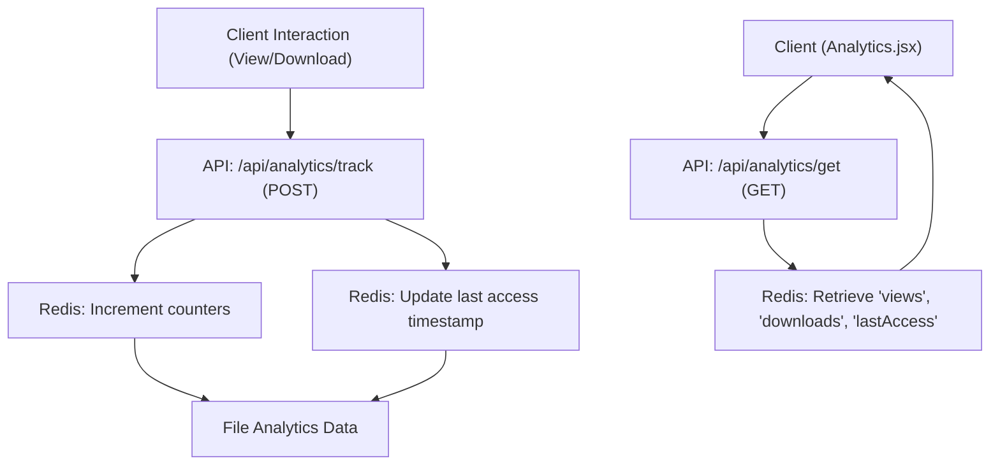
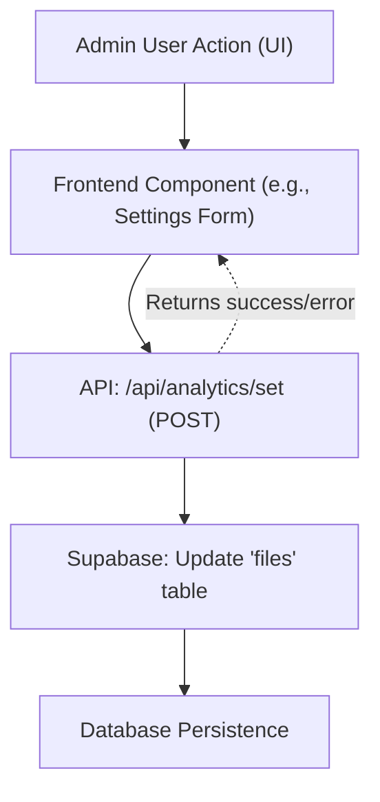

 # Analytics Tracking and Management

The Analytics Tracking and Management system provides robust capabilities for monitoring file interactions, setting access controls, and presenting real-time statistics to users. This system leverages Redis for high-performance, ephemeral tracking data and Supabase for persistent configuration and access control settings.

At its core, the system distinguishes between two primary types of data:
*   **Volatile Tracking Data**: Handled by Redis, this includes real-time views, downloads, and last access timestamps. It prioritizes speed and freshness for dynamic dashboards.
*   **Persistent Configuration Data**: Managed by Supabase, this covers crucial access rules such as maximum views/downloads, expiration dates, passwords, and auto-deletion policies. This data requires durability and relational integrity.

The integration of these two data stores allows for a flexible and efficient analytics solution, catering to both immediate tracking needs and long-term control requirements.

## API Endpoints

The analytics system exposes three key API endpoints, each serving a distinct purpose in the lifecycle of file analytics and management.

### `/api/analytics/track` - Recording File Interactions

This endpoint is responsible for incrementing interaction counters and updating access timestamps. It's designed to be lightweight and fast, processing events like file views and downloads.

*   **Method**: `POST`
*   **Purpose**: Records a "view" or "download" event for a specific file.
*   **Payload**:
    *   `id` (string, required): The unique identifier of the file.
    *   `type` (string, required): The type of interaction, either `"view"` or `"download"`.

Upon receiving a request, this endpoint uses Redis's `incr` command to atomically increment the respective counter (`file:{id}:views` or `file:{id}:downloads`). It also consistently updates the `file:{id}:lastAccess` timestamp, ensuring that the last interaction time is always current.

```javascript
// src/app/api/analytics/track/route.js
import { redis } from "@/lib/redis";

export async function POST(req) {
  const { id, type } = await req.json();
  if (!id || !type) {
    return new Response("Missing params", { status: 400 });
  }

  if (type === "view") {
    await redis.incr(`file:${id}:views`);
  }
  if (type === "download") {
    await redis.incr(`file:${id}:downloads`);
  }

  // always update last accessed
  await redis.set(`file:${id}:lastAccess`, Date.now());

  return Response.json({ success: true });
}
```
[View on GitHub](https://github.com/sumedhcharjan/Track-Vault/blob/main/src/app/api/analytics/track/route.js)

### `/api/analytics/get` - Retrieving Analytics Data

This endpoint provides a mechanism to fetch the current analytics data for a given file. It's crucial for displaying real-time statistics in the user interface.

*   **Method**: `GET`
*   **Purpose**: Retrieves the current view count, download count, and last access timestamp for a file.
*   **Query Parameters**:
    *   `id` (string, required): The unique identifier of the file.

The endpoint queries Redis for the `views`, `downloads`, and `lastAccess` keys associated with the provided file ID. It then formats this data into a JSON response, converting timestamps to ISO strings and ensuring numeric values are returned.

```javascript
// src/app/api/analytics/get/route.js
import { redis } from "@/lib/redis";

export async function GET(req) {
  const { searchParams } = new URL(req.url);
  const id = searchParams.get("id");

  if (!id) {
    return new Response("Missing id", { status: 400 });
  }

  const [views, downloads, lastAccess] = await Promise.all([
    redis.get(`file:${id}:views`),
    redis.get(`file:${id}:downloads`),
    redis.get(`file:${id}:lastAccess`),
  ]);

  return Response.json({
    views: Number(views || 0),
    downloads: Number(downloads || 0),
    lastAccess: lastAccess ? new Date(Number(lastAccess)).toISOString() : null,
  });
}
```
[View on GitHub](https://github.com/sumedhcharjan/Track-Vault/blob/main/src/app/api/analytics/get/route.js)

### `/api/analytics/set` - Managing Access Controls

This powerful endpoint allows for the configuration and modification of various access controls and properties for a file. These settings are persisted in the Supabase database.

*   **Method**: `POST`
*   **Purpose**: Updates persistent access control settings for a file, such as `maxViews`, `maxDownloads`, `expiresAt`, `password`, `deleteOnExpire`, and `deleteOnLimit`.
*   **Payload**:
    *   `file_id` (string, required): The unique identifier of the file to update.
    *   `maxViews` (number, optional): The maximum number of views allowed. `null` or `undefined` to ignore.
    *   `maxDownloads` (number, optional): The maximum number of downloads allowed. `null` or `undefined` to ignore.
    *   `expiresAt` (string, optional): ISO string representing the expiration timestamp.
    *   `password` (string, optional): Password for accessing the file.
    *   `deleteOnExpire` (boolean, optional): Whether to delete the file upon expiration.
    *   `deleteOnLimit` (boolean, optional): Whether to delete the file when view/download limits are reached.

The endpoint constructs an `updateData` object based on the provided payload and then uses Supabase to update the corresponding `files` table entry. This ensures that only specified fields are modified, allowing for partial updates.

```javascript
// src/app/api/analytics/set/route.js
import { supabase } from "@/lib/supabase";
import { NextResponse } from "next/server";

export async function POST(req) {
  try {
    const data = await req.json();
    const {
      file_id,
      maxViews,
      maxDownloads,
      expiresAt,
      password,
      deleteOnExpire,
      deleteOnLimit,
    } = data;

    const updateData = {};

    if (maxViews !== null && maxViews !== undefined) {
      updateData.max_views = maxViews;
    }

    if (maxDownloads !== null && maxDownloads !== undefined) {
      updateData.max_downloads = maxDownloads;
    }

    if (expiresAt) {
      updateData.expires_at = expiresAt;
    }

    if (password) {
      updateData.file_password = password;
    }

    if (typeof deleteOnExpire === "boolean") {
      updateData.delete_on_expire = deleteOnExpire;
    }

    if (typeof deleteOnLimit === "boolean") {
      updateData.delete_on_limit = deleteOnLimit;
    }

    const { error } = await supabase
      .from("files")
      .update(updateData)
      .eq("id", file_id);

    if (error) throw error;

    return NextResponse.json({
      success: true,
      message: "Access controls updated",
    });
  } catch (err) {
    console.error("Error in POST:", err);
    return NextResponse.json(
      { success: false, error: err.message },
      { status: 500 }
    );
  }
}
```
[View on GitHub](https://github.com/sumedhcharjan/Track-Vault/blob/main/src/app/api/analytics/set/route.js)

## Frontend Integration - `Analytics.jsx` Component

The `src/components/analyticsContol/Analytics.jsx` component is a React client-side component responsible for displaying and updating file analytics in real-time. It integrates with the `/api/analytics/get` endpoint to provide a dynamic user experience.

The component uses React's `useState` and `useEffect` hooks to manage its internal state and handle side effects.
A `useEffect` hook is configured to poll the `/api/analytics/get` endpoint every 5 seconds. This ensures that the displayed `views`, `downloads`, and `lastAccess` data are always up-to-date without requiring a page refresh.

```javascript
// src/components/analyticsContol/Analytics.jsx
"use client";
import { useEffect, useState } from "react";
import axios from "axios";
// ... other imports

export default function Analytics({ views, downloads, lastAccess, file }) {
  const [data, setData] = useState({ views, downloads, lastAccess });
  const [formattedDate, setFormattedDate] = useState("Never");

  useEffect(() => {
    if (data.lastAccess) {
      setFormattedDate(new Date(data.lastAccess).toLocaleString());
    }
  }, [data.lastAccess]);

  useEffect(() => {
    if (!file?.id) return;

    const interval = setInterval(async () => {
      try {
        const res = await axios.get(`/api/analytics/get?id=${file.id}`);
        setData(res.data);
      } catch (err) {
        console.error("Polling error:", err);
      }
    }, 5000); // Poll every 5 seconds

    return () => clearInterval(interval);
  }, [file?.id]);
  // ... rest of the component
}
```
[View on GitHub](https://github.com/sumedhcharjan/Track-Vault/blob/main/src/components/analyticsContol/Analytics.jsx#L8-L31)

This polling mechanism allows the user to observe analytics metrics change dynamically as interactions occur, providing immediate feedback on file usage. The component also handles the display of a public URL and a "Copy Public URL" button for user convenience.

```javascript
// src/components/analyticsContol/Analytics.jsx
// ... (previous code)

  const handleCopy = async () => {
    try {
      const link = `${window.location.origin}/public/${file.id}`;
      await navigator.clipboard.writeText(
        `Here is the link to access your file:\n${link}\nPassword: ${file.file_password}`
      );
      console.log("URL copied successfully");
    } catch (err) {
      console.error("Error copying URL:", err);
    }
  };

  return (
    <div className="grid grid-cols-1 sm:grid-cols-3 gap-4 mt-6">
      <div className="sm:col-span-3 flex justify-start">
        <Button variant="outline" size="sm" onClick={handleCopy}>
          Copy Public URL
        </Button>
      </div>
      {/* ... Card components for displaying views, downloads, etc. ... */}
    </div>
  );
}
```
[View on GitHub](https://github.com/sumedhcharjan/Track-Vault/blob/main/src/components/analyticsContol/Analytics.jsx#L33-L78)

## Analytics Data Flow

The following diagram illustrates the flow of data when tracking and retrieving analytics:





## Access Control Management Flow

This diagram outlines how file access controls are set and updated through the system:





## Key Integration Points

*   **Redis as a Fast Cache/Counter**: Redis is strategically used for real-time, high-volume operations like incrementing view/download counters and storing ephemeral data such as `lastAccess` timestamps. Its in-memory nature makes it ideal for these quick, non-critical reads/writes.
*   **Supabase for Persistent Controls**: Supabase (PostgreSQL) is employed for the durable storage of file metadata and access control rules. This ensures that configurations like `max_views`, `expires_at`, and `file_password` are reliably stored and available across sessions.
*   **Frontend Polling**: The `Analytics.jsx` component's use of polling with `setInterval` demonstrates a common pattern for displaying dynamic, real-time data in client-side applications. This balances the need for fresh data with server load, as data is fetched only when the component is mounted and visible.
*   **Robust Error Handling**: Each API endpoint includes `try...catch` blocks and returns appropriate HTTP status codes (e.g., 400 for missing parameters, 500 for server errors). This is crucial for building resilient systems that can gracefully handle unexpected issues.
*   **Separation of Concerns**: The design clearly separates tracking logic (Redis) from management/configuration logic (Supabase), leading to a more modular and maintainable system.

Next: [File Storage and Operations](./2.3_file-storage-operations.mdx)